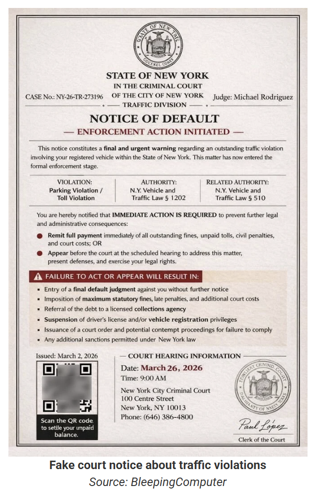
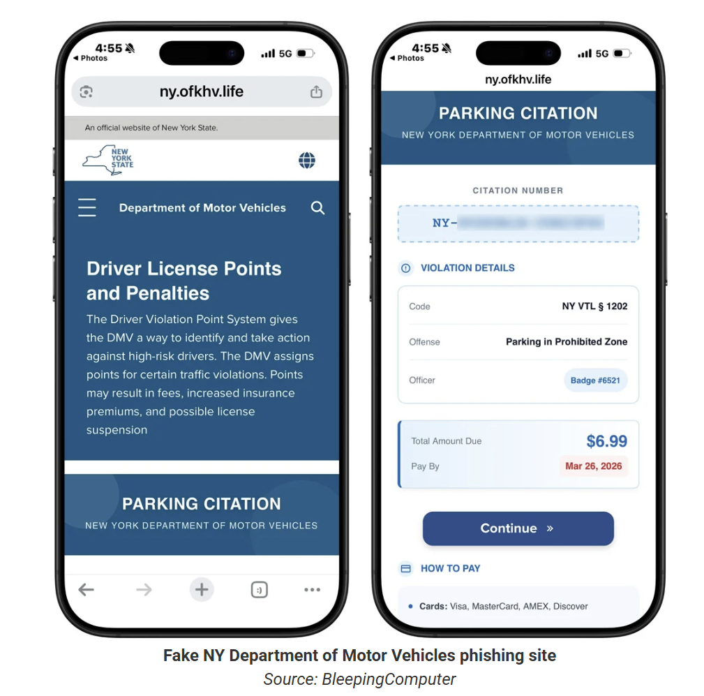

# QR Code Traffic Violation Phishing Campaign (Quishing Scam)

**Smishing**{.cve-chip} **QR Phishing (Quishing)**{.cve-chip} **Financial Fraud**{.cve-chip}

## Overview

A phishing campaign is distributing SMS messages that impersonate traffic violation notices and legal payment warnings. Instead of direct URLs, the messages use QR codes that route victims to fake payment portals.

The campaign uses urgency and low-fee payment prompts to increase compliance while harvesting payment and personal data.

## Technical Specifications

| Field | Details |
|-------|---------|
| **Delivery Method** | SMS phishing (smishing) |
| **Primary Lure Themes** | Traffic fines, court/legal notices, urgent penalties |
| **Evasion Method** | QR code redirection instead of explicit malicious URL |
| **Destination Type** | Fake payment sites imitating government portals |
| **Targeted Data** | Credit card information and personally identifiable information (PII) |
| **Monetization Trigger** | Small payment amount (for example around $6.99) |

## Affected Products

- Mobile users receiving unsolicited fine/violation SMS messages.
- Public-facing government/payment brand identities abused for impersonation.
- Payment card and personal identity data entered into fraudulent portals.

## Technical Details

- Attackers send smishing messages that mimic official enforcement communications.
- QR codes are used as an obfuscation layer to bypass simple URL-based detection.
- Victims are redirected to cloned payment pages styled as official platforms.
- Forms capture card data, billing details, and personal identifying information.
- Collected data can be reused for fraud, identity abuse, and follow-on phishing.

## Attack Scenario

1. Victim receives an SMS claiming an unpaid traffic fine or legal notice.
2. Message includes a QR code to "view" or "pay" the violation.
3. Victim scans the QR code on a mobile device.
4. Browser opens a spoofed government-style payment portal.
5. Victim submits payment and personal details.
6. Attacker captures the data for fraudulent transactions and identity theft.

## Impact Assessment

=== "Financial Impact"
    Stolen payment-card details can enable unauthorized charges and recurring fraud activity.

=== "Identity and Privacy Impact"
    Exposure of personal identifiers increases identity-theft and account-abuse risk.

=== "Campaign Effectiveness Impact"
    QR-based obfuscation can raise phishing success rates by evading traditional URL-focused user suspicion and filtering.

## Mitigation Strategies

### For Individuals

- Do not scan QR codes from unsolicited SMS messages.
- Verify legal/payment notices through official government websites directly.
- Avoid entering financial or personal data on unknown or unverified pages.
- Use mobile anti-phishing and security tools.

### For Organizations

- Deliver awareness training focused on quishing and mobile phishing patterns.
- Deploy mobile threat defense and SMS threat-detection controls.
- Improve filtering for suspicious SMS patterns and brand impersonation indicators.
- Monitor for abuse of organizational/government brand references in phishing campaigns.

## Resources

!!! info "Open-Source Reporting"
    - [Traffic violation scams switch to QR codes in new phishing texts](https://www.bleepingcomputer.com/news/security/traffic-violation-scams-switch-to-qr-codes-in-new-phishing-texts/)
    - [Fake Traffic Violation Text Scam Spreads Across US Using QR Codes to Steal Data](https://www.abijita.com/fake-traffic-violation-text-scam-spreads-across-us-using-qr-codes-to-steal-data/)

*Last Updated: April 6, 2026*