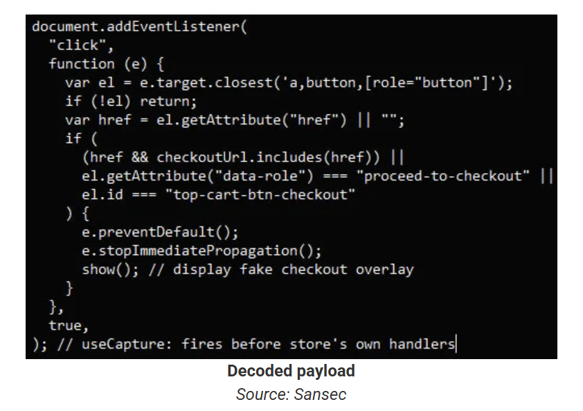

# Hackers Use Pixel-Large SVG Trick to Hide Credit Card Stealer

**Web Skimming**{.cve-chip} **Magecart**{.cve-chip} **Payment Card Theft**{.cve-chip}

## Overview

A sophisticated web skimming campaign targets Magento-based e-commerce stores by injecting malicious JavaScript hidden inside a 1×1 pixel invisible SVG image embedded directly in the page HTML. The attack deploys a fake payment overlay during checkout to harvest customer credit card details in real time, encrypts the stolen data, and silently exfiltrates it to attacker-controlled servers. The pixel-sized SVG container and heavy obfuscation make the payload nearly invisible to visual inspection and difficult to detect with traditional security scanning tools, enabling persistent card theft across compromised storefronts.

## Technical Specifications

| Attribute | Details |
|-----------|---------|
| **Attack Type** | Web Skimming / Magecart-Style Card Theft |
| **Target Platform** | Magento-Based Online Stores |
| **Initial Access** | Magento PolyShell RCE Vulnerability (Suspected) |
| **Payload Container** | Inline `<svg>` Element (1×1 Pixel) |
| **Execution Trigger** | SVG `onload` Event Handler |
| **Obfuscation** | Base64 Encoding (`atob()`), `setTimeout` Delayed Execution |
| **Overlay Attack** | Fake Checkout Form Injected Over Legitimate Payment Page |
| **Card Validation** | Luhn Algorithm |
| **Data Encryption** | XOR + Base64 |
| **Exfiltration Endpoint** | Attacker-Controlled Server (e.g., `/fb_metrics.php`) |
| **Persistence** | Browser `localStorage` Key (`_mgx_cv`) |

## Affected Products

- **Magento (Adobe Commerce)**: Unpatched Magento installations vulnerable to PolyShell or similar RCE vulnerabilities used for initial code injection
- **Magento Checkout Pages**: The skimmer specifically targets checkout flows where payment card entry forms are rendered
- **Customer Browsers**: Any browser rendering the compromised checkout page executes the injected SVG payload and fake overlay
- **End Users**: Shoppers entering payment card details (card number, CVV, expiry, billing address) on compromised storefronts

## Technical Details

- **Initial Compromise**: Attacker likely exploits a known Magento remote code execution vulnerability (e.g., PolyShell) to gain administrative or file-write access to the target storefront, enabling injection of malicious code into theme files or database-stored page templates
- **SVG Steganography**: Malicious JavaScript is embedded inside an inline `<svg width="1" height="1">` HTML element rendered at 1×1 pixel — visually invisible to users and easily overlooked during manual code review
- **Execution via `onload`**: The SVG's `onload` event attribute fires the obfuscated JavaScript automatically when the page loads, requiring no user interaction beyond visiting the checkout page
- **Obfuscation Layers**: Payload uses `atob()` Base64 decoding to reconstruct the malicious script at runtime; `setTimeout` delays execution to evade security tools that scan only at page-load time
- **Overlay Attack**: Once executed, the script injects a convincing fake payment form overlay on top of the legitimate Magento checkout UI; the overlay is visually identical to a real payment form, capturing card details before they reach the actual payment processor
- **Card Validation**: Stolen card numbers are validated client-side using the Luhn algorithm before transmission, filtering out typos and ensuring only valid card data is exfiltrated
- **Data Encryption**: Captured card data is encrypted using XOR combined with Base64 encoding prior to transmission, obfuscating the payload in network traffic and defeating simple content-based detection
- **Exfiltration**: Encrypted data is sent via HTTP POST to an attacker-controlled endpoint (e.g., `/fb_metrics.php`) disguised as analytics traffic, blending with legitimate third-party tracking requests
- **Persistence via LocalStorage**: The skimmer writes a key (`_mgx_cv`) to the browser's `localStorage` to track previously compromised sessions, avoid duplicate submissions, and potentially maintain state across browsing sessions

## Attack Scenario

1. **Initial Access**: Attacker exploits a Magento RCE vulnerability (e.g., PolyShell) or brute-forces admin credentials to gain write access to the storefront's theme files, CMS blocks, or database content
2. **Payload Injection**: Malicious inline `<svg>` element containing Base64-obfuscated JavaScript is injected into the checkout page template or a globally loaded script file
3. **Victim Visits Checkout**: Shopper navigates to the checkout page to complete a purchase; the SVG element renders invisibly (1×1 pixel) while its `onload` handler silently fires
4. **Delayed Script Execution**: `setTimeout` delays execution of the decoded JavaScript payload, bypassing automated scanners that evaluate pages only at initial load time
5. **Fake Overlay Deployment**: The script injects a pixel-perfect fake payment form overlay over the legitimate checkout UI; the victim sees what appears to be a normal payment card entry form
6. **Card Data Capture**: Victim enters credit card number, CVV, expiry date, and billing details into the fake overlay; the skimmer captures all input in real time
7. **Validation & Encryption**: Captured card number is validated using the Luhn algorithm; all collected data is encrypted with XOR + Base64 encoding
8. **Silent Exfiltration**: Encrypted card data is POST-ed to the attacker's server endpoint (disguised as analytics/metrics traffic); `localStorage` key is set to mark the session; victim is redirected to a normal order confirmation page, completely unaware of the theft

## Impact Assessment

=== "Consumer Impact"

    - **Payment Card Theft**: Credit card numbers, CVV codes, expiry dates, and billing addresses are silently stolen during checkout
    - **Financial Fraud**: Stolen card data is used for unauthorized purchases, sold on dark web marketplaces, or used in carding operations
    - **Delayed Discovery**: Victims typically discover the compromise only when unauthorized charges appear — often days or weeks after the skimming event
    - **Identity Risk**: Billing address data combined with card details provides sufficient information for identity theft and account takeover attempts

=== "Merchant Impact"

    - **Reputational Damage**: Customer-facing card theft incidents generate negative reviews, media coverage, and loss of consumer trust that persists long after remediation
    - **Chargebacks & Financial Loss**: Fraudulent transactions result in payment processor chargebacks, fees, and potential loss of merchant processing accounts
    - **Regulatory & Legal Consequences**: PCI DSS non-compliance resulting from a card data breach carries significant fines, mandatory forensic audits, and potential liability for consumer losses
    - **Prolonged Silent Infection**: The pixel-SVG technique enables the skimmer to persist undetected across many transactions before discovery, maximizing stolen card volume

=== "Detection & Response Challenge"

    - **Visual Invisibility**: 1×1 pixel SVG is imperceptible to manual page inspection and overlooked in visual code reviews
    - **Obfuscation Resistance**: Multi-layer Base64 + delayed execution evades automated scanners operating at page-load time
    - **Traffic Camouflage**: Exfiltration disguised as analytics POST requests blends with legitimate third-party traffic in proxy and SIEM logs
    - **LocalStorage Persistence**: Browser-side state tracking complicates forensic scope determination; victims may be tracked across multiple sessions

## Mitigation Strategies

### For Magento Store Operators

- **Patch Magento Immediately**: Apply all available Magento / Adobe Commerce security patches; specifically address PolyShell and any known RCE vulnerabilities; upgrade to the latest supported version
- **Implement Content Security Policy (CSP)**: Deploy strict CSP headers to whitelist approved script sources; block inline `<script>` and SVG event handlers via `script-src` and `default-src` directives; use `connect-src` to restrict exfiltration to approved domains only
- **File Integrity Monitoring**: Deploy file integrity monitoring on all Magento theme files, JavaScript includes, and CMS blocks; alert on any unauthorized modifications to checkout-related templates
- **Web Application Firewall (WAF)**: Configure WAF rules to detect and block injection of SVG/script content into page responses; add rules for known skimmer exfiltration patterns (e.g., `/fb_metrics.php`)
- **Monitor for Suspicious HTML**: Regularly audit page HTML for inline `<svg>` elements with event handlers, unexpected Base64-encoded script blocks, and unauthorized third-party script inclusions
- **Block Malicious IPs/Domains**: Subscribe to Magecart and web skimming threat intelligence feeds; block known attacker-controlled exfiltration domains and IPs at the WAF and DNS level
- **Subresource Integrity (SRI)**: Apply SRI hashes to all externally loaded JavaScript files to detect unauthorized modifications by CDN or supply chain tampering
- **Restrict Admin Access**: Enable two-factor authentication on all Magento admin accounts; restrict admin panel access to known IP addresses; review and remove unused admin accounts

### For End Users

- **Use Virtual or Masked Cards**: Pay with single-use virtual card numbers or digital wallets (Apple Pay, Google Pay) that do not expose real card details to the merchant
- **Monitor Bank Transactions**: Review card statements and banking alerts regularly; report unrecognized charges immediately to the card issuer
- **Be Alert to Unusual Checkout Behavior**: Treat unexpected redirects, double payment form prompts, or pages that load slowly during checkout as potential indicators of compromise; use a different payment method if in doubt

## Resources

!!! info "Open-Source Reporting"
    - [Hackers Use Pixel-Large SVG Trick to Hide Credit Card Stealer](https://www.bleepingcomputer.com/news/security/hackers-use-pixel-large-svg-trick-to-hide-credit-card-stealer/)

*Last Updated: April 9, 2026*