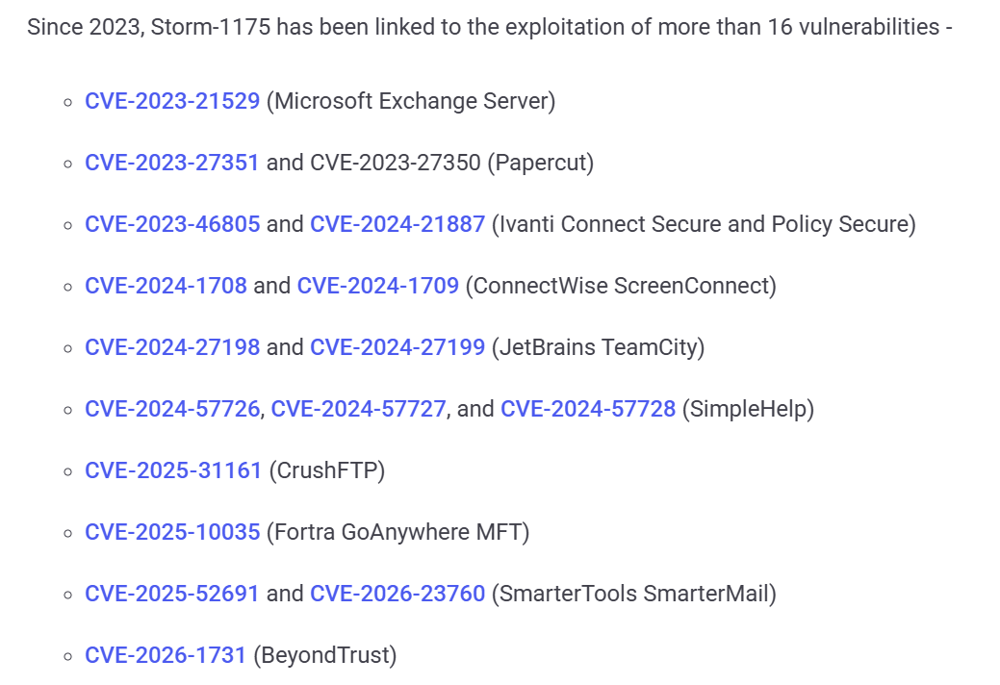
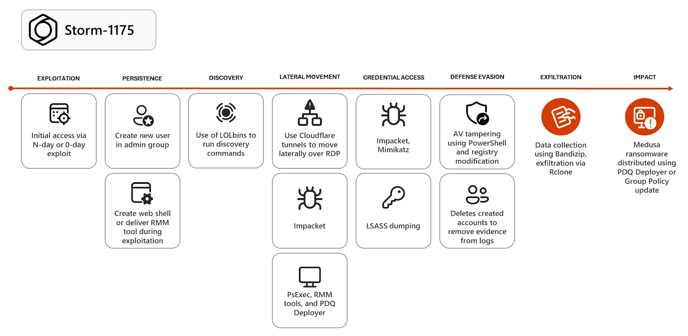

# China-Linked Storm-1175 Zero-Day Exploitation Campaign

**China-Linked APT**{.cve-chip} **Zero-Day Exploitation**{.cve-chip} **Medusa Ransomware**{.cve-chip}

## Overview

Storm-1175, a China-linked threat actor, has been observed conducting sophisticated zero-day and newly disclosed vulnerability exploitation campaigns against enterprise software. The group demonstrates rapid threat weaponization, quickly transitioning from initial access through exploitation of internet-facing systems to credential escalation, lateral movement, and deployment of Medusa ransomware. Attacks typically complete full system compromise within hours to 24 hours, employing double extortion tactics for financial gain.

## Technical Specifications

| Attribute | Details |
|-----------|---------|
| **Threat Actor** | Storm-1175 (China-Linked) |
| **Attack Type** | Vulnerability Exploitation, Ransomware Deployment |
| **Primary TTP** | Zero-Day & N-Day Weaponization |
| **Initial Access Vector** | Internet-Facing Applications |
| **Persistence Method** | RMM Tools, Admin Account Creation |
| **Lateral Movement** | RDP, Admin Tools, Network Scanning |
| **Data Exfiltration** | Cloud Sync Tools (Rclone) |
| **Impact** | Ransomware Encryption, Data Theft (Double Extortion) |
| **Timeline** | Hours to 24 Hours for Full Compromise |

## Affected Products

- **Email Infrastructure**: Microsoft Exchange, SmarterMail
- **VPN & Remote Access**: Ivanti VPN
- **Collaboration & IT Management**: ConnectWise, TeamCity
- **Printer/Document Services**: PaperCut
- **Internet-Facing Applications**: Any publicly accessible enterprise software

 

## Technical Details

- Exploits zero-day vulnerabilities (e.g., authentication bypass in SmarterMail) with minimal public disclosure lag
- Rapidly weaponizes N-day vulnerabilities after official disclosure
- Targets public-facing applications including email servers, managed file transfer (MFT) solutions, VPNs, and CI/CD platforms
- Deploys Remote Monitoring & Management (RMM) tools (ConnectWise, Splashtop) for persistent backdoor access
- Uses credential harvesting and privilege escalation techniques to elevate from initial foothold to administrative access
- Employs network reconnaissance tools (Netscan, AdvancedIPScanner) to enumerate systems and identify high-value targets
- Exfiltrates sensitive data using cloud synchronization tools like Rclone, AWS S3 CLI, or similar cloud storage clients
- Disables or removes security controls (antivirus, EDR, logging) before ransomware deployment
- Conducts double extortion campaign: encrypts systems with Medusa ransomware while threatening public data disclosure for additional ransom payment

 

## Attack Scenario

1. **Initial Access**: Exploit zero-day or recently disclosed vulnerability in an internet-facing system (email server, VPN, application) to gain initial shell access or command execution
2. **Establish Foothold**: Create persistent admin accounts, install RMM tools (ConnectWise, TeamCity agents), establish reverse shells and beacon communication channels; disable security controls and logging
3. **Lateral Movement**: Move across the network via RDP, admin consoles, and RMM tool interfaces; enumerate systems, privileges, and network topology using built-in Windows tools and custom scripts
4. **Credential Access**: Harvest domain credentials from memory, SAM hives, and LSASS processes; crack weak passwords; exploit Kerberos weaknesses to obtain domain admin privileges
5. **Data Exfiltration**: Identify and steal sensitive data (intellectual property, customer records, financial data, employee information); exfiltrate using cloud sync tools and S3 uploads; often a multi-day process for large data volumes
6. **Impact & Encryption**: Deploy Medusa ransomware to all accessible systems; encrypt files with strong encryption; display ransom note; contact victim organizations with double extortion threat (publish stolen data if ransom not paid)

## Impact Assessment

=== "Technical Impact"

    - **System Compromise**: Full compromise of affected systems within hours of initial access
    - **Data Integrity Loss**: Encryption of critical business documents and databases
    - **Credential Compromise**: Exposure of domain credentials, service accounts, and administrative privileges
    - **Security Control Bypass**: Antivirus and EDR evasion enables undetected persistence and lateral movement
    - **Ransomware Deployment**: Difficulty in system recovery without recent, offline backups

=== "Operational Impact"

    - **Business Continuity Disruption**: Encrypted systems unable to operate; critical business functions halted
    - **Prolonged Downtime**: Recovery effort can take days to weeks depending on backup availability and system complexity
    - **Double Extortion Threat**: Pressure to pay ransom to both decrypt systems and prevent public data release
    - **Incident Response Burden**: Extensive forensics, system rebuilds, and credential resets required
    - **Supply Chain Risk**: Exfiltrated data may include vendor, customer, and partner information

=== "Strategic Impact"

    - **Financial Loss**: Ransom payments (often $1M+), downtime costs, recovery expenses, and potential regulated notification costs
    - **Reputational Damage**: Public disclosure of breached data harms customer trust, investor confidence, and brand reputation
    - **Regulatory Consequences**: GDPR fines, SOX violations, and industry-specific compliance penalties for data loss
    - **Competitive Disadvantage**: Theft of intellectual property benefits competitors; disclosure of proprietary processes
    - **Geopolitical Implications**: Links to Chinese state-sponsored activities amplify diplomatic and legal consequences

## Mitigation Strategies

- **Patch Management**: Apply security updates immediately upon release, with priority given to internet-facing systems; implement automated patching where possible; maintain inventory of all software versions in production
- **Attack Surface Reduction**: Disable unused services and ports; restrict access to critical systems (VPNs, MFT, email) via IP whitelisting, multi-factor authentication, and zero-trust network access controls
- **Vulnerability Scanning**: Perform regular vulnerability assessments of internet-facing applications; implement continuous scanning for known vulnerabilities; use security headers and WAF rules to block exploitation attempts
- **Access Control**: Enforce principle of least privilege; separate user, admin, and service accounts; disable local admin accounts where possible; use privileged access management (PAM) solutions
- **Email Security**: Deploy advanced email filtering to detect phishing and malware; enable DMARC, SPF, and DKIM; implement sandboxing for suspicious attachments and links
- **Network Segmentation**: Implement network segmentation using VLANs, firewalls, and zero-trust architecture; isolate critical systems and data stores; restrict lateral movement via microsegmentation
- **Monitoring & Detection**: Monitor for unusual account creation, failed login attempts, and permission changes; detect RMM tool installation and suspicious process execution; alert on unusual outbound traffic to cloud services
- **Endpoint Detection & Response (EDR)**: Deploy EDR solutions across all systems; enable process monitoring, memory analysis, and behavioral detection; maintain 24/7 SOC monitoring
- **Backup Strategy**: Implement immutable, offline backups; test backup recovery regularly; maintain multiple backup copies in geographically dispersed locations; ensure backups are not connected to production networks
- **Incident Response Planning**: Develop and test incident response procedures; establish communication protocols with law enforcement and incident response firms; maintain updated asset inventory and network diagrams
- **RMM Tool Security**: Audit and restrict RMM tool usage; disable RMM tools not in active use; monitor RMM connections for suspicious behavior; control administrative tool access with PAM
- **Data Exfiltration Prevention**: Monitor cloud storage uploads; use Data Loss Prevention (DLP) tools to block unauthorized data transfer; encrypt sensitive data at rest and in transit; implement egress filtering rules

## Resources

!!! info "Open-Source Reporting"

    - [Microsoft Links Medusa Ransomware Affiliate to Zero-Day Attacks - DataBreaches.Net](https://www.databreaches.net)
    - [China-Linked Storm-1175 Exploits Zero-Days to Rapidly Deploy Medusa Ransomware](https://www.microsoft.com)
    - [CrowdStrike: China-Linked Threat Actor Storm-1175 Campaign Analysis](https://www.crowdstrike.com)
    - [CISA Alert: Exploitation of SmarterMail by Chinese APT Groups](https://www.cisa.gov)
