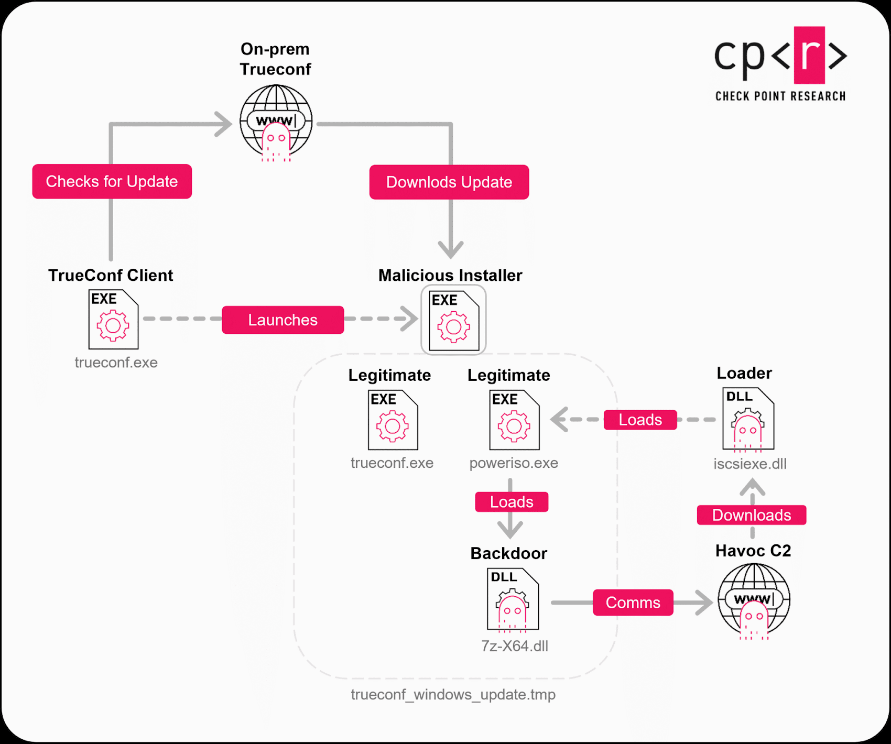

# TrueConf Zero-Day Exploitation (Operation TrueChaos) - CVE-2026-3502

**CVE-2026-3502**{.cve-chip}  **TrueConf**{.cve-chip}  **Malicious Update Abuse**{.cve-chip}  **Operation TrueChaos**{.cve-chip}

## Overview
A zero-day vulnerability in the TrueConf video conferencing platform was reportedly exploited in targeted attacks against government entities in Southeast Asia. The flaw enabled attackers to push malicious updates via compromised on-premises servers, causing broad endpoint infections and creating espionage risk.

The incident demonstrates supply-chain-like abuse of trusted internal software update channels.

## Technical Specifications

| **Attribute** | **Details** |
|---------------|-------------|
| **CVE ID** | CVE-2026-3502 |
| **Affected Product** | TrueConf video conferencing platform |
| **Core Weakness** | Client fails to properly verify update integrity/authenticity from server |
| **Exploit Mechanism** | Replacement of legitimate update package with malicious payload |
| **Execution Context** | Code executes under trusted application/update context |
| **Observed Techniques** | DLL sideloading, Havoc C2 usage, persistence and reconnaissance activity |
| **Target Profile** | Government networks in Southeast Asia (as reported) |

## Affected Products
- TrueConf on-premises server deployments
- TrueConf client endpoints trusting internal update notifications
- Government and enterprise environments using centralized internal update distribution
- Networks lacking strict validation for software update authenticity

## Attack Scenario
1. **Server Access**:
   Attacker gains access to an on-prem TrueConf server.

2. **Update Tampering**:
   Malicious update packages are uploaded or legitimate packages are replaced.

3. **Trusted Delivery**:
   Users receive normal trusted update prompts from their internal server.

4. **Endpoint Execution**:
   Victims install the update and execute attacker-controlled code.

5. **Operational Expansion**:
   Attack spreads across multiple endpoints with persistence, reconnaissance, and C2 activity.

## Impact Assessment

=== "Integrity"
    * Compromise of trusted software update workflows
    * Unauthorized code execution under legitimate application trust boundaries
    * Increased ability for attackers to stage follow-on malicious tooling

=== "Confidentiality"
    * Exposure risk for internal communications and sensitive organizational data
    * Potential theft of infrastructure details useful for long-term espionage
    * Expanded attacker visibility into endpoint and network topology

=== "Availability"
    * Simultaneous compromise of multiple endpoints can disrupt operations
    * Increased remediation workload due to broad trusted-channel infection scope
    * Persistent footholds can prolong incident containment and recovery

## Mitigation Strategies

### Immediate Actions
- Upgrade TrueConf to version 8.5.3 or later.
- Verify update package authenticity with strict code-signing checks.
- Isolate potentially affected servers and endpoints for triage.

### Short-term Measures
- Restrict and monitor administrative access to internal application servers.
- Deploy EDR across client and server endpoints.
- Audit update pipelines and remove unauthorized packages/artifacts.

### Monitoring & Detection
- Monitor for suspicious update activity and unusual package replacement events.
- Alert on unknown DLL execution or sideloading behavior.
- Track abnormal outbound C2-like traffic and persistence indicators.

### Long-term Solutions
- Enforce cryptographic update validation and secure update distribution governance.
- Segment update infrastructure from user zones to limit propagation.
- Conduct regular incident response drills for software supply-chain compromise scenarios.

## Resources and References

!!! info "Open-Source Reporting"
    - [TrueConf Zero-Day Exploited in Asian Government Attacks - SecurityWeek](https://www.securityweek.com/trueconf-zero-day-exploited-in-asian-government-attacks/)
    - [TrueConf Zero-Day Exploited in Attacks on Southeast Asian Government Networks](https://thehackernews.com/2026/03/trueconf-zero-day-exploited-in-attacks.html)
    - [Operation TrueChaos: 0-Day Exploitation Against Southeast Asian Government Targets - Check Point Research](https://research.checkpoint.com/2026/operation-truechaos-0-day-exploitation-against-southeast-asian-government-targets/)

---

*Last Updated: April 5, 2026*
