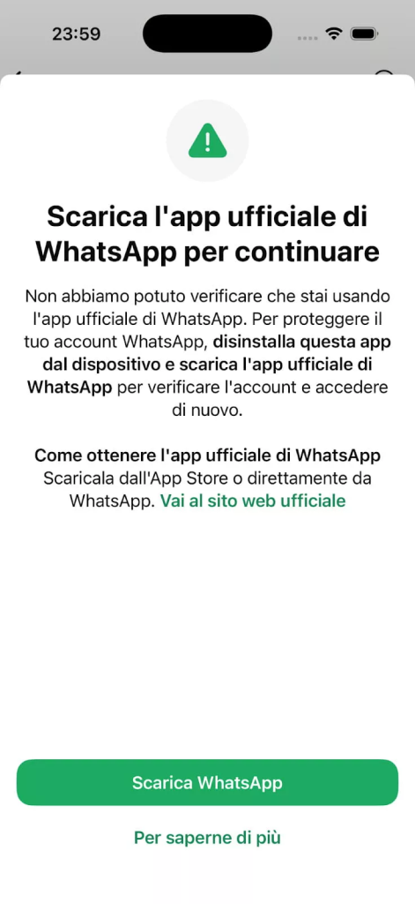

# WhatsApp Fake App Spyware Campaign

**WhatsApp Impersonation**{.cve-chip}  **Mobile Spyware**{.cve-chip}  **Social Engineering**{.cve-chip}  **Italy Targeting**{.cve-chip}

## Overview
Around 200 WhatsApp users in Italy were reportedly tricked into installing a fake WhatsApp application embedded with spyware. The operation relied on social-engineering delivery outside official app-store channels rather than cryptographic compromise of WhatsApp itself.

WhatsApp's end-to-end encryption model was not broken in this incident, but compromised devices enabled attackers to monitor user data through malicious local app behavior.

## Technical Specifications

| **Attribute** | **Details** |
|---------------|-------------|
| **Incident Type** | Mobile spyware distribution via trojanized application |
| **Target Platform** | iOS users (reported) |
| **Delivery Method** | Social engineering and off-store installation prompts |
| **Malicious Technique** | Fake WhatsApp app masquerading as legitimate client |
| **Data Collection Behavior** | Covert background collection of device data, contacts, and messages |
| **Encryption Status** | WhatsApp end-to-end encryption remained intact |
| **Response Action** | WhatsApp reportedly logged out affected users and sent security alerts |
| **Estimated Scope** | Approximately 200 users affected |

## Affected Products
- Users who installed unofficial WhatsApp builds outside trusted stores
- iOS devices exposed to sideloading/social engineering lures
- High-risk individuals potentially targeted for focused surveillance
- Organizations relying on personal mobile devices for sensitive communication

## Attack Scenario
1. **Lure Delivery**:
   Target receives a message urging installation of a "special" or "updated" WhatsApp version.

2. **Malicious Installation**:
   User sideloads the fake app from an unverified source.

3. **Stealth Operation**:
   Spyware executes in the background and begins collecting sensitive device information.

4. **Detection and Notification**:
   WhatsApp identifies compromise indicators, logs out affected accounts, and sends user alerts.

## Impact Assessment

=== "Integrity"
    * Device and messaging trust is undermined by malicious app impersonation
    * Potential manipulation of local mobile environment through covert spyware behavior
    * Increased risk of follow-on account abuse after device compromise

=== "Confidentiality"
    * Exposure of personal data, contacts, and message-related information
    * Focused surveillance risk against selected individuals
    * Intelligence collection potential despite intact transport-level encryption

=== "Availability"
    * Account interruptions due to forced logout and remediation workflow
    * User disruption while removing malware and restoring trusted app state
    * Ongoing operational burden for monitoring and incident handling

## Mitigation Strategies

### Immediate Actions
- Remove any unofficial/fake WhatsApp application immediately.
- Reinstall only official WhatsApp builds from App Store or Play Store.
- Review and revoke suspicious app permissions.

### Short-term Measures
- Enable WhatsApp two-step verification.
- Audit installed apps for unknown publishers or abnormal permissions.

### Monitoring & Detection
- Watch for unusual battery, network, or background process behavior on mobile devices.
- Alert on suspicious installation prompts and off-store app-delivery messages.
- Track account-security alerts and anomalous login/session events.

### Long-term Solutions
- Deliver ongoing user awareness training on fake app and phishing lures.
- Strengthen mobile endpoint security controls for high-risk user populations.

## Resources and References

!!! info "Open-Source Reporting"
    - [WhatsApp Alerts 200 Users After Fake iOS App Installed Spyware; Italian Firm Faces Action](https://thehackernews.com/2026/04/whatsapp-alerts-200-users-after-fake.html)
    - [Italian spyware vendor creates Fake WhatsApp app, targeting 200 users](https://securityaffairs.com/190276/malware/italian-spyware-vendor-creates-fake-whatsapp-app-targeting-200-users.html)
    - [WhatsApp notifies 200 users who installed fake app built by Italian spyware maker SIO](https://thenextweb.com/news/whatsapp-italian-spyware-fake-app-sio)
    - [WhatsApp warns users of fake app used to distribute spyware | The Record from Recorded Future News](https://therecord.media/whatsapp-warns-users-of-fake-app-used-for-spyware)
    - [WhatsApp says Italian surveillance company tricked around 200 users into downloading spyware | Reuters](https://www.reuters.com/sustainability/boards-policy-regulation/whatsapp-says-italian-surveillance-company-tricked-around-200-users-into-2026-04-01/)

---

*Last Updated: April 5, 2026*
