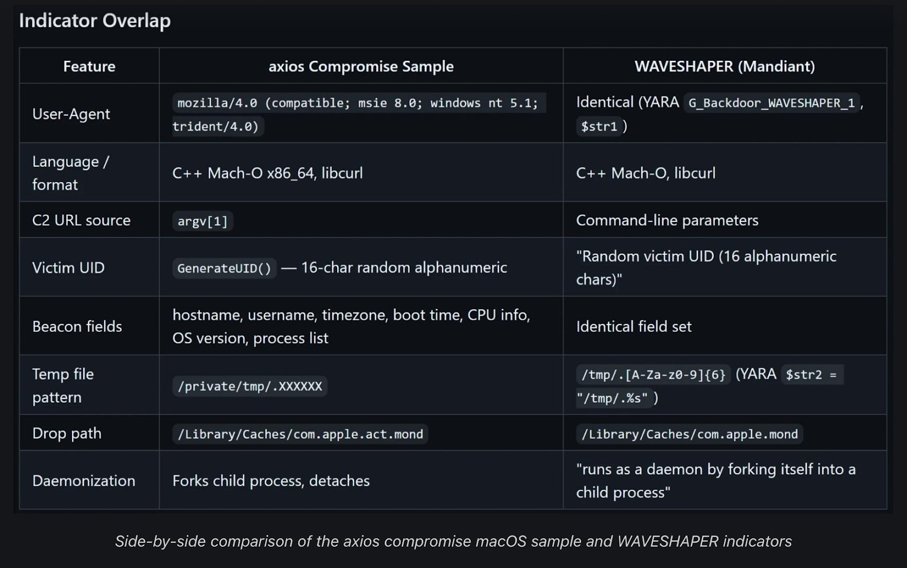

# Axios npm Supply Chain Attack (Linked to UNC1069 / North Korea)

**Supply Chain Attack**{.cve-chip} **npm Ecosystem**{.cve-chip} **RAT Deployment**{.cve-chip}

## Overview

Attackers compromised an Axios maintainer npm account and published malicious package versions that introduced a hidden dependency and post-install malware behavior.

Public reporting and attribution linked the campaign to North Korea-associated activity tracked as UNC1069. The compromise exposed developer environments to remote access malware across major operating systems.

## Technical Specifications

| Field | Details |
|-------|---------|
| **Targeted Package** | Axios (npm) |
| **Malicious Versions** | 1.14.1 and 0.30.4 |
| **Malicious Dependency** | plain-crypto-js@4.2.1 |
| **Execution Mechanism** | Post-install scripts downloading/executing payloads |
| **Platform Impact** | Windows, Linux, macOS |
| **Reported Attribution** | UNC1069 (North Korea-linked reporting) |

## Affected Products

- Projects that installed compromised Axios versions directly or transitively.
- Developer workstations and build/CI environments where install scripts executed.
- Internal repositories and credentials reachable from compromised developer systems.

## Technical Details

- Attackers reportedly used social engineering to compromise maintainer account access.
- Malicious Axios releases included a hidden dependency chain to deliver additional payload logic.
- Post-install execution behavior enabled silent malware delivery during normal package installation.
- Payload capabilities were consistent with remote-access tooling for command execution and persistence.
- Threat intelligence linked infrastructure and behavior to activity previously associated with UNC1069.

## Attack Scenario

1. Threat actors compromise maintainer credentials via social engineering.
2. Malicious package versions are published to npm under trusted package identity.
3. Developers and CI systems install affected versions through direct or transitive dependency resolution.
4. Post-install scripts run automatically and fetch additional malware components.
5. RAT establishes outbound C2 communications and enables remote attacker control.

## Impact Assessment

=== "Developer and Build Environment Impact"
    Developer endpoints and CI/CD systems may be compromised, enabling code tampering and credential theft.

=== "Ecosystem and Supply Chain Impact"
    Because Axios is widely used transitively, short-lived malicious releases can affect large portions of the software ecosystem.

=== "Business and Security Impact"
    Exposure may include source code, secrets, and internal infrastructure access, increasing downstream breach and operational risk.

## Mitigation Strategies

- Pin and audit Axios dependencies to known-safe versions.
- Remove malicious versions from dependency trees and regenerate lockfiles.
- Rotate credentials, tokens, and signing secrets on potentially affected systems.
- Hunt for indicators of compromise, including suspicious connections (for example `sfrclak.com`).
- Harden maintainer and developer accounts with MFA, hardware keys, and social-engineering-resistant workflows.
- Enforce package integrity checks and controlled dependency update pipelines.

## Resources

!!! info "Open-Source Reporting"
    - [Google links Axios npm supply chain attack to North Korea-linked APT UNC1069](https://securityaffairs.com/190256/security/google-links-axios-npm-supply-chain-attack-to-north-korea-linked-apt-unc1069.html)
    - [North Korean hackers linked to Axios npm supply chain compromise - Help Net Security](https://www.helpnetsecurity.com/2026/04/01/north-korean-hackers-linked-to-axios-npm-supply-chain-compromise/)
    - [Google Attributes Axios npm Supply Chain Attack to North Korean Group UNC1069](https://thehackernews.com/2026/04/google-attributes-axios-npm-supply.html)
    - [North Korea behind social engineering attack on Axios project - Techzine Global](https://www.techzine.eu/news/security/140130/north-korea-behind-social-engineering-attack-on-axios-project/)
    - [Top npm package backdoored to drop dirty RAT on dev machines | The Register](https://www.theregister.com/2026/03/31/axios_npm_backdoor_rat/)
    - [UNC1069 Social Engineering of Axios Maintainer Led to npm Supply Chain Attack](https://thehackernews.com/2026/04/unc1069-social-engineering-of-axios.html)

*Last Updated: April 6, 2026*