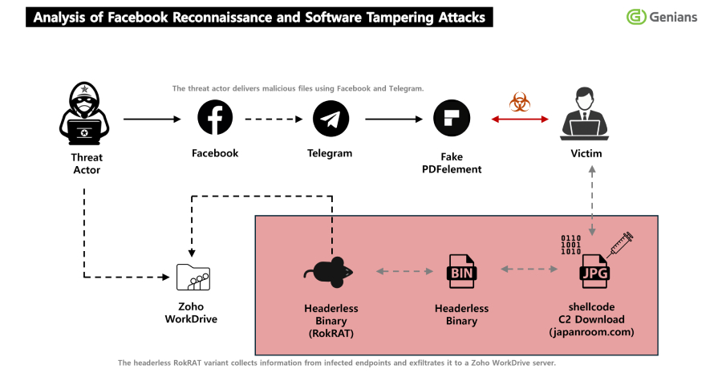
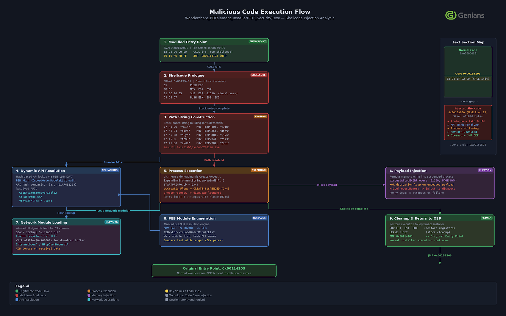

# North Korea's APT37 Uses Facebook Social Engineering to Deliver RokRAT Malware

**North Korea-Linked APT**{.cve-chip} **Social Engineering**{.cve-chip} **RokRAT Malware**{.cve-chip}

## Overview

APT37, a North Korea-linked cyber espionage group also known as ScarCruft, conducted a targeted campaign using Facebook social engineering to approach victims and persuade them to install a trojanized PDF viewer. The fake application delivered RokRAT malware, a long-running espionage tool associated with North Korean operations, enabling persistent remote access, surveillance, and data exfiltration. By leveraging a trusted social platform and disguising the malicious application as legitimate software, the attackers reduced suspicion and improved the likelihood of successful victim compromise.

## Technical Specifications

| Attribute | Details |
|-----------|---------|
| **Threat Actor** | APT37 / ScarCruft |
| **Attribution** | North Korea-Linked |
| **Initial Vector** | Facebook Messenger Social Engineering |
| **Delivery Mechanism** | Trojanized PDF Viewer |
| **Malware** | RokRAT |
| **Execution Method** | Embedded Shellcode Triggered on Open/Launch |
| **Persistence** | Remote Access Trojan Installed with Persistent Control Features |
| **C2 Communication** | Compromised Legitimate Websites |
| **Evasion Technique** | Payload Disguised as JPG/Image Files |
| **Primary Goal** | Cyber Espionage, Surveillance, Data Exfiltration |

## Affected Targets and Systems

- **Social Media Users Targeted by APT37**: Individuals approached through fake Facebook profiles and long-form trust-building conversations
- **Windows Endpoints**: Systems where victims downloaded and installed the trojanized PDF viewer
- **Sensitive User Data**: Documents, credentials, communications, and files accessible from infected systems
- **Organizations with Exposed Staff**: Government, policy, media, NGO, and research personnel susceptible to targeted social engineering on consumer platforms
- **Compromised Websites Used for C2**: Legitimate sites abused as staging or communications relays to reduce detection

## Technical Details

- Attackers created convincing fake Facebook profiles and initiated social contact with selected victims through Messenger
- Rather than sending an obvious malware attachment immediately, the operators built trust over time before introducing a lure document requiring a special PDF viewer
- The delivered application was a trojanized version of legitimate-looking PDF viewing software, lowering suspicion and bypassing users who expect documents to require supporting applications
- Upon installation or launch, embedded shellcode executed and deployed RokRAT silently in the background
- RokRAT established remote access functionality, allowing operators to issue commands, surveil victim activity, and extract files or credentials from the compromised host
- Command-and-control traffic used compromised legitimate websites as intermediaries, blending malicious traffic into otherwise normal browsing patterns and frustrating simple domain-based blocking
- Malicious payloads or components were disguised as JPG or other image files to evade manual scrutiny and signature-based scanning
- The use of Facebook as the initial contact platform provided social legitimacy and reduced the effectiveness of traditional email-focused phishing defenses
- The campaign reflects a broader pattern of North Korean espionage operations using social networking, fake personas, and lightweight malware delivery chains to target specific individuals

## Attack Scenario

1. **Persona Creation**: The attacker creates a fake Facebook profile crafted to appear credible and relevant to the intended victim's professional or personal interests
2. **Initial Contact**: A friend request or message is sent to the target through Facebook, often framed as a networking, media, academic, or policy-related outreach
3. **Trust Building**: Over a period of conversation, the attacker establishes rapport and lowers the target's suspicion through believable exchanges and social proof
4. **Malicious Lure Delivery**: The attacker shares a document or message claiming that a special PDF viewer is required to access the content properly
5. **Trojanized Application Install**: The victim downloads and installs the fake PDF viewer, believing it to be a legitimate requirement for viewing the shared file
6. **Silent Malware Execution**: Embedded shellcode executes and installs RokRAT without obvious user-facing indicators of compromise
7. **Remote Access Established**: RokRAT connects to attacker infrastructure through compromised legitimate websites, enabling surveillance, command execution, and data collection
8. **Espionage and Follow-On Activity**: The attacker steals sensitive data, monitors activity, and may use the compromised host for long-term surveillance or lateral movement into connected organizational systems

## Impact Assessment

=== "Direct Technical Impact"

    - **Unauthorized Remote Access**: Victim systems become remotely accessible to the attacker through RokRAT
    - **Data Theft**: Sensitive files, credentials, communications, and stored information can be collected from the compromised endpoint
    - **Persistent Surveillance**: Attackers can monitor user activity over extended periods, including document handling and operational workflows
    - **Potential Lateral Movement**: If the infected device is connected to an organizational environment, the foothold may support movement into additional systems

=== "Operational Impact"

    - **Long-Term Espionage Exposure**: Compromised users may be monitored for months without detection, exposing strategic or organizational information over time
    - **Targeted Social Engineering Follow-On**: Data harvested from the victim can support more effective impersonation and secondary compromise attempts against colleagues or partners
    - **Organizational Risk via Personal Platforms**: Social media-origin compromise bypasses many enterprise email controls and creates an external path into sensitive environments
    - **Investigation Complexity**: Trust-based social engineering combined with staged malware delivery complicates forensic reconstruction and user reporting timelines

=== "Strategic Impact"

    - **North Korean Intelligence Collection**: The campaign supports long-term collection of political, policy, media, or operational intelligence aligned with DPRK priorities
    - **Trusted Platform Abuse**: Leveraging Facebook demonstrates how mainstream platforms can be weaponized for highly targeted state-sponsored intrusion activity
    - **Broader Ecosystem Risk**: Contacts, partners, and affiliated organizations can be indirectly exposed through information stolen from the initial victim
    - **Low-Noise Access Model**: Trojanized utilities and covert C2 channels make this type of espionage campaign durable and difficult to identify early

## Mitigation Strategies

### User-Level

- **Avoid Unknown Contacts on Facebook**: Do not accept friend requests or engage with unknown profiles without independent identity verification
- **Do Not Download Software from Chat Links**: Treat any application delivered through Messenger or other chat platforms as untrusted unless verified through official vendor sources
- **Verify Identities Independently**: Confirm that the person contacting you is legitimate through known channels outside the social platform before opening files or installing software
- **Be Wary of Special Viewer Requests**: Legitimate documents rarely require custom viewers provided directly through chat conversations; treat such requests as suspicious by default

### Organization-Level

- **Security Awareness Training**: Train staff on social engineering through social media, not just email phishing; include fake persona tactics and chat-based lure scenarios
- **Application Allowlisting**: Restrict execution to approved software so untrusted PDF viewers and similarly trojanized applications cannot run freely on enterprise endpoints
- **Deploy EDR**: Use endpoint detection and response solutions that can detect shellcode execution, anomalous child processes, RAT behavior, and unusual outbound connections
- **Monitor Suspicious Outbound Traffic**: Alert on abnormal connections to compromised legitimate websites, suspicious image-file retrieval patterns, and covert C2 behavior
- **Restrict Software Installation Privileges**: Remove local admin rights where possible and require approval for installing new applications on managed systems
- **Threat Hunt for RokRAT TTPs**: Search for image-disguised payload artifacts, unusual PDF-viewer installations, persistence mechanisms, and known RokRAT behavior patterns

## Resources

!!! info "Open-Source Reporting"
    - [North Korea's APT37 Uses Facebook Social Engineering to Deliver RokRAT Malware](https://thehackernews.com/2026/04/north-koreas-apt37-uses-facebook-social.html)

---

*Last Updated: April 14, 2026*
