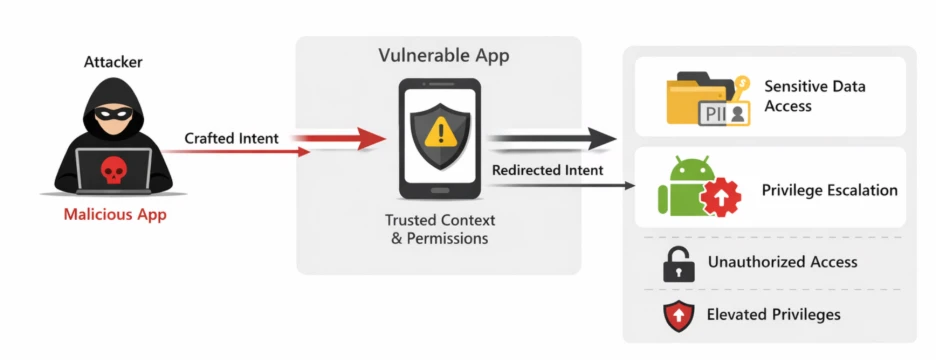

# EngageLab SDK Flaw Opens Door to Private Data on 50M Android Devices

**Android SDK Risk**{.cve-chip}  **Intent Redirection**{.cve-chip}  **EngageLab SDK**{.cve-chip}  **Mobile Data Exposure**{.cve-chip}

## Overview
A security flaw in the EngageLab Android SDK allowed malicious applications to abuse improperly validated intents and access sensitive data from other apps integrating the SDK. The issue undermines Android's intended app-isolation boundaries in affected app contexts.

The reported impact spans millions of installations, including high-risk wallet and finance-related deployments.

## Technical Specifications

| **Attribute** | **Details** |
|---------------|-------------|
| **Vulnerability Type** | Intent Redirection |
| **Affected Component** | `MTCommonActivity` (exported activity) |
| **Root Cause** | External intents accepted without adequate validation |
| **Build/Exposure Behavior** | Exported component automatically introduced during app build in affected integrations |
| **Privilege Context** | Malicious requests can execute with victim app permissions |
| **Potential Abuse Outcomes** | Access to private files, interaction with internal content providers, sensitive-data extraction |
| **Exposure Scale (Reported)** | Up to 50M Android device installs potentially affected |

## Affected Products
- Android applications integrating vulnerable EngageLab SDK versions
- Apps exposing `MTCommonActivity` through exported activity configuration
- Wallet and financial apps reported in the affected ecosystem
- User devices with sideloaded or untrusted apps capable of sending crafted intents

## Attack Scenario
1. **Malicious App Presence**:
   Attacker publishes or installs a malicious Android app on a target device.

2. **Crafted Intent Delivery**:
   The malicious app sends a specially crafted intent to a vulnerable app.

3. **Unsafe Intent Handling**:
   EngageLab SDK logic processes the intent without strict validation.

4. **Privilege Abuse**:
   The request executes under the victim app's trust/permission context.

5. **Unauthorized Data Access**:
   Attacker obtains sensitive files, provider data, tokens, or other private information.

## Impact Assessment

=== "Integrity"
    * Malicious cross-app action execution in victim app context
    * Potential misuse of trusted internal app components
    * Increased risk of unauthorized workflow manipulation

=== "Confidentiality"
    * Leakage of credentials, tokens, personal data, and wallet-related information
    * Unauthorized access to internal app storage and private content providers
    * Broader user privacy exposure across affected app ecosystems

=== "Availability"
    * Possible app instability from malformed or hostile intent interactions
    * Increased incident response overhead for affected developers and operators
    * User trust and platform confidence degradation in high-risk app categories

## Mitigation Strategies

### For Developers
- Update to EngageLab SDK v5.2.1 or later.
- Disable unnecessary exported components.
- Validate all incoming intents and calling contexts.
- Enforce strict permission checks for sensitive code paths.

### For Users
- Keep installed apps updated to latest patched versions.
- Avoid installing untrusted applications and unknown APK sources.
- Remove outdated or unused applications that no longer receive updates.

### Monitoring & Detection
- Monitor for suspicious inter-app intent traffic and abnormal component invocation.
- Alert on unexpected access to sensitive storage/providers by non-core workflows.
- Integrate mobile telemetry into SOC/SIEM workflows where possible.

## Resources and References

!!! info "Open-Source Reporting"
    - [EngageLab SDK flaw opens door to private data on 50M Android devices](https://securityaffairs.com/190586/hacking/engagelab-sdk-flaw-opens-door-to-private-data-on-50m-android-devices.html)
    - [Intent redirection vulnerability in third-party SDK exposed millions of Android wallets to potential risk | Microsoft Security Blog](https://www.microsoft.com/en-us/security/blog/2026/04/09/intent-redirection-vulnerability-third-party-sdk-android/)
    - [EngageLab SDK Flaw Exposed 50M Android Users, Including 30M Crypto Wallet Installs](https://thehackernews.com/2026/04/engagelab-sdk-flaw-exposed-50m-android.html)
    - [Critical EngageLab SDK Bug Put 50 Million Android Users and 30 Million Wallets at Risk](https://cybersecuritywaala.com/news/engagelab-sdk-intent-redirection-exposes-millions/)
    - [Microsoft: Third-Party Android Vulnerability Leaves Over 50M Users Exposed](https://www.techrepublic.com/article/news-engagelab-sdk-android-vulnerability-malware-bridge/)

---

*Last Updated: April 12, 2026*
