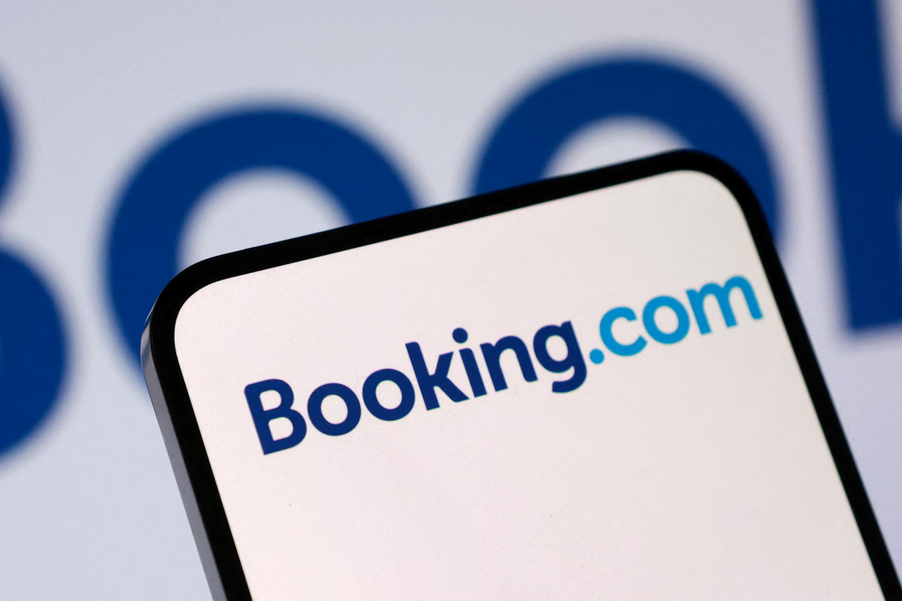
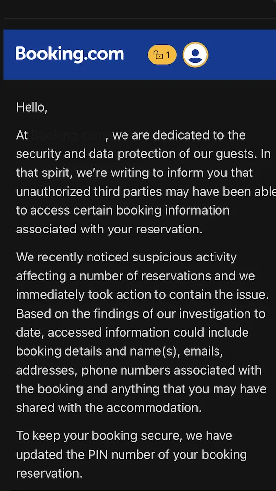

# Hackers Access Booking.com User Data, Company Secures Systems

**Data Breach**{.cve-chip} **Travel Platform**{.cve-chip} **PII Exposure**{.cve-chip}

## Overview

Booking.com confirmed that attackers gained unauthorized access to customer booking data after suspicious activity was detected by internal monitoring systems. The breach affected reservation-related information and exposed sensitive personal details connected to travel bookings and customer communications. The company stated that payment card data was not accessed, and responded by blocking unauthorized access, securing affected systems, and resetting impacted reservation PINs. The root cause has not been publicly disclosed, though possible scenarios include credential compromise, API abuse, or compromise of a partner or hotel-side system.

## Technical Specifications

| Attribute | Details |
|-----------|---------|
| **Organization** | Booking.com |
| **Incident Type** | Unauthorized Access / Customer Data Breach |
| **Affected Data Scope** | Reservation and Booking-Related Customer Data |
| **Data Exposed** | Names, Email Addresses, Phone Numbers, Booking Details, Customer Communications |
| **Payment Card Data** | Not Reportedly Accessed |
| **Detection Method** | Internal Monitoring Systems |
| **Mitigation Actions** | Blocked Unauthorized Access, Secured Systems, Reset Reservation PINs |
| **Root Cause** | Undisclosed (Possible Credential Abuse, API Abuse, or Third-Party Compromise) |

## Affected Data and Systems

- **Customer Booking Records**: Reservation details, travel timing, accommodation references, and associated communications
- **Personally Identifiable Information (PII)**: Customer names, email addresses, and phone numbers
- **Reservation Access Controls**: Reservation PINs reset as part of remediation, suggesting risk to booking management workflows or lookup functions
- **Partner / Hotel Ecosystem**: Possible indirect exposure path if attacker access originated through connected partner systems or compromised hotel-side accounts
- **Customer Communications**: Booking-related messages and communications that could support convincing phishing or social engineering activity

## Technical Details

- Suspicious activity was identified through Booking.com's internal monitoring, indicating the organization detected abnormal access patterns or anomalous interactions with reservation-related systems
- Attackers gained unauthorized access to booking or reservation systems containing customer travel and communication data
- Exposed information reportedly included names, email addresses, phone numbers, booking details, and related communication history
- Booking.com stated that payment or credit card data was not accessed, suggesting segmentation between reservation data and payment processing environments or third-party payment handling
- Reservation PINs were reset after detection, implying a concern that booking lookup or modification capabilities could otherwise be abused by threat actors
- The initial intrusion vector remains undisclosed, but plausible scenarios include stolen partner credentials, phishing, abuse of customer-service workflows, or API access misuse against booking-related systems
- The exposed dataset is highly valuable for follow-on phishing because it contains contextual travel details that can make fraudulent hotel or Booking.com messages appear credible
- Attackers may use the stolen data to impersonate Booking.com support or accommodation providers, requesting payments, re-confirmation of details, or urgent action tied to upcoming reservations

## Attack Scenario

1. **Initial Access**: Attackers likely gain access through compromised credentials, phishing, abuse of third-party partner accounts, or misuse of an exposed API or booking-management workflow
2. **System Access**: Using valid or hijacked access, the threat actor reaches reservation or customer-service systems that store booking records and associated user communications
3. **Data Enumeration**: The attackers identify high-value records containing customer names, email addresses, phone numbers, itinerary details, and message histories
4. **Data Extraction**: Reservation-related datasets are copied or queried in bulk, allowing the attackers to collect structured customer PII and travel context
5. **Detection**: Internal monitoring systems flag suspicious activity or abnormal access behavior, prompting investigation by Booking.com security teams
6. **Containment**: Booking.com blocks unauthorized access, secures affected systems, and resets reservation PINs and possibly related credentials to prevent continued misuse
7. **Follow-On Abuse**: Even after containment, attackers may use the stolen booking context to launch targeted phishing or social engineering campaigns impersonating Booking.com or partner hotels
8. **User Impact**: Affected customers face privacy exposure, increased fraud risk, and the possibility of highly tailored scams built around real travel reservations

## Impact Assessment

=== "Direct Impact"

    - **PII Exposure**: Customer names, email addresses, phone numbers, and travel-related details were exposed to unauthorized parties
    - **Privacy Risk**: Reservation information can reveal travel plans, accommodation details, and communication patterns that customers reasonably expect to remain private
    - **Account and Booking Risk**: Resetting reservation PINs indicates a risk that exposed information could be used to access or manipulate booking records if not remediated quickly
    - **Trust Impact**: Users may lose confidence in Booking.com’s ability to safeguard travel and communication data

=== "Indirect Impact"

    - **Targeted Phishing**: Real booking details make phishing emails or messages impersonating Booking.com or hotels significantly more convincing
    - **Financial Fraud**: Attackers can pressure customers to pay fake invoices, update payment details, or authorize fraudulent transactions related to real trips
    - **Identity Theft and Social Engineering**: Combined PII and travel context increase the effectiveness of impersonation, credential harvesting, and account takeover attempts
    - **Partner Ecosystem Risk**: Hotels or service partners connected to the platform may also face follow-on impersonation attacks leveraging stolen booking context

=== "Business Impact"

    - **Brand and Reputational Damage**: Public confirmation of unauthorized access to user data harms trust in a global consumer travel platform
    - **Support and Incident Costs**: Customer support burden rises sharply as users seek verification, assistance, or remediation for suspicious messages and booking concerns
    - **Regulatory and Legal Exposure**: Data protection obligations, breach notification requirements, and potential regulatory scrutiny may follow depending on affected regions and data types
    - **Long-Term Abuse Window**: Even with no payment card data exposed, reservation context retains value over time for fraud campaigns tied to future travel dates

## Mitigation Strategies

### For Users

- **Do Not Share Payment Details via Email or Messaging Apps**: Booking or hotel staff should not request card details through unofficial channels; treat such requests as suspicious
- **Verify Bookings Through Official Platforms**: Use the Booking.com app, website, or known official contact points rather than links sent in unsolicited messages
- **Be Cautious with Urgent Messages**: Treat urgent payment requests, booking changes, or account warnings tied to real reservations as potential phishing attempts until independently verified
- **Enable MFA on Accounts**: Turn on multi-factor authentication wherever available to reduce risk from credential reuse or account takeover attempts
- **Monitor for Fraud**: Watch email, SMS, and banking activity closely after breach notifications, especially if upcoming travel plans could be used as lure material

### For Organizations

- **Enforce Strong Authentication for Partner Access**: Require MFA, conditional access, and least-privilege controls for hotel, vendor, and support-side access to reservation systems
- **Monitor Abnormal Access to Booking Systems**: Detect unusual data queries, bulk exports, failed login patterns, and anomalous access to booking-management functions or APIs
- **Implement Zero Trust Architecture**: Apply strong segmentation, device trust, identity verification, and continuous access validation across customer, partner, and internal support systems
- **Enhance Logging and Anomaly Detection**: Centralize logs for booking workflows, API calls, partner access, and administrative actions; alert on suspicious deviations from normal usage patterns
- **Run Phishing Awareness Campaigns**: Educate both staff and customers about likely follow-on phishing scenarios using real reservation context and impersonation of hotels or Booking.com support
- **Review Third-Party Exposure**: Audit partner and vendor access paths, service integrations, and any external systems that can reach booking-related data or communications

## Resources

!!! info "Open-Source Reporting"
    - [Hackers Access Booking.com User Data, Company Secures Systems](https://securityaffairs.com/190757/data-breach/hackers-access-booking-com-user-data-company-secures-systems.html)
    - [Booking.com Warns Customers of Hack That Exposed Their Data | The Guardian](https://www.theguardian.com/technology/2026/apr/13/booking-com-customers-hack-exposed-data)
    - [Booking.com Confirms Hackers Accessed Customers' Data | TechCrunch](https://techcrunch.com/2026/04/13/booking-com-confirms-hackers-accessed-customers-data/)
    - [Scammers Are Posing as Booking.com After Global Data Breach | News24](https://www.news24.com/business/money/scammers-are-posing-as-bookingcom-after-global-data-breach-20260413-0909)
    - [Booking.com Warns Customers of Possible Data and Security Breach by 'Unauthorised Parties' | ABC News](https://www.abc.net.au/news/2026-04-13/booking-com-data-security-breach-personal-details/106557630)

---

*Last Updated: April 14, 2026*