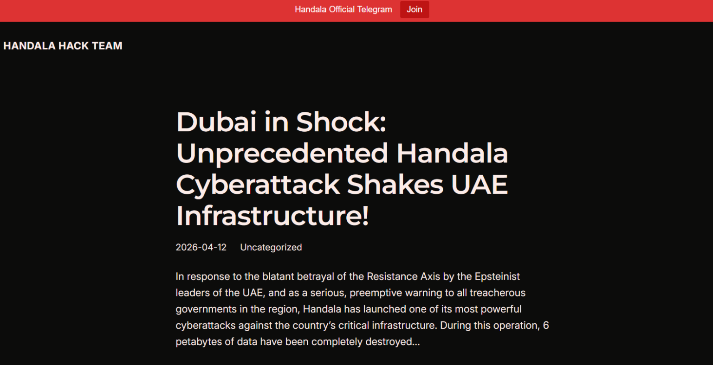
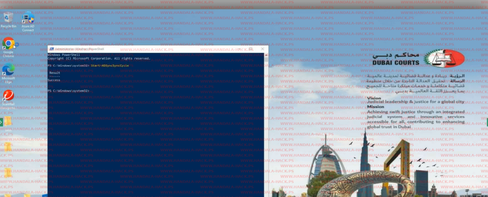

# Iran-Linked Group Handala Claims to Have Breached Three Major UAE Organizations

**Iran-Linked Hacktivists**{.cve-chip} **Data Exfiltration Claim**{.cve-chip} **Destructive Attack Claim**{.cve-chip}

## Overview

An Iran-linked hacktivist group known as Handala claimed responsibility for a large-scale cyberattack targeting three major UAE government organizations: Dubai Courts, Dubai Land Department, and Dubai Roads & Transport Authority. The group alleges it exfiltrated massive volumes of sensitive data and carried out destructive actions against internal systems. If true, the incident would represent a high-impact regional cyber operation affecting judicial, land administration, and transportation services. At the time of reporting, UAE authorities have not publicly confirmed the breach claims.

## Technical Specifications

| Attribute | Details |
|-----------|---------|
| **Threat Actor** | Handala (Iran-Linked Hacktivist Group) |
| **Target Organizations** | Dubai Courts, Dubai Land Department, Dubai Roads & Transport Authority |
| **Claimed Exfiltration Volume** | Approximately 149 TB |
| **Claimed Destruction Volume** | Approximately 6 PB |
| **Attack Type** | Claimed Data Theft and Destructive Intrusion |
| **Motivation** | Political / Regional Cyber Tensions |
| **Initial Access (Likely)** | Credential Compromise, Phishing, or Leaked Credentials |
| **Post-Compromise Activity** | Lateral Movement, Administrative Tool Abuse, Possible Wiper-Like Actions |
| **Public Evidence** | No confirmed malware samples or verified IOCs released publicly |

## Affected Organizations

- **Dubai Courts**: Potential exposure of legal records, court workflows, case materials, and internal judicial communications
- **Dubai Land Department**: Potential compromise of land ownership records, property transaction data, cadastral systems, and citizen records
- **Dubai Roads & Transport Authority**: Potential disruption affecting transportation operations, internal systems, service coordination, and infrastructure management data
- **Government Users & Citizens**: Potential downstream impact to residents, legal entities, and public-service users whose data may reside in affected systems

## Technical Details

- Claims indicate a large-scale intrusion involving both data exfiltration and destructive activity, though independent validation is not yet available
- Based on Handala's known tradecraft, likely initial access vectors include phishing, credential reuse, or abuse of leaked credentials obtained from prior compromise activity
- Operators likely relied on legitimate administrative tools and LOLBins to reduce malware footprint and blend with ordinary system administration activity
- Cloud management or device management platforms may have been abused to access distributed systems and accelerate post-compromise operations
- The reported exfiltration volume suggests access to centralized storage, backup repositories, or large internal data platforms rather than isolated endpoint theft alone
- Claimed destructive activity may indicate file deletion, system wiping, storage corruption, or deliberate sabotage of business-critical data stores
- No public malware samples, forensic indicators, or infrastructure IOCs had been released at the time of reporting, limiting definitive attribution and technical confirmation
- Public disclosure through online channels appears intended to amplify psychological pressure and geopolitical signaling, consistent with prior hacktivist information operations

## Attack Scenario

1. **Initial Access**: Attackers likely obtain entry using compromised credentials, phishing against government employees, or credentials leaked from prior intrusions
2. **Privilege Expansion**: After gaining foothold access, the operators escalate privileges and enumerate identity systems, administrative consoles, file repositories, and cloud-connected environments
3. **Lateral Movement**: Using legitimate administrative tools, remote management utilities, and built-in Windows features, the attackers move across internal government systems and possibly interconnected cloud platforms
4. **Data Collection**: Sensitive datasets from judicial, land, and transportation systems are identified and aggregated for exfiltration, potentially including citizen data, internal records, and operational documents
5. **Data Exfiltration**: Large volumes of data are transferred out through remote channels, likely using encrypted outbound sessions or trusted administrative pathways to avoid immediate detection
6. **Destructive Activity**: Following exfiltration, the attackers may deploy destructive actions such as deleting files, corrupting repositories, or using wiper-like techniques to damage system availability and recovery capability
7. **Operational Impact**: Affected organizations may experience service degradation, record access issues, disruption of internal workflows, or broader public-facing service interruptions if core platforms are impacted
8. **Public Claim & Psychological Effect**: Handala publicly announces the operation through online channels to maximize political, psychological, and reputational impact regardless of the full technical scope actually achieved

## Impact Assessment

=== "Operational Impact"

    - **Judicial Disruption**: Court operations, case handling, scheduling, and legal record access may be interrupted if Dubai Courts systems were genuinely affected
    - **Land Administration Risk**: Compromise of ownership records or transaction systems could delay real estate processing and undermine trust in record integrity
    - **Transportation Service Interruption**: Internal disruption at the Roads & Transport Authority could affect service coordination, planning systems, or supporting operational platforms
    - **Recovery Burden**: If destructive actions occurred, recovery may require large-scale restoration from clean backups and extensive forensic validation

=== "Data Exposure Impact"

    - **Sensitive Government Data Exposure**: Large-scale exfiltration could include legal records, citizen data, administrative documents, and operational datasets
    - **Public Trust Erosion**: Claims involving major UAE institutions create immediate reputational damage even before technical confirmation is complete
    - **Secondary Abuse Risk**: Stolen information may be leaked, sold, or used to support follow-on phishing, extortion, or influence operations
    - **Integrity Concerns**: Even without public data release, uncertainty around record integrity can disrupt normal business and government processes

=== "Strategic Impact"

    - **Regional Cyber Tension Escalation**: A successful or credibly claimed attack against major UAE organizations heightens existing geopolitical cyber tensions in the region
    - **Psychological Operations Value**: Publicly claiming multi-agency compromise amplifies political messaging and fear, which may be part of the intended objective even if technical details remain incomplete
    - **Government Sector Targeting Trend**: The incident underscores the attractiveness of public-sector institutions as symbolic and operational targets in regional cyber conflict
    - **Policy and Security Pressure**: High-profile breach claims increase pressure on UAE institutions to strengthen identity controls, monitoring, segmentation, and backup resilience

## Mitigation Strategies

### Immediate Actions

- **Verify System and Backup Integrity**: Validate the integrity of critical systems, backup repositories, and recovery images before restoration activities begin
- **Reset Potentially Compromised Credentials**: Force password resets for privileged, service, and administrator accounts; enforce MFA across affected identity systems immediately
- **Monitor for Data Leakage**: Continuously monitor Telegram channels, leak sites, underground forums, and dark web sources for publication or sale of claimed stolen data
- **Hunt for Administrative Abuse**: Review logs for unusual use of PowerShell, PsExec, RDP, scheduled tasks, cloud admin actions, and other LOLBin-style post-compromise activity

### Preventive Measures

- **Implement Zero Trust Architecture**: Apply continuous verification, least privilege, and conditional access across government systems and remote administration workflows
- **Strengthen Identity and Access Management**: Harden IAM processes, restrict privilege assignment, rotate secrets regularly, and review federation and cloud identity trust paths
- **Monitor Privileged Activity**: Deploy detections for abnormal administrator behavior, privilege escalation, unusual remote access patterns, and mass data access events
- **Deploy EDR/XDR**: Use endpoint and extended detection solutions capable of identifying credential misuse, lateral movement, and destructive post-exploitation behavior
- **Network Segmentation**: Isolate critical judicial, land, and transport environments to limit attacker movement between agencies and core systems
- **Maintain Immutable Offline Backups**: Keep regularly tested offline backups that cannot be modified from production environments; verify restoration procedures often
- **Security Awareness Training**: Train staff against phishing and credential theft, especially employees in high-value administrative or citizen-data roles

## Resources

!!! info "Open-Source Reporting"
    - [Iran-linked Group Handala Claims to Have Breached Three Major UAE Organizations](https://securityaffairs.com/190716/hacking/iran-linked-group-handala-claims-to-have-breached-three-major-uae-organizations.html)

---

*Last Updated: April 14, 2026*