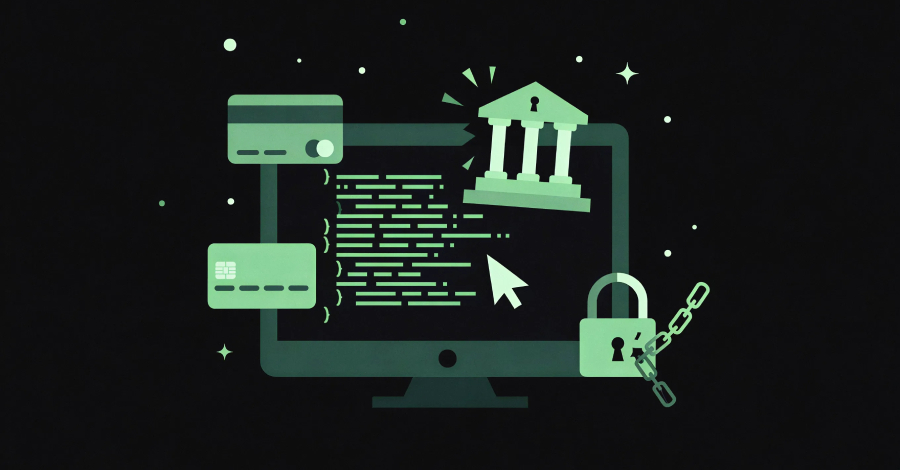
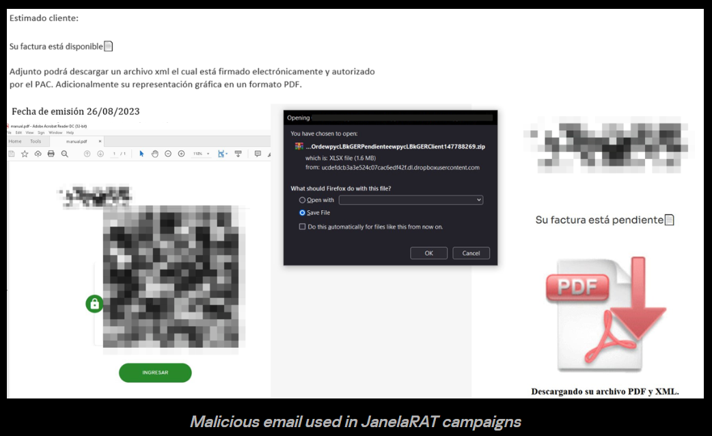
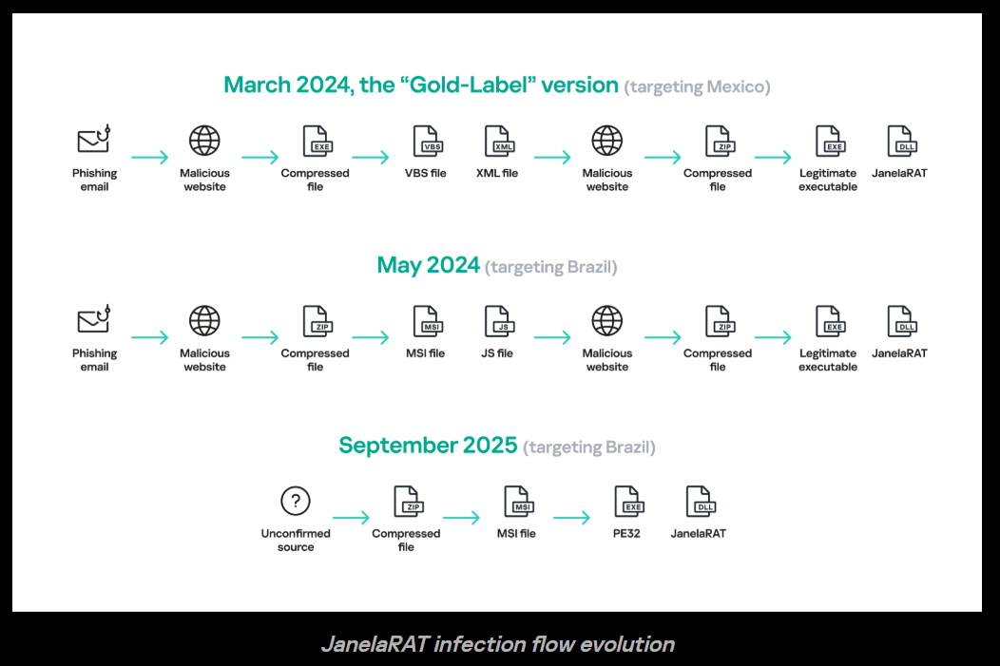

# JanelaRAT Malware Targets Latin American Banks with 14,739 Attacks in Brazil in 2025

**Banking Malware**{.cve-chip} **Remote Access Trojan**{.cve-chip} **Latin America**{.cve-chip}

## Overview

JanelaRAT is a sophisticated remote access trojan focused on financial theft and credential interception, with strong targeting of banking users in Latin America. The malware is primarily distributed through phishing campaigns and uses a multi-stage infection chain to deploy its final payload while evading detection. Once installed, it monitors user activity, especially access to banking websites, and steals credentials or active session data that can be used for fraudulent transactions, account takeover, and broader financial abuse. Reporting indicates 14,739 attacks were observed in Brazil during 2025, highlighting the scale of the campaign.

## Technical Specifications

| Attribute | Details |
|-----------|---------|
| **Malware Name** | JanelaRAT |
| **Type** | Remote Access Trojan / Banking Malware |
| **Primary Region** | Latin America |
| **Observed Activity** | 14,739 Attacks in Brazil During 2025 |
| **Initial Vector** | Phishing Emails with Malicious ZIP Attachments |
| **Execution Chain** | ZIP -> Scripts (VBS/BAT/XML) -> ZIP -> Legitimate EXE + Malicious DLL |
| **Execution Technique** | DLL Side-Loading |
| **Browser Component** | Malicious Chromium-Based Browser Extension |
| **Capabilities** | Keylogging, Screenshots, Mouse Tracking, Browser Data Exfiltration |
| **Unique Behavior** | Window Title Monitoring for Banking Session Detection |
| **Tools / Components** | PowerShell, Batch Scripts, Go-Based Payloads |

## Affected Targets and Systems

- **Online Banking Users**: Individuals accessing Latin American banking portals from infected Windows systems
- **Chromium-Based Browsers**: Google Chrome, Microsoft Edge, Brave, Opera, and other Chromium-derived browsers that can load malicious extensions
- **Windows Endpoints**: Systems targeted through phishing-delivered ZIP archives and staged script execution
- **Financial Institutions**: Banks indirectly affected through credential theft, session hijacking, and fraudulent transactions against customers
- **Organizations Handling Financial Activity**: Businesses and employees using online banking portals from enterprise-managed devices

## Technical Details

- The infection chain begins with a phishing email, often themed as a fake invoice, billing notice, or other urgent business-related document
- Victims download a ZIP archive containing script-based stages such as VBS, BAT, or XML components that unpack and launch additional payloads
- A secondary ZIP or unpacked directory contains a legitimate executable paired with a malicious DLL, enabling DLL side-loading to execute the malware under the guise of trusted software
- JanelaRAT uses PowerShell, batch scripts, and Go-based payload components to stage execution, persistence, and post-infection actions
- The malware installs a malicious browser extension in Chromium-based browsers, providing deep visibility into web activity and browser session data
- Core capabilities include keylogging, screenshot capture, mouse tracking, and exfiltration of browser-stored or in-session information
- A distinctive technique involves monitoring active window titles to identify when the victim is visiting a banking site, allowing the malware to trigger theft behavior at the most valuable moment
- When a banking session is detected, the malware can capture credentials, intercept authentication flows, or steal session material that supports follow-on financial fraud
- DLL side-loading and the use of legitimate binaries help reduce detection by endpoint tools that focus only on obviously malicious executables

## Attack Scenario

1. **Phishing Delivery**: The victim receives a phishing email, often disguised as a fake invoice, payment notice, or business document requiring attention
2. **Archive Download**: The victim downloads a malicious ZIP attachment or file bundle from the email or linked infrastructure
3. **Script Execution**: Embedded VBS, BAT, or XML-based scripts execute and begin unpacking the next infection stages on the endpoint
4. **DLL Side-Loading Deployment**: A legitimate executable is launched together with a malicious DLL, causing JanelaRAT to run through DLL side-loading while appearing to originate from trusted software
5. **Browser Extension Installation**: The malware installs a malicious extension into a Chromium-based browser to monitor browser activity and access sensitive session data
6. **Banking Session Detection**: JanelaRAT watches window titles and user behavior until the victim opens an online banking portal or related financial application
7. **Credential and Session Theft**: Once a banking session is active, the malware captures credentials, screenshots, keystrokes, mouse actions, or session tokens needed for fraud
8. **Financial Abuse**: The attacker uses the stolen data to perform unauthorized transactions, hijack accounts, or support follow-on account takeover activity against the victim or business

## Impact Assessment

=== "Direct Technical Impact"

    - **Credential Theft**: Online banking usernames, passwords, and potentially session tokens can be stolen from infected endpoints
    - **Session Hijacking**: Active authenticated banking sessions may be abused without needing to re-enter credentials manually
    - **Remote Monitoring**: Keylogging, screenshots, and mouse tracking give attackers deep visibility into victim actions and financial workflows
    - **Browser Compromise**: Installation of a malicious browser extension creates persistent access to sensitive web activity across Chromium-based browsers

=== "Financial Impact"

    - **Unauthorized Transactions**: Attackers can use stolen credentials or hijacked sessions to initiate fraudulent transfers or payment actions
    - **Account Takeover**: Victim banking accounts may be fully controlled by attackers, leading to direct financial loss for individuals and businesses
    - **Fraud at Scale**: High attack volume in Brazil indicates a mature operation capable of repeatedly targeting banking users at scale
    - **Institutional Burden**: Banks face fraud response costs, reimbursement pressure, customer support load, and trust erosion

=== "Operational Impact"

    - **User Device Compromise**: Infected systems remain unsafe for financial or business use until fully remediated
    - **Business Workflow Risk**: Employees conducting banking operations from enterprise devices may expose organizational funds and credentials
    - **Detection Challenges**: DLL side-loading, staged scripts, and use of legitimate executables complicate traditional signature-based detection
    - **Longer-Term Exposure**: The browser extension and staged components may allow ongoing monitoring beyond a single theft event

## Mitigation Strategies

### For Individuals

- **Avoid Untrusted Attachments**: Do not open ZIP attachments or execute files from unknown or suspicious senders, especially emails themed as invoices or urgent financial notices
- **Avoid Suspicious Links**: Download software and documents only from verified official sources rather than links delivered by email or messaging
- **Review Browser Extensions Regularly**: Check installed extensions in Chrome, Edge, and other Chromium browsers; remove anything unfamiliar or unapproved immediately
- **Use Updated Endpoint Protection**: Keep antivirus and endpoint security tools updated and enable behavioral detection features where available
- **Separate Banking Activity**: Use a clean, trusted device or hardened browser profile for banking activity when possible

### For Organizations

- **Implement Email Security**: Deploy phishing detection, attachment sandboxing, DMARC/SPF/DKIM controls, and link protection to reduce initial compromise risk
- **Restrict Script Execution**: Limit or block VBS, BAT, and similar scripting where not operationally required; apply PowerShell constrained language mode and script logging
- **Monitor for DLL Side-Loading**: Detect unusual parent-child process chains, unsigned DLL loads by legitimate binaries, and execution from temporary or user-writeable paths
- **Deploy EDR**: Use endpoint detection and response tooling capable of identifying staged script execution, side-loading behavior, malicious browser extensions, and credential theft patterns
- **Enforce Browser Security Policies**: Restrict extension installation to approved sources and signed extensions only; centrally manage browser configuration for enterprise devices
- **Monitor Network Traffic**: Inspect for suspicious outbound traffic, staged payload downloads, and exfiltration behavior associated with compromised endpoints
- **Protect Financial Workflows**: Use segregated systems, stronger authentication, and transaction verification controls for employees handling banking or payments

## Resources

!!! info "Open-Source Reporting"
    - [JanelaRAT Malware Targets Latin American Banks with 14,739 Attacks in Brazil in 2025](https://thehackernews.com/2026/04/janelarat-malware-targets-latin.html)
    - [JanelaRAT Targeting Online Banking Users in Latin America | Securelist](https://securelist.com/janelarat-financial-threat-in-latin-america/119332/)
    - [JanelaRAT Malware Banking-Angriff - IT-Experten Kreis Heinsberg](https://wasacon.com/blog/janelarat-malware-banking-angriff?lang=en-GB)

---

*Last Updated: April 14, 2026*