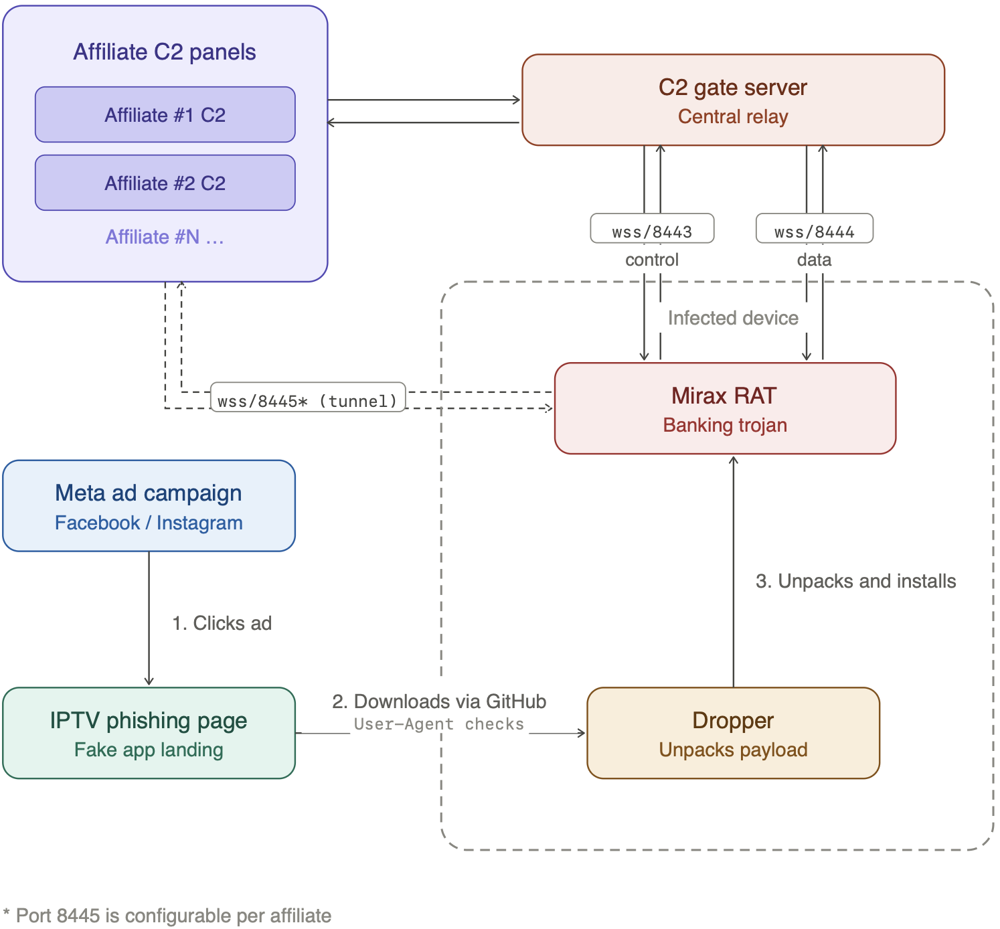

# Mirax Android Malware Campaign

**Android Malware**{.cve-chip} **Banking Trojan**{.cve-chip} **Malware-as-a-Service**{.cve-chip} **Botnet**{.cve-chip}

## Overview

A large-scale cyber campaign leveraging the Mirax Android malware infected over 220,000 users across multiple countries, with a primary focus on Spanish-speaking populations. Distributed through malicious advertising on social platforms and fake applications, Mirax provides attackers with full remote control of compromised devices. Beyond credential theft and banking fraud, infected devices are silently enrolled into a SOCKS5 proxy network, converting ordinary smartphones into anonymous traffic-routing infrastructure for attacker operations. Mirax operates under a Malware-as-a-Service (MaaS) model and is actively sold to affiliates on underground forums.

## Technical Specifications

| Attribute              | Details                                                                 |
|------------------------|-------------------------------------------------------------------------|
| **Malware Family**     | Mirax Android RAT / Banking Trojan                                      |
| **Distribution**       | Malvertising on social platforms; fake APK download pages               |
| **Scale**              | 220,000+ infected devices                                               |
| **Primary Targets**    | Spanish-speaking users; banking customers                               |
| **Delivery Method**    | Malicious APK via phishing pages mimicking legitimate services           |
| **Installation**       | Requires victim to enable sideloading and manual APK installation       |
| **C2 Communication**   | Persistent connection to attacker-controlled Command & Control servers  |
| **Key Capabilities**   | Remote access, overlay attacks, SOCKS5 proxy module                     |
| **Business Model**     | Malware-as-a-Service (MaaS) |

## Affected Products

- **Android devices** — all versions susceptible to sideloaded APK installation
- **Banking applications** — targeted via overlay attacks for credential capture
- **Victim device network infrastructure** — co-opted as SOCKS5 proxy nodes

## Attack Scenario

1. User encounters a malicious advertisement on a social platform (e.g., offering a free streaming service or premium app)
2. Clicking the ad redirects the user to a fake website mimicking a legitimate service or app store
3. The page prompts the user to download and install an APK file directly (sideloading)
4. Victim enables "Install Unknown Apps" in device settings as instructed by the fake site
5. APK is installed; malware requests high-risk permissions (accessibility, overlay, contacts, SMS)
6. Mirax establishes a persistent connection to attacker-controlled C2 infrastructure
7. Attacker gains full remote control of the device and deploys overlay attacks on banking apps
8. Victim's banking credentials and OTPs are harvested in real time during login attempts
9. Stolen credentials are used for unauthorized financial transactions
10. Device's SOCKS5 proxy module activates silently, routing attacker traffic anonymously through the victim's internet connection

## Impact

=== "Technical Impact"

    - Full remote control of infected Android devices via persistent C2 connection
    - Real-time credential harvesting through overlay attacks on banking applications
    - OTP interception enabling full authentication bypass
    - Silent enrollment of victim devices into a SOCKS5 residential proxy botnet
    - Device used as anonymous traffic relay for further attacker operations and fraud

=== "Business Impact"

    - Unauthorized financial transactions and banking fraud for affected users
    - Theft of banking credentials leading to account takeover
    - Victims' devices used to obscure attacker identity during subsequent attacks
    - 220,000+ compromised devices represents significant botnet infrastructure capacity
    - MaaS distribution model enables rapid scaling and affiliate-driven targeting of new regions

=== "Ecosystem Impact"

    - MaaS business model lowers the barrier for less-skilled threat actors to deploy advanced Android RAT capabilities
    - Residential proxy network complicates fraud detection — attacker traffic originates from legitimate user IPs
    - Demonstrates continued weaponization of malvertising on major social platforms for mobile malware distribution
    - Spanish-speaking users disproportionately targeted, reflecting geographically focused threat actor strategy

## Mitigations

### For Individuals

- Avoid installing apps from sources outside the official Google Play Store
- Do not click on advertisements offering "free premium" apps or streaming services
- Disable the **"Install Unknown Apps"** (sideloading) option in Android settings
- Use a reputable mobile security or antivirus solution with real-time scanning
- Regularly review installed app permissions and revoke any that appear excessive or unnecessary

### For Organizations

- Enforce **Mobile Device Management (MDM)** policies that prevent sideloading on corporate devices
- Block installation of APKs from unauthorized sources via policy controls
- Deploy **Mobile Threat Defense (MTD)** solutions to detect anomalous device behavior and C2 communications
- Monitor network traffic for unusual proxy activity or persistent outbound connections on non-standard ports
- Educate employees on social engineering risks via malvertising and unsolicited app download prompts

## Resources

!!! info "Open-Source Reporting"
    - [Mirax malware campaign hits 220K accounts, enables full remote control](https://securityaffairs.com/190842/uncategorized/mirax-malware-campaign-hits-220k-accounts-enables-full-remote-control.html)
    - [Mirax RAT Targeting Android Users in Europe — SecurityWeek](https://www.securityweek.com/mirax-rat-targeting-android-users-in-europe/)
    - [Mirax Android RAT Turns Devices into SOCKS5 Proxies, Reaching 220,000 via Meta Ads](https://thehackernews.com/2026/04/mirax-android-rat-turns-devices-into.html)
    - [Mirax Bot Malware Threat: Android Banking App Vulnerability Exposed Globally](https://www.news4hackers.com/mirax-bot-malware-threat-android-banking-app-vulnerability-exposed-globally/)
    - [Mirax Android Trojan Turns Devices Into Residential Proxy Nodes — Infosecurity Magazine](https://www.infosecurity-magazine.com/news/mirax-trojan-devices-proxy-nodes/)
    - [Mirax: nowy Android RAT zmienia smartfony w narzędzia zdalnej kontroli i węzły proxy — Security Bez Tabu](https://securitybeztabu.pl/mirax-nowy-android-rat-zmienia-smartfony-w-narzedzia-zdalnej-kontroli-i-wezly-proxy/)

---

*Last Updated: April 16, 2026*