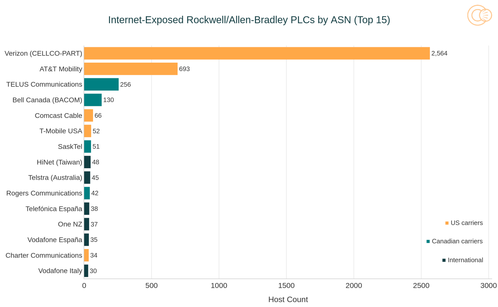
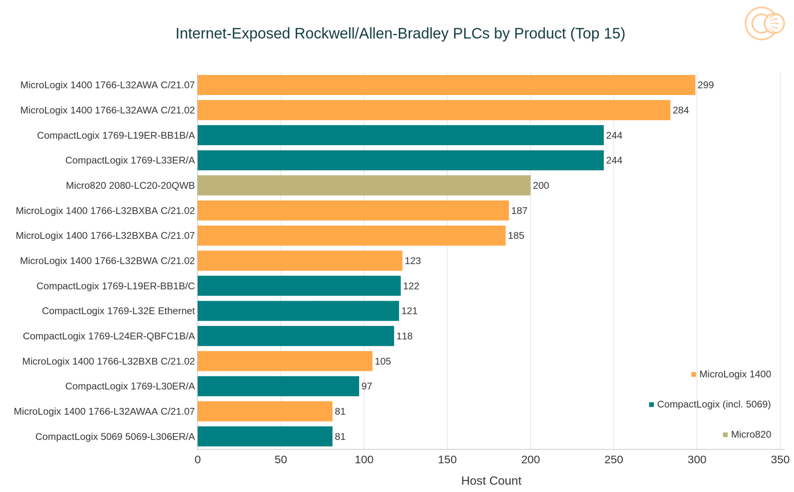

# Exposed ICS/SCADA Devices Targeted by Iranian APTs (Censys Report)

**ICS/SCADA Exposure**{.cve-chip}  **Iranian APT Activity**{.cve-chip}  **Rockwell/Allen-Bradley**{.cve-chip}  **Critical Infrastructure Risk**{.cve-chip}

## Overview
A Censys report identified 5,219 internet-exposed industrial control system (ICS) devices, with a large share associated with Rockwell Automation / Allen-Bradley PLC environments. The report indicates these exposed assets are being actively targeted by Iranian state-linked threat actors.

Direct internet exposure of operational technology systems significantly elevates the risk of unauthorized access, logic manipulation, and disruption of critical infrastructure operations.

## Technical Specifications

| **Attribute** | **Details** |
|---------------|-------------|
| **Incident Type** | Internet-exposed OT/ICS attack surface with active nation-state targeting |
| **Reported Exposure Count** | 5,219 ICS devices (Censys reporting context) |
| **Primary Protocol/Port** | EtherNet/IP on TCP 44818 |
| **Core Weakness** | Insufficient authentication/segmentation enables identification and enumeration |
| **Additional Exposed Services** | VNC, Telnet, Modbus, and in some cases HTTP/FTP |
| **Device Security Condition** | Many systems running outdated firmware |
| **Connectivity Paths** | Public exposure via direct internet, cellular links, and satellite links (including Starlink scenarios) |

## Affected Products
- Internet-exposed ICS/PLC devices, especially Rockwell/Allen-Bradley environments
- OT networks exposing management or industrial protocol services to untrusted networks
- Critical infrastructure operators in sectors such as power, water, and manufacturing
- Organizations with legacy OT firmware and weak remote-access controls

## Attack Scenario
1. **Reconnaissance**:
   Threat actors scan the internet for exposed ICS/PLC services and open industrial ports.

2. **Fingerprinting**:
   Device type, firmware, and service posture are identified through protocol and banner analysis.

3. **Initial Access**:
   Attackers leverage weak or unsecured services such as Telnet/VNC or other exposed interfaces.

4. **Control Manipulation**:
   PLC logic/project files are uploaded or modified, and HMI/process behavior may be altered.

5. **Operational Disruption**:
   Adversaries can disrupt processes, degrade safety, or trigger physical-impact scenarios.

## Impact Assessment

=== "Integrity"
    * Unauthorized modification of PLC logic and industrial control parameters
    * Potential tampering with operational workflows and HMI representations
    * Increased risk of manipulated process behavior across critical environments

=== "Confidentiality"
    * Exposure of industrial architecture, asset inventory, and operational metadata
    * Leakage of sensitive process and infrastructure information
    * Intelligence advantage for adversaries planning follow-on operations

=== "Availability"
    * Disruption of electricity, water, manufacturing, and related critical services
    * Potential physical equipment damage and prolonged recovery windows
    * Financial losses from downtime, incident response, and service interruption

## Mitigation Strategies

### Immediate Actions
- Remove direct internet exposure of ICS/SCADA devices.
- Restrict remote connectivity to secured VPN paths with MFA.
- Disable unnecessary services such as Telnet and VNC.

### Short-term Measures
- Implement strong firewalling and strict IT/OT network segmentation.
- Patch and update firmware on exposed/legacy devices based on risk prioritization.
- Harden authentication and access controls for engineering and remote-management interfaces.

### Monitoring & Detection
- Monitor OT network traffic and logs for suspicious scanning, enumeration, and command activity.
- Alert on unauthorized logic/project file changes and unusual protocol behavior.
- Integrate OT telemetry into SIEM/SOC workflows for rapid triage and response.

## Resources and References

!!! info "Open-Source Reporting"
    - [Censys finds 5,219 devices exposed to attacks by Iranian APTs, majority in U.S.](https://securityaffairs.com/190646/ics-scada/censys-finds-5219-devices-exposed-to-attacks-by-iranian-apts-majority-in-u-s.html)
    - [Iranian-Affiliated APT Targeting of Rockwell/Allen-Bradley PLCs - Censys](https://censys.com/blog/iranian-affiliated-apt-targeting-rockwell-allen-bradley-plcs/)
    - [Iranian-Affiliated Cyber Actors Exploit Programmable Logic Controllers Across US Critical Infrastructure | CISA](https://www.cisa.gov/news-events/cybersecurity-advisories/aa26-097a)
    - [Nearly 4K industrial control devices vulnerable to Iran-linked hacking campaign | Cybersecurity Dive](https://www.cybersecuritydive.com/news/critical-infrastucture-plcs-iran-hacking-censys/817209/)
    - [Nearly 4,000 US industrial devices exposed to Iranian cyberattacks](https://www.bleepingcomputer.com/news/security/nearly-4-000-us-industrial-devices-exposed-to-iranian-cyberattacks/)

---

*Last Updated: April 12, 2026*
