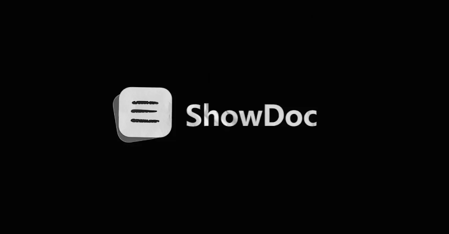

# ShowDoc RCE Flaw CVE-2025-0520 Actively Exploited on Unpatched Servers

**Remote Code Execution**{.cve-chip} **Web Application Security**{.cve-chip} **Active Exploitation**{.cve-chip}

## Overview

A critical vulnerability in the ShowDoc documentation platform (CVE-2025-0520) allows attackers to upload malicious files without proper server-side validation, enabling remote code execution on vulnerable servers. The flaw has been observed in active exploitation and can lead to full system compromise, data theft, service disruption, and potential lateral movement into internal environments. Internet-exposed and unpatched ShowDoc instances, especially versions below 2.8.7, are at highest risk.

## Technical Specifications

| Attribute | Details |
|-----------|---------|
| **CVE ID** | CVE-2025-0520 |
| **Vulnerability Type** | Unrestricted File Upload / Remote Code Execution |
| **CWE** | CWE-434 (Improper Validation of File Upload) |
| **Affected Product** | ShowDoc Documentation Platform |
| **Affected Versions** | ShowDoc < 2.8.7 |
| **Attack Vector** | Internet-Exposed Web Application |
| **Exploitation Method** | Malicious PHP Upload and Remote Invocation |
| **Observed Status** | Actively Exploited in the Wild |

## Technical Details

- The vulnerability stems from improper validation and filtering of uploaded files in ShowDoc's file handling workflow
- Attackers can upload a malicious PHP payload (often a web shell) disguised as a normal document or image upload
- The server stores uploaded content in a directory that remains web-accessible and executable under default or weak configurations
- Because execution restrictions are not enforced in upload paths, the malicious file can be invoked via direct HTTP request
- Once executed, attacker-controlled code runs with the privileges of the web server process, enabling command execution and further payload deployment
- Exploitation can be chained with additional tooling for persistence, privilege escalation attempts, or lateral movement in connected environments
- Active exploitation risk is elevated due to broad internet exposure of self-hosted documentation systems and delayed patching on legacy instances

## Attack Scenario

1. **Target Discovery**: Attacker scans the internet for exposed ShowDoc instances and fingerprints version/build indicators
2. **Vulnerability Identification**: The attacker confirms the target runs an unpatched version (below 2.8.7)
3. **Malicious Upload**: A crafted PHP web shell is uploaded, often disguised as an allowed file type
4. **File Storage in Accessible Path**: ShowDoc saves the file into a web-reachable upload directory without execution controls
5. **Remote Invocation**: Attacker accesses the uploaded file over HTTP/S and triggers server-side execution
6. **Code Execution Established**: Remote code execution is obtained on the application host
7. **Persistence Setup**: Attacker installs additional web shells or backdoors to retain access
8. **Post-Exploitation Activity**: Sensitive documentation is harvested, malware/ransomware may be deployed, and movement to adjacent systems may be attempted

## Impact Assessment

=== "Technical Impact"

    - **Full Server Compromise**: Attackers can execute arbitrary commands on the ShowDoc host
    - **Data Theft**: API documentation, credentials, architecture details, and internal technical notes may be exfiltrated
    - **Malware Deployment**: Compromised servers can be used to deploy miners, stealers, or ransomware
    - **Persistence and Re-Entry**: Web shells allow repeated attacker access even after partial cleanup

=== "Business Impact"

    - **Service Disruption**: Documentation services may become unavailable, defaced, or unstable
    - **Operational Risk**: Loss of internal engineering documentation can delay development and incident response efforts
    - **Reputational Damage**: Public compromise of technical infrastructure undermines trust among customers and partners
    - **Compliance Exposure**: If sensitive data is exposed, notification and regulatory obligations may apply

=== "Ecosystem Impact"

    - **Mass Exploitation Potential**: Publicly exposed unpatched instances enable wide-scale opportunistic attacks
    - **Internal Network Risk**: ShowDoc servers often reside near internal tooling and can become a pivot point for lateral movement
    - **Credential Reuse Risk**: Secrets and endpoints documented in compromised instances can be reused against other systems

## Mitigation Strategies

- **Upgrade Immediately**: Update ShowDoc to version 2.8.7 or later across all environments
- **Restrict Upload Types**: Enforce strict allowlists for file extensions and MIME types; block executable content uploads
- **Disable Execution in Upload Paths**: Configure web server rules to prevent execution of scripts (e.g., `.php`) in upload directories
- **Deploy WAF Protections**: Add rules to detect and block suspicious multipart uploads and web shell access patterns
- **Monitor Security Logs**: Alert on anomalous file uploads, unexpected `.php` file creation, and direct requests to upload paths
- **Scan for Web Shells**: Perform retrospective scans for unknown scripts, modified upload content, and suspicious persistence artifacts
- **Reduce Exposure**: Remove unused instances, place ShowDoc behind VPN/SSO where possible, and avoid direct public exposure
- **Harden Host and Access**: Apply least privilege for web services, rotate credentials, and segment documentation servers from critical internal assets

## Resources

!!! info "Open-Source Reporting"
    - [ShowDoc RCE Flaw CVE-2025-0520 Actively Exploited on Unpatched Servers](https://thehackernews.com/2026/04/showdoc-rce-flaw-cve-2025-0520-actively.html)
    - [CVE-2025-0520: ShowDoc File Upload RCE Vulnerability](https://www.sentinelone.com/vulnerability-database/cve-2025-0520/)
    - [NVD - CVE-2025-0520](https://nvd.nist.gov/vuln/detail/cve-2025-0520)

---

*Last Updated: April 14, 2026*