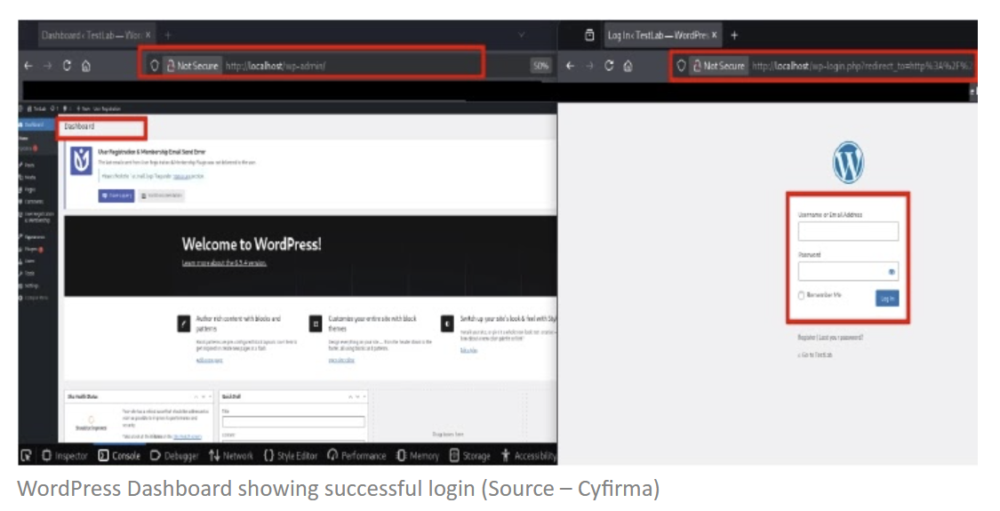

# WordPress Plugin Supply Chain Attack (EssentialPlugin Compromise)

**Supply Chain Attack**{.cve-chip} **WordPress**{.cve-chip} **Backdoor**{.cve-chip} **Remote Code Execution**{.cve-chip}

## Overview

A large-scale supply chain attack compromised a suite of WordPress plugins known as EssentialPlugin. The attacker gained control of the plugin developer's infrastructure and embedded malicious backdoor code into over 30 plugins. These poisoned updates were distributed through legitimate, trusted update mechanisms — bypassing conventional security scrutiny — and resulted in the infection of thousands of websites. The malware enabled remote command execution, spam content injection, and malicious redirections, with some sites experiencing full administrative takeover.

## Technical Specifications

| Attribute               | Details                                                                    |
|-------------------------|----------------------------------------------------------------------------|
| **Attack Type**         | Software supply chain attack (developer account takeover)                  |
| **Target**              | EssentialPlugin suite — 30+ WordPress plugins                              |
| **Distribution Vector** | Official plugin update channels (trusted by site admins)                   |
| **Backdoor Capabilities** | Remote command execution, spam injection, malicious redirects            |
| **C2 Communication**    | Compromised plugins connect to attacker-controlled servers post-install    |
| **Evasion**             | Code initially dormant; activates after widespread installation            |
| **Scale**               | Thousands of WordPress websites affected                                   |
| **Privilege Impact**    | Potential escalation to WordPress admin-level access                       |

## Affected Products

- **EssentialPlugin suite** — 30+ individual WordPress plugins (backdoored versions)
- **WordPress** installations running any affected plugin across all versions
- **Website visitors** — at risk of malware delivery via compromised sites

## Attack Scenario

1. Attacker acquires control of the EssentialPlugin developer account or repository infrastructure
2. Malicious backdoor code is inserted into the codebases of 30+ plugins in the suite
3. Backdoored versions are published as legitimate updates through official WordPress plugin channels
4. Website administrators install updates, trusting the familiar source and update mechanism
5. Malware initially remains dormant to avoid detection during the early distribution phase
6. After achieving widespread installation across thousands of sites, the backdoor activates
7. Each infected site establishes a connection to attacker-controlled C2 infrastructure
8. Attacker issues remote commands, injecting spam content and malicious pages for SEO poisoning
9. Malicious redirects are deployed, sending site visitors to attacker-controlled or malware-hosting URLs
10. In some cases, the attacker escalates privileges to WordPress admin level, achieving full site takeover

## Impact

=== "Technical Impact"

    - Persistent backdoor access across thousands of WordPress websites simultaneously
    - Remote command execution enabling arbitrary server-side code execution
    - Spam and malicious page injection for SEO poisoning and blacklisting
    - Malicious redirects exposing site visitors to phishing or malware delivery
    - Potential full admin-level takeover of affected WordPress installations
    - Dormant activation pattern complicates forensic attribution and timeline reconstruction

=== "Business Impact"

    - Website defacement and reputational damage to site owners
    - Google and search engine blacklisting due to malware/spam content injection
    - Loss of visitor trust and traffic from malicious redirect behavior
    - Data exposure risk if compromised hosting environments contain sensitive customer data
    - Recovery costs: incident response, forensics, site restoration from clean backups
    - Supply chain trust erosion — legitimate update channels weaponized against admins

=== "Ecosystem Impact"

    - Demonstrates the outsized risk of single-developer plugin suites in the WordPress ecosystem
    - Official plugin update infrastructure successfully abused to achieve mass compromise
    - Thousands of downstream website owners harmed by a single upstream developer compromise
    - Visitors to thousands of affected sites exposed to malware without any action on their part
    - Reinforces need for cryptographic signing and integrity verification of plugin updates

## Mitigations

### Immediate Actions

- **Remove all affected EssentialPlugin suite plugins immediately** from infected WordPress installations
- Restore websites from known-clean backups predating the compromised update
- Change all credentials: WordPress admin accounts, hosting panel passwords, database passwords, FTP/SSH credentials
- Scan for unauthorized administrator users added by the backdoor and remove them
- Audit all modified files for injected code and remove any malicious content
- Review server access logs for C2 communication or unauthorized remote commands

### Preventive Measures

- Deploy a **Web Application Firewall (WAF)** to detect and block malicious traffic patterns
- Implement **file integrity monitoring** to detect unauthorized changes to plugin or core files
- Avoid plugins with unclear ownership, abandoned maintenance, or a history of sudden ownership transfers
- Monitor plugin update changelogs and developer reputation before applying updates
- Prefer plugins from established developers with transparent release histories and security disclosure practices
- Consider staging environments where plugin updates are tested before production deployment

## Resources

!!! info "Open-Source Reporting"
    - [WordPress plugin suite hacked to push malware to thousands of sites](https://www.bleepingcomputer.com/news/security/wordpress-plugin-suite-hacked-to-push-malware-to-thousands-of-sites/)
    - [Critical WordPress Plugin Flaw Lets Attackers Bypass Authentication and Gain Admin Access | Cryptika Cybersecurity](https://www.cryptika.com/critical-wordpress-plugin-flaw-lets-attackers-bypass-authentication-and-gain-admin-access/)
    - [WordPress websites under attack — dozens of plugins hijacked to target thousands of sites | TechRadar](https://www.techradar.com/pro/security/wordpress-websites-under-attack-expert-report-says-dozens-of-plugins-hijacked-to-target-thousands-of-sites)
    - [Someone planted backdoors in dozens of WordPress plug-ins used in thousands of websites | TechCrunch](https://techcrunch.com/2026/04/14/someone-planted-backdoors-in-dozens-of-wordpress-plugins-used-in-thousands-of-websites/)

---

*Last Updated: April 16, 2026*