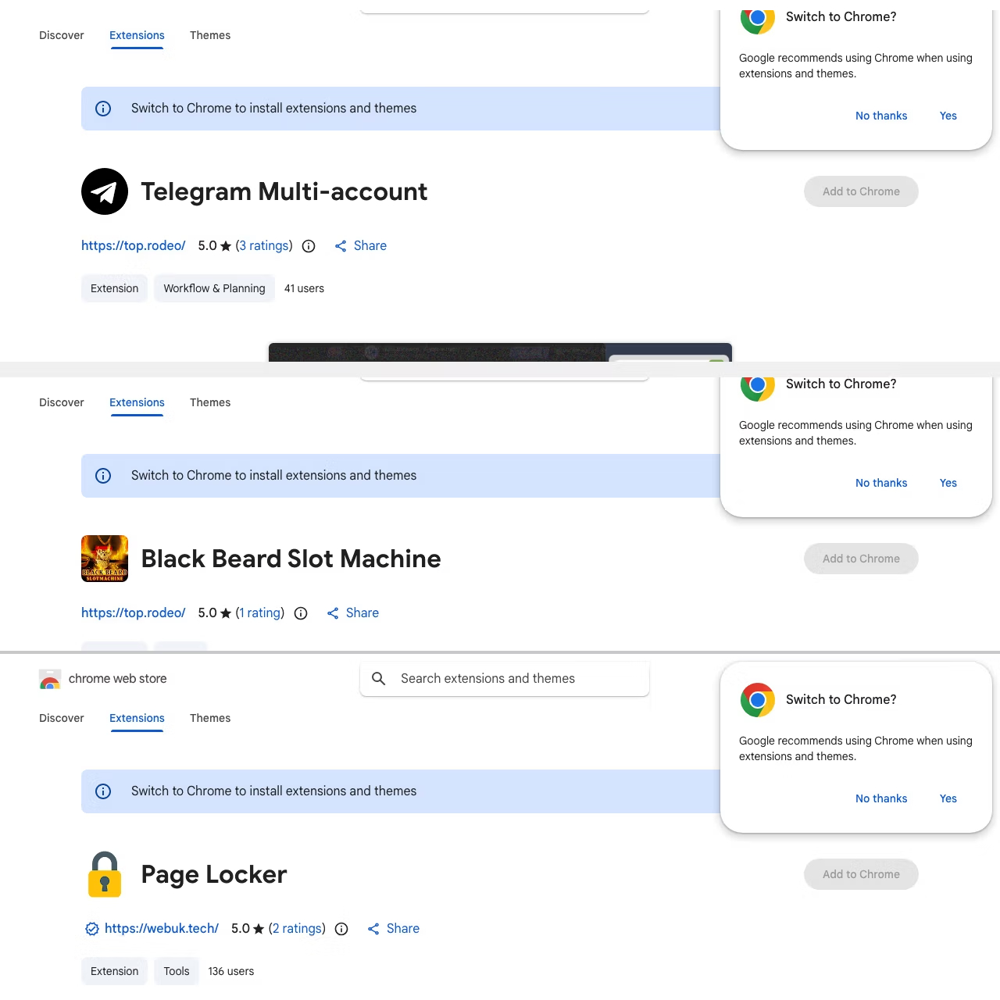

# Malicious Chrome Extensions Campaign (108 Extensions Data Theft Operation)

**Malware**{.cve-chip} **Browser Security**{.cve-chip} **Supply Chain Attack**{.cve-chip} **Credential Theft**{.cve-chip}

## Overview

A large-scale campaign involving 108 malicious browser extensions uploaded to the Chrome Web Store was discovered in April 2026. The extensions impersonated legitimate tools — including Telegram utilities, video enhancers, and translation aids — to deceive users into installation. Once installed, they silently collected authentication tokens, session cookies, and other sensitive data, enabling attackers to hijack accounts without requiring passwords or bypassing multi-factor authentication.

## Technical Specifications

| Attribute            | Details                                                  |
|----------------------|----------------------------------------------------------|
| **Campaign Scale**   | 108 malicious extensions; ~20,000 affected users         |
| **Platform**         | Google Chrome Web Store                                  |
| **Impersonation**    | Telegram tools, video enhancers, translators             |
| **Technique**        | Obfuscated JavaScript, C2 communication, script injection |
| **Data Stolen**      | Google OAuth tokens, Telegram session cookies            |
| **Backdoor**         | Remote command execution, attacker-URL loading           |
| **Exfiltration**     | HTTP requests to attacker-controlled infrastructure      |
| **Defense Evasion**  | CSP (Content Security Policy) bypass                     |

## Affected Products

- **Google Chrome** — all versions supporting Web Store extension installation
- **Google Account / Google Workspace** — via compromised OAuth tokens
- **Telegram** — via stolen session cookies
- **Any website visited by the victim** — due to broad "read all website data" permissions

## Attack Scenario

1. Attacker creates 108 fake browser extensions, each disguised as a popular utility
2. Extensions are uploaded to the Chrome Web Store with convincing descriptions and icons
3. User discovers and installs an extension believing it is legitimate
4. Extension requests high-risk permissions, including access to all website data
5. On installation, obfuscated JavaScript executes hidden malicious logic in the background
6. Extension silently harvests Google OAuth tokens and Telegram session cookies from the browser
7. Stolen credentials are exfiltrated over HTTP to attacker-controlled C2 infrastructure
8. Some extensions leverage backdoor functionality to fetch and execute remote commands or open attacker-controlled URLs
9. Attacker uses stolen tokens to hijack Google and Telegram accounts — bypassing passwords and MFA entirely
10. Optional: injected scripts introduce further malicious content into active browsing sessions, enabling surveillance or lateral movement

## Impact

=== "Technical Impact"

    - Full account takeover for Google and Telegram accounts via stolen OAuth tokens and session cookies
    - MFA bypass — valid session tokens allow account access without credential re-entry
    - Arbitrary script injection into all visited web pages
    - Backdoor access enabling remote command execution on affected browsers
    - CSP bypass suppressing browser-native security protections
    - Persistent exfiltration channel over standard HTTP traffic, blending with normal browsing

=== "Business Impact"

    - Enterprise compromise risk via hijacked Google Workspace accounts
    - Unauthorized access to corporate emails, shared drives, and collaboration tools
    - Potential data theft of confidential business communications and documents
    - Reputational damage and regulatory exposure if employee accounts are breached
    - Lateral movement risk within organizations using SSO tied to compromised Google identities

=== "Ecosystem Impact"

    - Erosion of trust in the Chrome Web Store as a safe extension distribution platform
    - ~20,000 users directly affected across personal and enterprise contexts
    - Demonstrated scalability of supply-chain-style extension campaigns
    - Privacy violations from passive surveillance of all visited websites
    - Broader chilling effect on enterprise browser extension adoption policies

## Mitigations

### Immediate Actions

- Remove all suspicious or unrecognized browser extensions immediately
- Revoke OAuth tokens granted to third-party apps via [Google Account Security Settings](https://myaccount.google.com/permissions)
- Log out from all active Google and Telegram sessions
- Change account passwords as a precaution even if no direct compromise is confirmed
- Review browser extension permissions for any installed extension requesting broad site access

### Preventive Measures

- Install extensions only from verified, well-known developers with established review histories
- Scrutinize permissions before installation — legitimate utilities rarely need "read all website data"
- Deploy endpoint or browser security monitoring tools capable of detecting extension-based data exfiltration
- Enforce extension allowlisting in enterprise environments via browser management policies
- Regularly audit installed extensions across all endpoints

## Resources

!!! info "Open-Source Reporting"
    - [108 Malicious Chrome Extensions Steal Google and Telegram Data, Affecting 20,000 Users](https://thehackernews.com/2026/04/108-malicious-chrome-extensions-steal.html)
    - [Thousands of users hit by malicious Chrome extensions — Cybernews](https://cybernews.com/security/chrome-extensions-flagged-for-stealing-user-data/)
    - [108 Fake Chrome Extensions Were Stealing Your Google and Telegram Data. Remove Them Now.](https://www.gizchina.com/malicious-apps/108-fake-chrome-extensions-were-stealing-your-google-and-telegram-data-remove-them-now)
    - [108 Malicious Chrome Extensions Stole User Data and Hijacked Browsers — HackYourMom](https://hackyourmom.com/en/novyny/108-shkidlyvyh-rozshyren-chrome-kraly-dani-korystuvachiv-i-atakuvaly-brauzery/)
    - [108 malicious Chrome extensions steal Google data](https://www.secnews.gr/en/702794/108-kakovoula-chrome-extensions-dedomena/)
    - [108 Coordinated Malicious Chrome Extensions Exfiltrate OAuth — Threat Campaign Analysis](https://techjacksolutions.com/scc-intel/108-coordinated-malicious-chrome-extensions-exfiltrate-oauth2-tokens-and-telegram-sessions-via-shared-c2-infrastructure/)

---

*Last Updated: April 15, 2026*