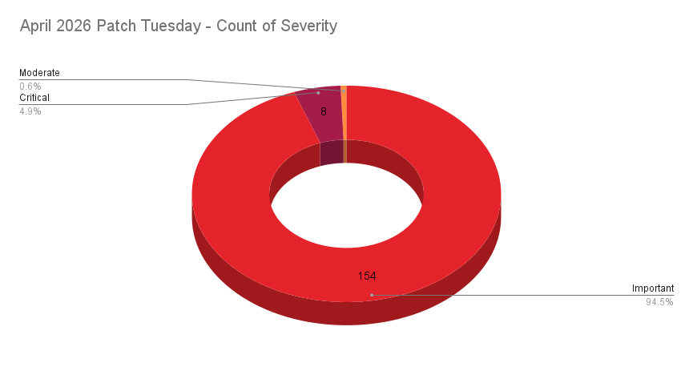
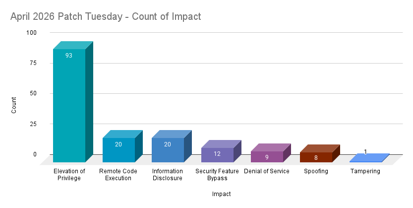
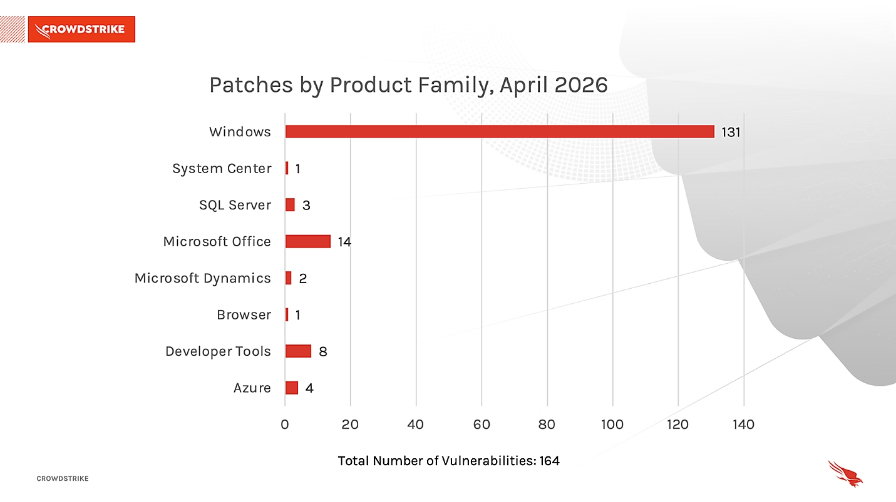

# Microsoft Patch Tuesday — April 2026 (165 Vulnerabilities, SharePoint Zero-Day)

**Patch Tuesday**{.cve-chip} **Zero-Day**{.cve-chip} **Remote Code Execution**{.cve-chip} **SharePoint Server**{.cve-chip}

## Overview

Microsoft's April 2026 Patch Tuesday addressed 165 vulnerabilities across its product portfolio, making it one of the largest single-month update releases in recent years. Among the fixes was a critical zero-day vulnerability in on-premises SharePoint Server that had been actively exploited in the wild before a patch was available. Zero-days are particularly dangerous because defenders have no advance warning — attackers can leverage them freely until a fix is issued and widely deployed.

## Technical Specifications

| Attribute               | Details                                                              |
|-------------------------|----------------------------------------------------------------------|
| **Update Cycle**        | April 2026 Patch Tuesday                                             |
| **Total CVEs Fixed**    | 165                                                                  |
| **Zero-Days**           | At least 1 actively exploited (SharePoint Server RCE)               |
| **Vulnerability Type**  | Remote Code Execution (RCE)                                          |
| **Affected Product**    | On-premises SharePoint Server (SharePoint Online not affected)       |
| **Attack Vector**       | Network (internet-accessible SharePoint deployments)                  |
| **Known Exploitation**  | Active in the wild prior to patch release                            |
| **Related Techniques**  | Deserialization attacks, authentication bypass, low-privilege abuse  |

## Affected Products

- **Microsoft SharePoint Server** (on-premises) — actively exploited zero-day RCE
- **Microsoft 365 / Office suite** — additional CVEs addressed
- **Windows** — multiple privilege escalation and RCE fixes included in the update bundle
- **Other Microsoft services** — 165 total CVEs span Azure, Edge, and developer tools

## Attack Scenario

1. Attacker scans the internet for on-premises SharePoint Server instances exposed on standard ports
2. Identifies unpatched targets vulnerable to the April 2026 zero-day RCE
3. Exploits the vulnerability — likely requiring minimal or no elevated authentication — to submit a malicious request
4. Server-side code deserialization or improper input handling triggers arbitrary code execution
5. Attacker gains an initial foothold on the SharePoint server with server-level privileges
6. Establishes persistence and begins lateral movement into the internal network using the SharePoint server as a pivot point
7. Enumerates and exfiltrates documents, internal files, and credentials stored or accessible via SharePoint
8. Optionally deploys ransomware or additional malware payloads across the compromised environment

## Impact

=== "Technical Impact"

    - Full remote code execution on unpatched SharePoint Server instances
    - Server-level compromise enabling persistent access and command execution
    - Lateral movement potential across the internal network from the compromised server
    - Access to all documents, lists, and data stored in or accessible via SharePoint
    - Risk of credential harvesting from SharePoint-integrated identity systems
    - Pre-patch window of unknown duration during which exploitation was actively occurring

=== "Business Impact"

    - Exfiltration of sensitive business documents and internal communications
    - Potential ransomware deployment causing operational downtime
    - Regulatory and legal exposure if confidential or personal data is accessed
    - Business continuity risk from disrupted SharePoint-dependent workflows
    - Incident response and forensic costs for organizations that were exploited before patching

=== "Ecosystem Impact"

    - Highlights persistent risk of on-premises SharePoint deployments that fall behind patch cadence
    - Reinforces attacker interest in SharePoint as a high-value pivot point inside enterprise networks
    - Organizations slow to apply Patch Tuesday updates remain exposed for extended periods
    - Demonstrates continued exploitation of SharePoint RCE vulnerabilities, consistent with historical patterns (e.g., CVE-2024-38094, CVE-2023-29357)

## Mitigations

### Immediate Actions

- **Apply the April 2026 Patch Tuesday updates immediately** — prioritize SharePoint Server patches
- Restrict public internet access to SharePoint Server deployments that do not require external exposure
- Enable **Microsoft Defender for Endpoint** on SharePoint server hosts for behavioral threat detection
- Enable **AMSI (Antimalware Scan Interface)** integration to intercept malicious script execution server-side
- Review logs for suspicious incoming requests, unusual authentication events, or unexpected process spawning on SharePoint servers

### Best Practices

- Implement network segmentation to limit lateral movement potential from compromised servers
- Enforce least-privilege access controls on SharePoint service accounts and administrator roles
- Establish a regular, timely patch management process to minimize the window of exposure after Patch Tuesday releases
- Consider migrating workloads to SharePoint Online where feasible to shift patching responsibility to Microsoft
- Maintain offline backups of SharePoint content to support recovery in the event of ransomware deployment

## Resources

!!! info "Open-Source Reporting"
    - [Microsoft Patch Tuesday for April 2026 fixed actively exploited SharePoint zero-day](https://securityaffairs.com/190831/security/microsoft-patch-tuesday-for-april-2026-fixed-actively-exploited-sharepoint-zero-day.html)
    - [Microsoft April 2026 Patch Tuesday fixes 167 flaws, 2 zero-days](https://www.bleepingcomputer.com/news/microsoft/microsoft-april-2026-patch-tuesday-fixes-167-flaws-2-zero-days/)
    - [Microsoft and Adobe Patch Tuesday, April 2026 Security Update Review | Qualys](https://blog.qualys.com/vulnerabilities-threat-research/2026/04/14/microsoft-and-adobe-patch-tuesday-april-2026-security-update-review)
    - [April 2026 Patch Tuesday: Updates and Analysis | CrowdStrike](https://www.crowdstrike.com/en-us/blog/patch-tuesday-analysis-april-2026/)
    - [Microsoft's April 2026 Patch Tuesday Addresses 163 CVEs (CVE-2026-32201) | Tenable](https://www.tenable.com/blog/microsofts-april-2026-patch-tuesday-addresses-163-cves-cve-2026-32201)

---

*Last Updated: April 15, 2026*