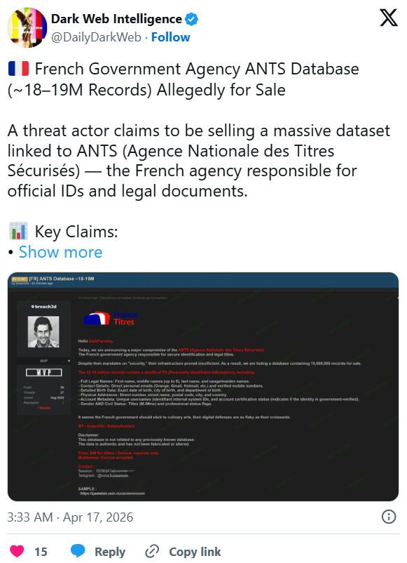
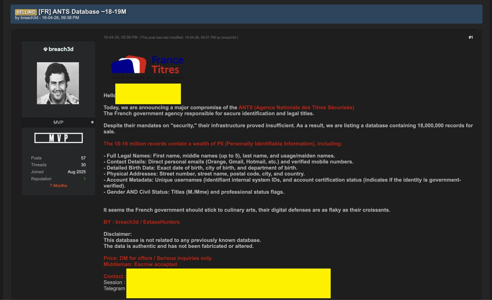

# France ANTS ID System Cyberattack / Data Breach

**Government Data Breach**{.cve-chip} **PII Exposure**{.cve-chip} **Identity Documents**{.cve-chip} **Critical Infrastructure**{.cve-chip}

## Overview

A cyberattack targeted France's National Agency for Secure Documents (ANTS — *Agence Nationale des Titres Sécurisés*), the government platform responsible for managing identity cards, passports, residence permits, and driver's licenses. Authorities confirmed a security incident that may have exposed personal data belonging to users of both individual and professional accounts. The exact attack vector remains under investigation. While ANTS states that uploaded document scans do not appear to have been accessed, the potential scale of exposure is significant given that millions of French citizens use the platform annually.

## Technical Specifications

| Attribute | Details |
|---|---|
| **Target** | ANTS — French National Agency for Secure Documents |
| **Platform Function** | ID cards, passports, residence permits, driver's licenses |
| **Incident Type** | Cyberattack / data breach |
| **Attack Vector** | Under investigation (phishing, credential abuse, or vulnerability exploitation) |
| **Confirmed Exposed Data** | Names, email addresses, dates of birth, login identifiers / account IDs |
| **Potentially Exposed** | Postal addresses, phone numbers, place of birth |
| **Documents Leaked** | No evidence of uploaded document scans (e.g., ID scans) being accessed |
| **Account Access Risk** | Exposed data reportedly cannot directly access accounts |
| **Scope** | Millions of users interact with ANTS annually |

## Affected Products

- **ANTS web portal** — government-operated platform for identity and travel document management
- **Individual user accounts** — personal PII potentially exposed
- **Professional accounts** — business/agency accounts potentially affected
- **Citizens** using the platform for ID card, passport, residence permit, and driving licence services

## Attack Scenario

1. Attackers identify and target the ANTS web portal as a high-value government identity platform
2. Initial access is obtained via an undisclosed vector — likely phishing, credential stuffing, or exploitation of a web application vulnerability
3. Attackers gain unauthorized access to backend systems or account-related data stores
4. Personal information (PII) associated with registered user accounts is extracted
5. Extracted data includes names, email addresses, dates of birth, and login identifiers; possibly also addresses, phone numbers, and place of birth
6. Stolen data is staged and exfiltrated to attacker-controlled infrastructure
7. Claims of data theft surface publicly; potential sale of the dataset on dark web forums is reported and under investigation

## Impact

=== "Technical Impact"

    - Unauthorized extraction of PII from a government-operated identity management platform
    - Exposure of names, email addresses, dates of birth, and login identifiers
    - Potential exposure of additional data including addresses, phone numbers, and place of birth
    - No confirmed access to uploaded document images (ID scans, passport copies)
    - Exposed credentials cannot directly unlock accounts per authority statements, but enable follow-on attacks

=== "Business / Government Impact"

    - Millions of French citizens potentially affected given ANTS annual user volume
    - Government credibility risk: breach of a platform explicitly designed for secure document management
    - Regulatory exposure under GDPR — French data protection authority (CNIL) likely to be involved
    - Significant incident response and notification obligations for individual user communication

=== "Societal Impact"

    - Stolen PII enables targeted phishing, social engineering, and identity theft at scale
    - Affected users at elevated risk of fraud campaigns exploiting their government service context
    - Erosion of public trust in digital government identity services
    - Potential chilling effect on adoption of online public administration platforms

## Mitigations

### Official Guidance to Affected Users

- Users will be notified individually if their data is confirmed to have been accessed
- Be alert to phishing emails referencing identity documents, passport renewals, or ANTS services
- Do not click links in unsolicited emails purporting to be from ANTS or French government services
- Monitor accounts and email for signs of unusual activity or social engineering attempts

### Platform and Organizational Measures

- Increased security measures have been implemented on the ANTS platform following discovery
- Audit access logs for signs of unauthorized backend access and lateral movement
- Validate that sensitive document uploads remain isolated from exposed account data stores
- Enforce multi-factor authentication and anomaly detection on government portal accounts
- Coordinate with CNIL for GDPR breach notification obligations and timeline compliance

## Resources

!!! info "Open-Source Reporting"
    - [France's ANTS ID System website hit by cyberattack, possible data breach](https://securityaffairs.com/191069/data-breach/frances-ants-id-system-website-hit-by-cyberattack-possible-data-breach.html)
    - [Cyberattack at French identity document agency may have exposed personal data | The Record from Recorded Future News](https://therecord.media/france-cyberattack-agency-passports)
    - [French document agency cyberattack: Personal data leak impacts ID and passport holders](https://www.connexionfrance.com/news/personal-data-leak-french-document-agency-hit-by-cyberattack/784573)
    - [Cyberattack likely caused major data leak on French government website](https://f.aa.com.tr/en/europe/cyberattack-likely-caused-major-data-leak-on-french-government-website/3912184)

---

*Last Updated: April 21, 2026*