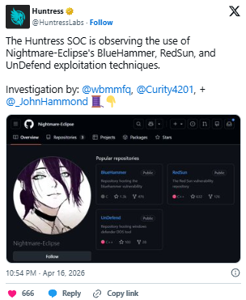
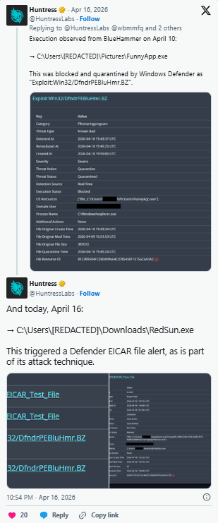

# Microsoft Defender Zero-Day Vulnerabilities (BlueHammer, RedSun, UnDefend)

**Microsoft Defender**{.cve-chip}  **Zero-Day Exposure**{.cve-chip}  **Privilege Escalation**{.cve-chip}  **Defense Tampering Risk**{.cve-chip}

## Overview
Three zero-day vulnerabilities were disclosed in Microsoft Defender under the names BlueHammer, RedSun, and UnDefend. The issues can allow attackers to elevate privileges and weaken endpoint protection controls; two of the reported flaws remain unpatched.

The vulnerabilities target internal Defender behavior, enabling attackers to bypass or disable protections and execute malicious actions with high privileges.

## Technical Specifications

| **Attribute** | **Details** |
|---------------|-------------|
| **BlueHammer** | Patched flaw abusing Defender signature update mechanism |
| **BlueHammer Impact** | Privilege escalation to SYSTEM level |
| **RedSun** | Unpatched flaw in handling of malicious/flagged files |
| **RedSun Impact** | Privilege escalation to SYSTEM level |
| **UnDefend** | Unpatched flaw enabling Defender update/protection interference |
| **UnDefend Impact** | Security control weakening and persistence enablement |
| **Primary Risk Class** | Local privilege escalation + endpoint protection tampering |

## Affected Products
- Windows endpoints using Microsoft Defender where vulnerable code paths are present
- Enterprise environments relying primarily on Defender as first-line endpoint control
- High-value targets where initial foothold can be converted into SYSTEM-level control
- Systems lacking layered monitoring of Defender service and update integrity

## Attack Scenario
1. **Initial Access**:
   Attacker gains foothold via phishing, malware delivery, or insider-assisted execution.

2. **Privilege Escalation**:
   RedSun or BlueHammer primitives are used to obtain SYSTEM privileges.

3. **Defense Degradation**:
   UnDefend behavior is leveraged to disable/interfere with Defender updates and protections.

4. **Post-Exploitation**:
   Attacker deploys ransomware, RATs, spyware, or other payloads and establishes persistence.

## Impact Assessment

=== "Integrity"
    * SYSTEM-level access enables full host control and security policy tampering
    * Defender trust boundaries can be altered to conceal malicious activity
    * Increased ability to stage follow-on compromise across enterprise environments

=== "Confidentiality"
    * Elevated risk of data theft and endpoint surveillance under high privilege
    * Credential and token harvesting opportunities increase with defense evasion
    * Sensitive enterprise and user data may be exposed during prolonged dwell time

=== "Availability"
    * Increased ransomware execution success due to weakened endpoint defenses
    * Reduced detection response can extend outage and remediation timelines
    * Broad operational disruption if compromise propagates laterally

## Mitigation Strategies

### Immediate Actions
- Apply latest Windows and Defender security updates (including BlueHammer patch).
- Verify Defender services and update channels are operational and untampered.
- Isolate suspected compromised hosts pending forensic review.

### Short-term Measures
- Monitor for local privilege-escalation attempts and unusual SYSTEM-context activity.
- Restrict local user/admin rights under least-privilege principles.
- Enable advanced endpoint logging and EDR coverage on all critical assets.

### Monitoring & Detection
- Alert on Defender tampering indicators, disabled update paths, or policy drift.
- Hunt for suspicious child-process chains from security service contexts.
- Correlate privilege-escalation, persistence, and C2 signals in SIEM/SOC workflows.

### Long-term Solutions
- Implement defense-in-depth layers beyond a single endpoint security product.
- Conduct regular red-team exercises focused on security-control bypass scenarios.
- Maintain continuous patch governance with rapid validation and rollback planning.

## Resources and References

!!! info "Open-Source Reporting"
    - [Microsoft defender under attack as three zero-days, two of them still unpatched, enable elevated access](https://securityaffairs.com/190961/hacking/microsoft-defender-under-attack-as-three-zero-days-two-of-them-still-unpatched-enable-elevated-access.html)
    - [Three Microsoft Defender Zero-Days Actively Exploited; Two Still Unpatched](https://thehackernews.com/2026/04/three-microsoft-defender-zero-days.html)
    - [Over 1 billion Windows users at risk after disgruntled security researcher leaks Defender zero-days | Tom's Guide](https://www.tomsguide.com/computing/online-security/over-1-billion-windows-users-at-risk-after-disgruntled-security-researcher-leaks-defender-zero-days)
    - [Three Microsoft Defender Zero-Days Actively Exploited; Two Still Unpatched - Cypro](https://www.cypro.se/2026/04/17/three-microsoft-defender-zero-days-actively-exploited-two-still-unpatched/)

---

*Last Updated: April 19, 2026*
