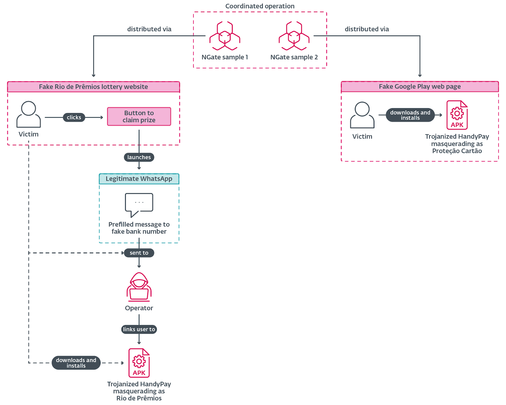
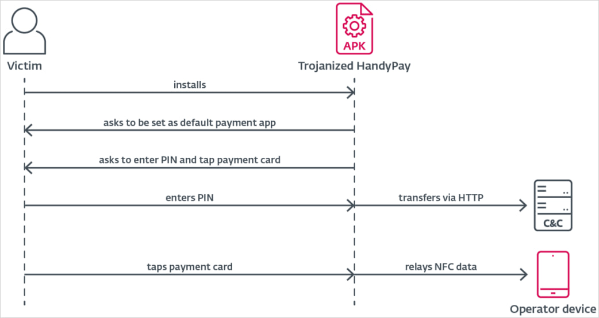

# NGate Android Malware (NFC Relay Attack Campaign)

**Android Malware**{.cve-chip} **NFC Relay Attack**{.cve-chip} **Financial Fraud**{.cve-chip} **Banking Trojan**{.cve-chip}

## Overview

NGate is a sophisticated Android malware that abuses NFC (Near Field Communication) capabilities to capture and relay payment card data in real time. Victims are socially engineered into installing malicious applications — distributed as Progressive Web Apps (PWAs) or fake banking utilities — and then guided to place their physical payment cards near their phones while NFC is active. The malware silently reads the card data and transmits it live to attacker-controlled devices, which can then emulate the captured card to perform fraudulent ATM withdrawals and contactless payments. NGate is based on a modified version of the legitimate NFCGate research tool and does not require root access to operate.

## Technical Specifications

| Attribute | Details |
|---|---|
| **Malware Family** | NGate (based on modified NFCGate) |
| **Platform** | Android |
| **NFC Mechanism** | Uses Android NFC APIs to read ISO 14443 smart card data |
| **Relay Method** | Real-time data relay to attacker-controlled device over encrypted channels (HTTPS) |
| **Distribution** | Phishing SMS/calls → fake PWA/WebAPK or banking utility app installation |
| **Root Required** | No |
| **Key Prerequisite** | NFC enabled on victim device; physical card in proximity |
| **Fraudulent Actions** | ATM cash withdrawal, contactless payment emulation |
| **Known Campaign Target** | Brazil (HandyPay impersonation); broader regional targeting observed |

## Affected Products

- **Android devices** with NFC capability — no root required for compromise
- **Contactless payment cards** (credit/debit) — EMV/NFC-enabled cards susceptible to relay capture
- **Financial institutions** — ATMs and contactless POS terminals targeted via emulated cards

## Attack Scenario

1. Victim receives a phishing SMS or vishing call impersonating their bank, warning of a security issue requiring immediate action
2. Victim is directed to install a malicious application — delivered as a PWA/WebAPK or disguised banking utility (e.g., a fake "HandyPay" NFC app)
3. Attacker instructs the victim (via in-app prompt or call) to enable NFC on their device
4. Victim is told to hold their physical payment card near the back of their phone as a verification step
5. NGate reads the card's NFC data silently using Android NFC APIs
6. Captured card data is relayed in real time over an encrypted channel to an attacker-controlled device
7. Attacker loads the relayed data onto their own Android device running a card emulation app
8. Attacker performs fraudulent transactions: ATM cash withdrawals or contactless payments using the emulated card

## Impact

=== "Technical Impact"

    - Real-time NFC relay enables card cloning without physical card theft
    - Transactions performed by the attacker appear as legitimate cardholder activity
    - No device root required — broader victim pool across standard Android devices
    - Malware operates without persistent system-level indicators, complicating detection
    - Encrypted relay traffic blends with normal HTTPS activity

=== "Financial Impact"

    - Direct financial loss to victims from unauthorized ATM withdrawals and contactless payments
    - Fraudulent transactions are difficult to detect in real time due to legitimate card data being used
    - Chargeback and dispute processing costs for issuing banks
    - Reputational damage to financial institutions whose branding is impersonated in delivery campaigns

=== "Ecosystem Impact"

    - Demonstrates weaponization of legitimate security research tooling (NFCGate) for criminal campaigns
    - NFC relay attack methodology bypasses traditional card-not-present fraud controls
    - Campaign scalability via PWA distribution — no app store approval required
    - Signals emerging threat to contactless payment infrastructure beyond digital card compromise

## Mitigations

### For Users

- Install apps only from trusted sources such as the official Google Play Store; avoid installing apps linked from SMS messages or calls
- Do not click links in unsolicited messages purporting to be from your bank
- **Never place your physical payment card near your phone when instructed by an unknown party** — no legitimate bank process requires this
- Disable NFC when not actively in use to eliminate the passive capture surface

### For Organizations

- Monitor for unusual patterns of ATM withdrawals and contactless transactions — especially clustered or rapid-sequence activity
- Implement **behavioral fraud analytics and transaction risk scoring** to flag relay-pattern anomalies
- Deploy **step-up authentication** (e.g., PIN confirmation, push notification) for high-value or suspicious transactions
- Raise customer awareness through in-app messaging about smishing and vishing tactics used to deliver NFC malware
- Collaborate with card networks to implement velocity checks targeting relay-emulation transaction patterns

## Resources

!!! info "Open-Source Reporting"
    - [NGate Android malware uses HandyPay NFC app to steal card data](https://www.bleepingcomputer.com/news/security/ngate-android-malware-uses-handypay-nfc-app-to-steal-card-data/)
    - [NGate Campaign Targets Brazil, Trojanizes HandyPay to Steal NFC Data and PINs](https://thehackernews.com/2026/04/ngate-campaign-targets-brazil.html)

---

*Last Updated: April 22, 2026*