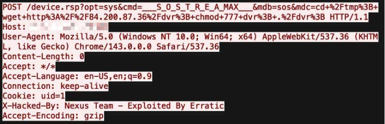

# Nexcorium (Mirai Variant IoT Botnet Campaign)

**Mirai Variant**{.cve-chip}  **IoT Botnet**{.cve-chip}  **DVR/Router Exploitation**{.cve-chip}  **DDoS Threat**{.cve-chip}

## Overview
A newly identified Mirai-based malware variant, Nexcorium, is actively targeting vulnerable IoT devices including DVR systems and outdated routers. The malware exploits known vulnerabilities to gain remote access, deploys architecture-specific payloads, and enrolls compromised hosts into a DDoS botnet.

The campaign combines vulnerability exploitation, weak credential abuse, and rapid propagation to scale attack capacity.

## Technical Specifications

| **Attribute** | **Details** |
|---------------|-------------|
| **Malware Family** | Mirai variant (Nexcorium) |
| **Primary Targets** | TBK DVR devices, legacy/EOL routers, exposed IoT infrastructure |
| **Exploited CVEs** | CVE-2024-3721 (TBK DVR command injection), CVE-2023-33538 (TP-Link), CVE-2017-17215 (Huawei lateral spread path) |
| **Initial Execution Flow** | Exploit triggers command injection and downloads shell script |
| **Payload Selection** | Script fingerprints architecture (ARM, MIPS, x86) and fetches matching binary |
| **Persistence Methods** | Cron job insertion (`crontab`) and/or service persistence (`systemd`) |
| **Propagation Methods** | Telnet brute-force, default credential abuse, network scanning |
| **DDoS Capabilities** | UDP flood, TCP SYN/ACK flood, SMTP flood, VSE flood |

## Affected Products
- Vulnerable TBK DVR deployments exposed to internet access
- End-of-life TP-Link routers and other unpatched edge devices
- Huawei router environments susceptible to CVE-2017-17215-based spread attempts
- Networks with weak IoT segmentation, default credentials, or open Telnet services

## Attack Scenario
1. **Discovery**:
   Attackers scan internet-exposed DVR/router devices for known-vulnerable services.

2. **Initial Exploitation**:
   CVE-2024-3721 is abused to execute remote commands on target devices.

3. **Loader Stage**:
   A malicious shell script is downloaded and executed.

4. **Payload Deployment**:
   The script selects architecture-specific malware binary and executes Nexcorium.

5. **Persistence and Spread**:
   Malware sets persistence, then scans/brute-forces additional devices.

6. **Botnet Operations**:
   Infected nodes are coordinated to launch large-scale DDoS attacks.

## Impact Assessment

=== "Integrity"
    * Unauthorized remote control over IoT and surveillance-class devices
    * Potential manipulation of device behavior and configuration states
    * Expanded attacker foothold across poorly segmented networks

=== "Confidentiality"
    * Increased risk of unauthorized access to video/network device data
    * Exposure of internal topology through compromised edge assets
    * Potential intelligence collection from persistent IoT compromise

=== "Availability"
    * Large-scale DDoS disruption against external targets
    * Local network degradation from scanning and flooding traffic
    * Operational downtime and service instability in affected environments

## Mitigation Strategies

### Immediate Actions
- Replace end-of-life routers, especially unsupported TP-Link models.
- Patch vulnerable DVR/edge devices where vendor updates are available.
- Disable Telnet and remove unnecessary internet exposure.

### Hardening Measures
- Change all default credentials and enforce strong unique passwords.
- Segment IoT/OT devices from core business networks.
- Restrict management interfaces to trusted, authenticated access paths.

### Monitoring & Detection
- Monitor outbound traffic for unusual flood/scanning behavior.
- Watch for unknown cron jobs and suspicious system services.
- Alert on repeated failed login attempts and brute-force patterns.

### Long-term Controls
- Maintain continuous IoT asset inventory and exposure management.
- Apply regular vulnerability assessments to edge/embedded devices.
- Integrate IoT telemetry into SOC/SIEM detection workflows.

## Resources and References

!!! info "Open-Source Reporting"
    - [Nexcorium Mirai variant exploits TBK DVR flaw to launch DDoS attacks](https://securityaffairs.com/190974/malware/nexcorium-mirai-variant-exploits-tbk-dvr-flaw-to-launch-ddos-attacks.html)
    - [Mirai Variant Nexcorium Exploits CVE-2024-3721 to Hijack TBK DVRs for DDoS Botnet](https://thehackernews.com/2026/04/mirai-variant-nexcorium-exploits-cve.html)
    - [Tracking Mirai Variant Nexcorium: A Vulnerability-Driven IoT Botnet Campaign | FortiGuard Labs](https://www.fortinet.com/blog/threat-research/tracking-mirai-variant-nexcorium-a-vulnerability-driven-iot-botnet-campaign)
    - [Nexcorium malware targets IoT devices, leverages Mirai variant for DDoS attacks | brief | SC Media](https://www.scworld.com/brief/nexcorium-malware-targets-iot-devices-leverages-mirai-variant-for-ddos-attacks)
    - [Nexcorium-Associated Mirai Variant Uses TBK DVR Exploit to Scale Botnet Operations | Cryptika Cybersecurity](https://www.cryptika.com/nexcorium-associated-mirai-variant-uses-tbk-dvr-exploit-to-scale-botnet-operations/)

---

*Last Updated: April 19, 2026*
