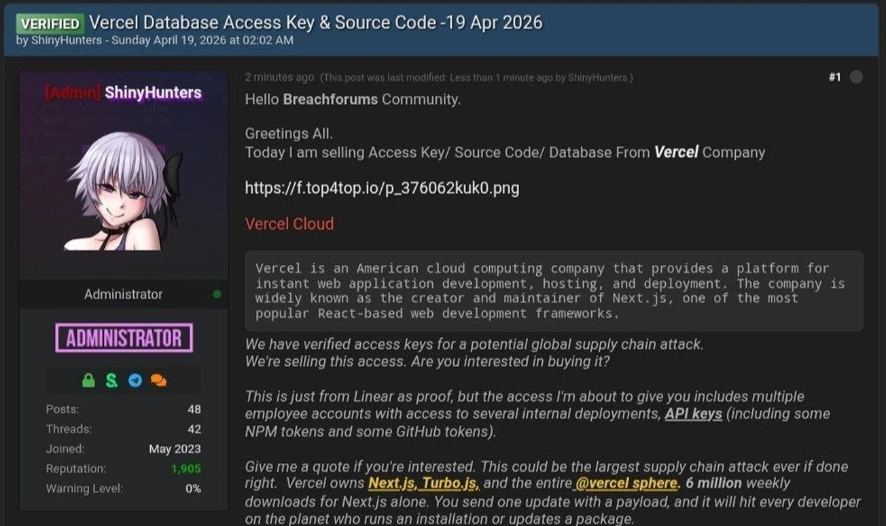

# Vercel Confirms Breach as Hackers Claim to Be Selling Stolen Data

**Cloud Platform Breach**{.cve-chip} **OAuth Abuse**{.cve-chip} **Third-Party Risk**{.cve-chip} **Supply Chain Exposure**{.cve-chip}

## Overview

Vercel confirmed a security incident in April 2026 after attackers claimed they were selling stolen data from the company. According to Vercel, the intrusion originated from a compromised third-party integration, and the observed impact affected only a limited subset of users. The attacker path reportedly involved abuse of a Google Workspace OAuth application, which enabled unauthorized access to an employee account and subsequent movement into internal systems.

## Technical Specifications

| Attribute | Details |
|---|---|
| **Incident Type** | Unauthorized access / cloud platform breach |
| **Initial Access Vector** | Compromised third-party integration (Context.ai) |
| **Identity Abuse Method** | Malicious or abused Google Workspace OAuth app |
| **Compromised Principal** | Vercel employee account |
| **Post-Compromise Activity** | Internal pivoting and data access |
| **Data Accessed** | Internal docs/systems, employee metadata, non-sensitive environment variables |
| **Sensitive Env Vars** | Reported as protected and not exposed |
| **External Threat Activity** | Data advertised for sale on hacking forums |

## Affected Products

- **Vercel internal systems and documentation portals**
- **A limited subset of customer-related environments** (per company statement)
- **Employee account metadata** (names, email addresses)
- **Non-sensitive environment variables**

## Attack Scenario

1. Attacker compromises Context.ai, a third-party AI service integrated into enterprise workflows.
2. A Google Workspace OAuth application is abused to obtain broad permissions.
3. OAuth token access enables compromise of a Vercel employee account.
4. Attacker uses the trusted identity context to pivot into internal systems.
5. Internal documentation and selected systems are queried for useful operational data.
6. Employee metadata and non-sensitive environment variables are collected.
7. Extracted data is staged and exfiltrated to attacker infrastructure.
8. Threat actor advertises the stolen dataset for sale on underground forums.

## Impact

=== "Technical Impact"

    - Unauthorized access to internal systems via federated identity abuse.
    - Exposure of employee metadata and non-sensitive environment variables.
    - Elevated risk of follow-on attacks using harvested organizational context.
    - Potential for token replay or OAuth abuse if controls are weak.

=== "Business Impact"

    - Reputational pressure from public breach claims and dark-web sale posts.
    - Incident response costs for key/token rotation, auditing, and customer communication.
    - Trust erosion around third-party integrations and SaaS operational security.

=== "Ecosystem Impact"

    - Reinforces third-party integration risk in modern cloud development stacks.
    - Highlights OAuth governance gaps as a practical entry point for attackers.
    - Encourages stronger vendor vetting and scoped app consent models.

## Mitigations

### Immediate Actions

- Rotate API keys, access tokens, and environment variables across affected scopes.
- Audit all Google Workspace OAuth applications and revoke untrusted grants.
- Remove or suspend risky third-party integrations pending investigation.
- Monitor identity and application logs for anomalous token usage and lateral movement.

### Hardening Measures

- Use sensitive environment variable classification for secrets and enforce access boundaries.
- Apply least-privilege access controls to users, service accounts, and integrations.
- Enforce periodic OAuth consent reviews and app allowlisting in Google Workspace.
- Implement integration risk scoring with approval workflows for third-party tools.

## Resources

!!! info "Open-Source Reporting"
    - [Vercel confirms breach as hackers claim to be selling stolen data](https://www.bleepingcomputer.com/news/security/vercel-confirms-breach-as-hackers-claim-to-be-selling-stolen-data/)
    - [Vercel April 2026 security incident | Vercel Knowledge Base](https://vercel.com/kb/bulletin/vercel-april-2026-security-incident)
    - [Vercel Breach Tied to Context AI Hack Exposes Limited Customer Credentials](https://thehackernews.com/2026/04/vercel-breach-tied-to-context-ai-hack.html)
    - [Breaking: Vercel Breach Linked to Infostealer Infection at Context.ai | InfoStealers](https://www.infostealers.com/article/breaking-vercel-breach-linked-to-infostealer-infection-at-context-ai/)
    - [Cloud development platform Vercel was hacked | The Verge](https://www.theverge.com/tech/914723/vercel-hacked)
    - [Vercel's April 2026 Breach Explained: How a Context.ai OAuth Compromise Reached Customer Environments](https://wilico.co.jp/en/blog/vercel-oauth-origin-cloud-dev-platform-incident-overview)

---

*Last Updated: April 20, 2026*