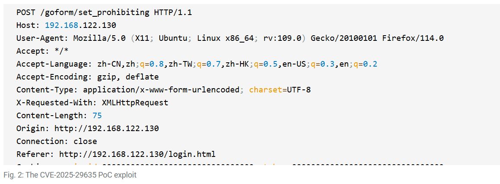

# Mirai Botnet Targeting CVE-2025-29635 in D-Link DIR-823X Routers

**CVE-2025-29635**{.cve-chip} **Mirai Botnet**{.cve-chip} **Command Injection**{.cve-chip} **End-of-Life Device**{.cve-chip}

## Overview

A Mirai-based botnet campaign is actively exploiting CVE-2025-29635, a command injection vulnerability in discontinued D-Link DIR-823X routers. Attackers scan for internet-exposed devices, send a crafted HTTP POST request to achieve remote code execution, then download and execute a Mirai payload that enrolls the device into botnet infrastructure used for DDoS attacks and other malicious operations. As the affected devices are end-of-life, no vendor patch will be issued.

## Technical Specifications

| Attribute | Details |
|---|---|
| **CVE** | CVE-2025-29635 |
| **Vulnerability Type** | Command Injection → Remote Code Execution |
| **Affected Device** | D-Link DIR-823X router (discontinued / EoL) |
| **Attack Vector** | Crafted HTTP POST request (network-accessible management interface) |
| **Payload** | Mirai variant — XOR-obfuscated binary |
| **Post-Exploitation** | Shell command execution, malware download, C2 enrollment |
| **Botnet Use** | DDoS attacks; potential traffic interception |
| **Patch Available** | No — device is end-of-life |

## Affected Products

- **D-Link DIR-823X** routers — all firmware versions (end-of-life, no patch forthcoming)

## Attack Scenario

1. Attacker mass-scans the internet for devices exposing the DIR-823X management interface
2. Vulnerable devices are identified and targeted with a crafted HTTP POST request exploiting CVE-2025-29635
3. Command injection triggers remote code execution on the router's underlying OS
4. Shell commands download the Mirai payload (XOR-encoded) from an attacker-controlled server
5. Payload is decoded and executed on the device
6. Device connects to C2 infrastructure and joins the Mirai botnet
7. Compromised router participates in DDoS campaigns and awaits further attacker commands

## Impact

=== "Technical Impact"

    - Full remote compromise of vulnerable DIR-823X routers
    - Device enrolled into Mirai botnet for DDoS and other operations
    - Risk of network traffic interception on the affected segment
    - Potential pivot point for lateral movement into connected internal networks

=== "Broader Impact"

    - Botnet scale amplified by the large installed base of EoL routers that will never receive patches
    - Coordinated DDoS capacity usable against any downstream target
    - Owners unlikely to detect compromise — no visible symptoms on consumer routers

## Mitigations

- **Replace affected routers** — DIR-823X is end-of-life; replacement with a supported device is the only full remediation
- Avoid continued use of EoL network devices, particularly those exposed to the internet
- Disable remote/WAN-side administration interfaces on all routers where not required
- Apply firewall rules to restrict external access to router management ports
- Monitor network traffic for anomalous outbound connections indicative of C2 activity
- Ensure all other network devices run current, vendor-supported firmware

## Resources

!!! info "Open-Source Reporting"
    - [Mirai Botnet Targets Flaw in Discontinued D-Link Routers — SecurityWeek](https://www.securityweek.com/mirai-botnet-targets-flaw-in-discontinued-d-link-routers/)
    - [Mirai Botnet exploits CVE-2025-29635 to target legacy D-Link routers](https://securityaffairs.com/191135/malware/mirai-botnet-exploits-cve-2025-29635-to-target-legacy-d-link-routers.html)
    - [New Mirai campaign exploits RCE flaw in EoL D-Link routers](https://www.bleepingcomputer.com/news/security/new-mirai-campaign-exploits-rce-flaw-in-eol-d-link-routers/)
    - [CVE-2025-29635: Mirai Campaign Targets D-Link Devices | Akamai](https://www.akamai.com/blog/security-research/cve-2025-29635-mirai-campaign-targets-d-link-devices)
    - [New Mirai variants target routers and DVRs in parallel campaigns — Help Net Security](https://www.helpnetsecurity.com/2026/04/22/new-mirai-variants-target-routers-and-dvrs-via-old-flaws/)
    - [NVD — CVE-2025-29635](https://nvd.nist.gov/vuln/detail/CVE-2025-29635)

---

*Last Updated: April 23, 2026*