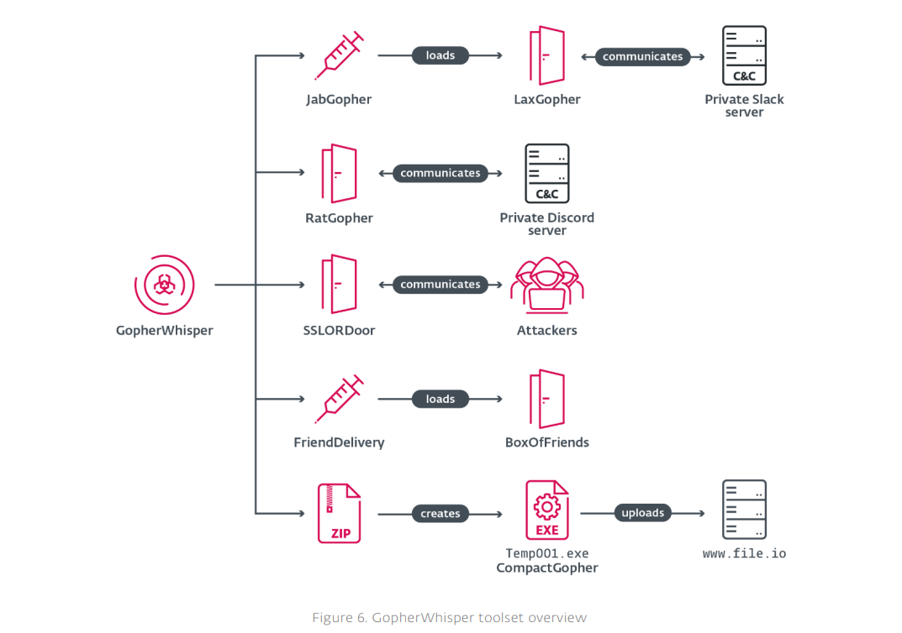

# China-Linked GopherWhisper Infects 12 Mongolian Government Systems with Go Backdoors

**GopherWhisper**{.cve-chip}  **China-Linked Espionage**{.cve-chip}  **Go Malware Toolset**{.cve-chip}  **Cloud C2 Abuse**{.cve-chip}

## Overview
GopherWhisper is a China-linked cyber espionage campaign targeting government entities, with confirmed activity against organizations in Mongolia. Operators deploy a custom malware suite, largely written in Go, to establish persistence, execute commands, and exfiltrate sensitive data.

The campaign stands out for command-and-control (C2) operations over legitimate cloud platforms such as Slack, Discord, and Microsoft Outlook, helping attacker traffic blend into expected enterprise activity.

## Technical Specifications

| **Attribute** | **Details** |
|---------------|-------------|
| **Campaign Name** | GopherWhisper |
| **Primary Victim Set** | Government systems in Mongolia (reported at least 12 compromised systems) |
| **Malware Family Design** | Multi-component toolset (Go-heavy + C++) |
| **Core Backdoor** | LaxGopher (command execution via `cmd`) |
| **Loader/Injector** | JabGopher |
| **Remote Access Module** | RatGopher (Discord-based channel) |
| **Collection/Exfil Module** | CompactGopher |
| **Additional Backdoor** | SSLORDoor (C++ HTTPS channel over port 443) |
| **Cloud API C2 Component** | BoxOfFriends (Microsoft Graph / Outlook drafts channel) |
| **Stealth Technique** | DLL injection and trusted SaaS abuse |
| **Exfiltration Channel** | File-sharing services (for example `file.io`) |
| **Data Protection by Attacker** | AES-CFB-128 encryption for stolen data |
| **Initial Access** | Not confirmed (likely phishing or exploitation) |

## Affected Products
- Government endpoints and servers with outbound access to SaaS communication platforms
- Environments allowing unmanaged Slack, Discord, or Microsoft Graph/Outlook traffic paths
- Systems vulnerable to DLL injection and unsigned/untrusted binary execution
- Networks without strict egress control to public file-sharing services

## Attack Scenario
1. **Initial Compromise**:
   A target government system is compromised through an unknown initial access vector.

2. **Loader Deployment**:
   JabGopher is dropped to inject/launch additional payloads.

3. **Backdoor Establishment**:
   LaxGopher is installed for persistent command execution.

4. **C2 Channel Activation**:
   Attackers use Slack/Discord/Outlook Graph channels for covert command delivery.

5. **Modular Expansion**:
   RatGopher, CompactGopher, and other components are deployed as needed.

6. **Collection and Exfiltration**:
   Sensitive files (`.doc`, `.pdf`, `.xls`, etc.) are compressed, AES-encrypted, and exfiltrated via file-sharing channels.

7. **Long-Term Access**:
   Multiple persistence-capable backdoors maintain sustained intelligence collection.

## Impact Assessment

=== "Integrity"
    * Persistent unauthorized control over government endpoints
    * Increased risk of command execution and configuration tampering
    * Difficulty distinguishing malicious from legitimate SaaS-driven operations

=== "Confidentiality"
    * Exposure of confidential government documents and internal communications
    * Sustained intelligence theft through covert cloud C2 channels
    * Potential expansion to additional victims beyond currently confirmed scope

=== "Availability"
    * Operational degradation from persistent compromise and response activity
    * Increased incident-response complexity due to multi-backdoor architecture
    * Longer dwell time and delayed containment in permissive outbound environments

## Mitigation Strategies

### Immediate Actions
- Hunt for suspicious activity tied to Slack, Discord, and Microsoft Graph API usage patterns.
- Isolate suspected systems and collect forensic artifacts before cleanup.
- Revoke compromised credentials and invalidate affected tokens/sessions.

### Short-term Measures
- Restrict or tightly audit use of external SaaS communication platforms.
- Deploy and tune EDR detections for DLL injection and unknown Go executables.
- Block or monitor outbound traffic to public file-sharing services such as `file.io`.

### Monitoring & Detection
- Correlate anomalous SaaS API usage with endpoint process lineage.
- Alert on unusual archive/encryption activity followed by external transfers.
- Track persistence mechanisms and repeated command execution behavior across hosts.

### Long-term Solutions
- Apply least privilege and network segmentation across sensitive government systems.
- Strengthen patch and hardening baselines for internet-exposed and high-value assets.
- Build threat-hunting playbooks for cloud-abuse C2 tradecraft in espionage campaigns.

## Resources and References

!!! info "Open-Source Reporting"
    - [China-Linked GopherWhisper Infects 12 Mongolian Government Systems with Go Backdoors](https://thehackernews.com/2026/04/china-linked-gopherwhisper-infects-12.html)

---

*Last Updated: April 26, 2026*
