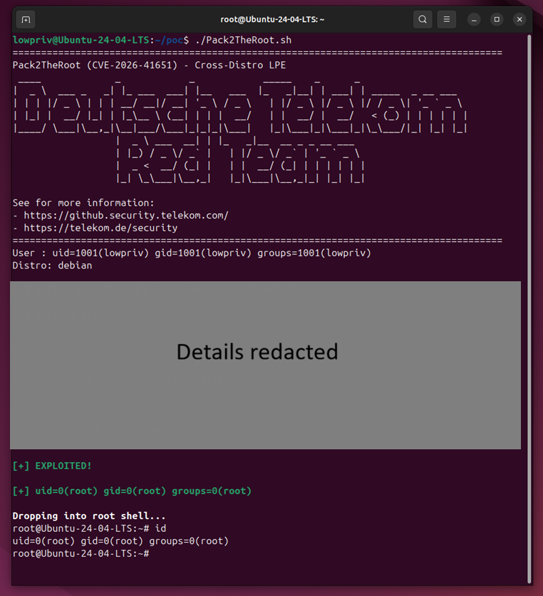

# Easily Exploitable Pack2TheRoot Linux Vulnerability Leads to Root Access

**CVE-2026-41651**{.cve-chip}  **Pack2TheRoot**{.cve-chip}  **Linux Privilege Escalation**{.cve-chip}  **PackageKit TOCTOU**{.cve-chip}

## Overview
Pack2TheRoot is a high-severity local privilege-escalation vulnerability in PackageKit, tracked as CVE-2026-41651, with reported CVSS scores ranging from 8.1 to 8.8. It allows local unprivileged users to install or remove packages as root without proper authentication on many default Linux deployments.

Because PackageKit is widely enabled across desktop and some server distributions, the vulnerability creates a broad post-compromise escalation path.

## Technical Specifications

| **Attribute** | **Details** |
|---------------|-------------|
| **Component** | PackageKit daemon (cross-distro package management abstraction layer) |
| **CVE** | CVE-2026-41651 |
| **Alias** | Pack2TheRoot |
| **CVSS v3.1** | 8.1-8.8 (High) |
| **Affected Versions** | Reported in PackageKit 1.0.2-1.3.4; likely lineage back to 0.8.1 |
| **Bug Class** | TOCTOU race condition on transaction flags |
| **Root Cause Summary** | Caller-controlled flags can be modified/used between auth check and backend dispatch |
| **Primary Effect** | Unprivileged users can run package transactions with root-equivalent authority |
| **Detection Clue** | Exploitation attempts may crash PackageKit daemon |
| **Patch Baseline** | PackageKit 1.3.5 and distro backports/fixes |

## Affected Products
- Linux distributions using PackageKit with default-enabled workflows (desktop-heavy and some server contexts)
- Confirmed testing contexts include Ubuntu, Debian, Rocky Linux, and Fedora variants
- Multi-user Linux systems such as shared servers, VDI pools, and jump hosts
- Enterprise environments where attackers can already obtain low-privileged local shell access

## Attack Scenario
1. **Local Foothold**:
   Attacker obtains any unprivileged local account (for example via compromised creds, reverse shell, or low-priv SSH access).

2. **PackageKit Invocation**:
   Attacker triggers PackageKit-backed operations through local tooling/front-ends.

3. **TOCTOU Exploitation**:
   Transaction flags are raced/manipulated between authorization phase and backend dispatch.

4. **Privilege Abuse**:
   Backend processes the transaction as effectively authorized/root-privileged without proper auth.

5. **Root Compromise**:
   Malicious or scriptlet-bearing package installation/removal executes with root privileges.

6. **Post-Exploitation**:
   Attacker establishes persistence, removes security controls, and pivots laterally.

## Impact Assessment

=== "Integrity"
    * Full host state manipulation through root-level package operations
    * Security tooling removal or downgrade risk
    * Ability to implant persistent privileged backdoors

=== "Confidentiality"
    * Access to sensitive system and user data after root escalation
    * Credential/token theft risk from compromised hosts
    * Expanded intelligence collection across enterprise Linux footprints

=== "Availability"
    * Potential service disruption through critical package removal/modification
    * Operational impact from remediation and re-hardening
    * Increased blast radius in shared or multi-user Linux environments

## Mitigation Strategies

### Patch and Configuration Fixes
- Upgrade PackageKit to 1.3.5 or later (or vendor-provided backported fixes).
- Apply distro security advisories and recommended hardening guidance.

### Exposure Reduction While Patching
- Restrict or disable PackageKit usage on sensitive servers where not required.
- Limit unprivileged invocation paths using policy controls and host hardening.
- Reduce unnecessary interactive shell access on critical systems.

### Detection and Monitoring
- Log and review PackageKit transactions initiated by non-admin accounts.
- Watch for PackageKit daemon crashes as potential exploitation indicators.
- Hunt for unexpected package installs, removals, and privileged account changes.

### General Hardening
- Enforce least privilege and eliminate shared local account practices.
- Pair remediation with broader Linux LPE review and defense-in-depth controls.

## Resources and References

!!! info "Open-Source Reporting"
    - [Easily Exploitable Pack2TheRoot Linux Vulnerability Leads to Root Access | SecurityWeek](https://www.securityweek.com/easily-exploitable-pack2theroot-linux-vulnerability-leads-to-root-access/)
    - [Deutsche Telekom Security Blog: Pack2TheRoot Linux Local Privilege Escalation](https://github.security.telekom.com/2026/04/pack2theroot-linux-local-privilege-escalation.html)
    - [Security Affairs: 12-year-old Pack2TheRoot Bug Lets Linux Users Gain Root Privileges](https://securityaffairs.com/191231/security/12-year-old-pack2theroot-bug-lets-linux-users-gain-root-privileges.html)
    - [BleepingComputer: New Pack2TheRoot Flaw Gives Hackers Root Linux Access](https://www.bleepingcomputer.com/news/security/new-pack2theroot-flaw-gives-hackers-root-linux-access/)
    - [CyberSecTV: Pack2 The Root Flaw Lets Attackers Gain Root](https://cybersectv.eu/pack2-the-root-flaw-lets-attackers-gain-root/)
    - [Expert in the Cloud: Pack2TheRoot Critical Linux Privilege Escalation Vulnerability](https://expertinthecloud.co.za/pack2theroot-critical-linux-privilege-escalation-vulnerability/)

---

*Last Updated: April 28, 2026*
