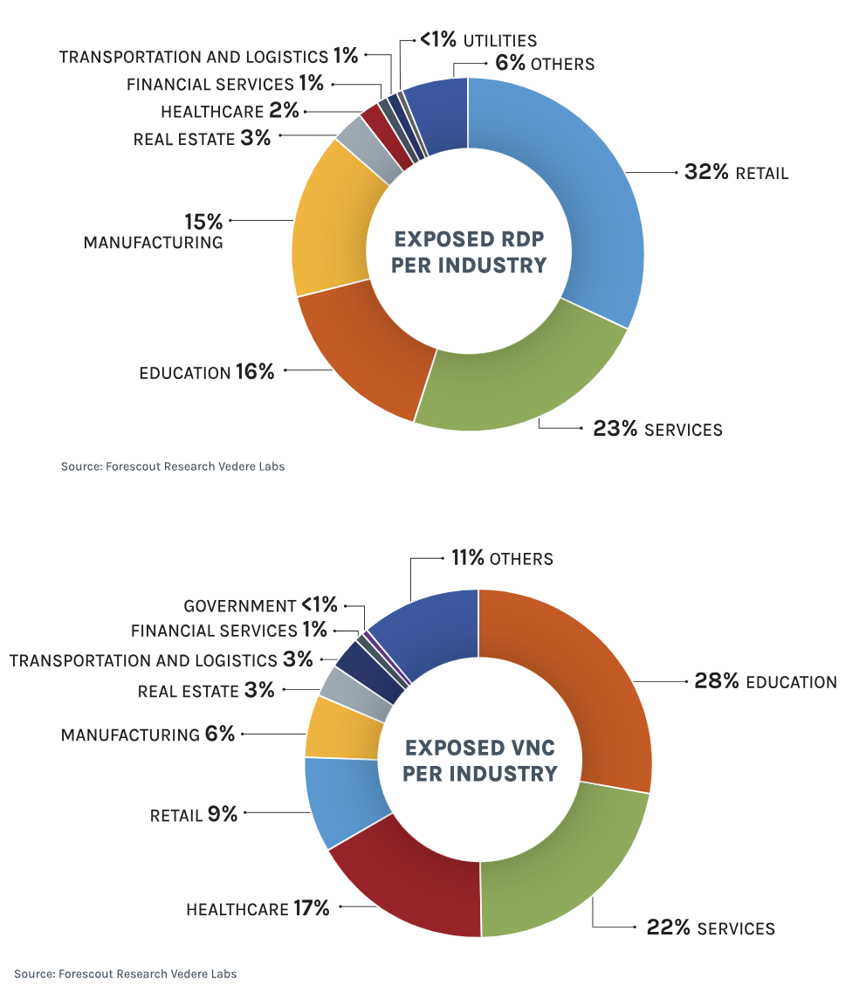

# Internet-Exposed VNC/RDP Servers in ICS/OT Infrastructure

**ICS/OT Security**{.cve-chip} **Exposed Remote Access**{.cve-chip} **Critical Infrastructure**{.cve-chip} **Unauthenticated Access**{.cve-chip}

## Overview

Research reveals that hundreds of internet-facing VNC servers and tens of thousands of RDP systems are exposed globally, with a significant subset directly connected to ICS/OT environments including SCADA and HMI systems. Approximately 60,000 VNC servers require no authentication at all, and ~670 are directly linked to industrial control infrastructure. Many affected systems run legacy operating systems with unpatched vulnerabilities, providing attackers a direct path into critical industrial environments without needing to exploit any software flaw — just an open port.

## Technical Specifications

| Attribute | Details |
|---|---|
| **Exposed RDP Servers** | ~1.8 million internet-facing |
| **Exposed VNC Servers** | ~1.6 million internet-facing |
| **Unauthenticated VNC** | ~60,000 servers (no login required) |
| **VNC Linked to ICS/OT** | ~670 servers directly connected to industrial systems |
| **Key Ports** | RDP: 3389 / VNC: 5900 |
| **Common Weaknesses** | No authentication, weak credentials, unpatched legacy OS, missing network segmentation |
| **Known Exploits** | BlueKeep (CVE-2019-0708) RCE for unpatched RDP; direct no-auth VNC access |
| **Affected Environments** | SCADA systems, HMI panels, factories, utilities, critical infrastructure |

## Affected Products

- **VNC server software** — all vendors where servers are internet-exposed with no or weak authentication
- **Microsoft RDP** — unpatched Windows systems exposed on port 3389 (including BlueKeep-vulnerable hosts)
- **ICS/OT systems** — SCADA and HMI interfaces reachable via exposed remote desktop services
- **Legacy operating systems** — unpatched Windows and Linux hosts in OT environments

## Attack Scenario

1. Attacker uses internet scanning tools (e.g., Shodan, Censys) to enumerate publicly exposed RDP and VNC services
2. Identifies targets with no authentication (VNC) or weak/default credentials
3. Connects directly to unauthenticated VNC servers or performs brute-force / credential stuffing against RDP/VNC login prompts
4. Gains full remote desktop access to the exposed system
5. Navigates the desktop environment to locate SCADA dashboards, HMI panels, or engineering workstations
6. Executes malicious actions: deploys ransomware, manipulates industrial process parameters, or exfiltrates sensitive configuration data
7. Establishes persistence for long-term access or hands off to further exploitation stages

## Impact

=== "Operational Impact"

    - Direct unauthorized control of industrial systems — SCADA, HMI, and engineering workstations reachable with no exploitation required
    - Disruption or shutdown of factory, utility, or critical infrastructure operations
    - Physical damage to equipment through manipulation of control parameters
    - Safety risks to human operators from altered process conditions

=== "Security Impact"

    - Data exfiltration of process designs, configurations, and operational data
    - Ransomware deployment encrypting OT-adjacent systems and halting operations
    - Persistent covert access enabling long-term espionage or pre-positioning for future attacks
    - Unauthenticated access means no credentials are needed — exploitation is trivial and scalable

=== "Ecosystem Impact"

    - Scale of exposure (60,000 unauthenticated VNC servers) indicates systemic misconfiguration across many sectors
    - ICS/OT systems with direct internet exposure violate fundamental OT security architecture principles
    - Demonstrates continued failure to air-gap or properly segment operational technology from the public internet

## Mitigations

### Immediate Actions

- **Do not expose RDP or VNC directly to the internet** — remove firewall rules or cloud security group entries permitting inbound access on ports 3389 and 5900 from public IPs
- Disable unauthenticated VNC access immediately on all identified servers
- Conduct an asset inventory and internet exposure scan to identify all externally reachable remote access services

### Secure Remote Access

- Replace direct RDP/VNC exposure with secure remote access solutions: **Zero Trust Network Access (ZTNA)** or authenticated jump servers / bastion hosts
- Enforce **Multi-Factor Authentication (MFA)** on all remote access paths into ICS/OT environments
- Apply strong password policies and eliminate default or weak credentials on all remote access services

### Hardening and Segmentation

- Patch all internet-facing Windows systems; prioritize BlueKeep-vulnerable RDP hosts (CVE-2019-0708)
- Implement strict **IT/OT network segmentation** — OT systems should not be reachable from the internet under any circumstances
- Deploy continuous monitoring and logging on all remote access sessions for anomaly detection
- Maintain an up-to-date asset inventory with regular exposure management scans

## Resources

!!! info "Open-Source Reporting"
    - [Hundreds of Internet-Facing VNC Servers Expose ICS/OT — SecurityWeek](https://www.securityweek.com/hundreds-of-internet-facing-vnc-servers-expose-ics-ot/)
    - [RDP Security: CPS Threats Spark Need for Secure Remote Access](https://www.forescout.com/blog/rdp-security-cps-threats-spark-need-for-secure-remote-access/)

---

*Last Updated: April 30, 2026*