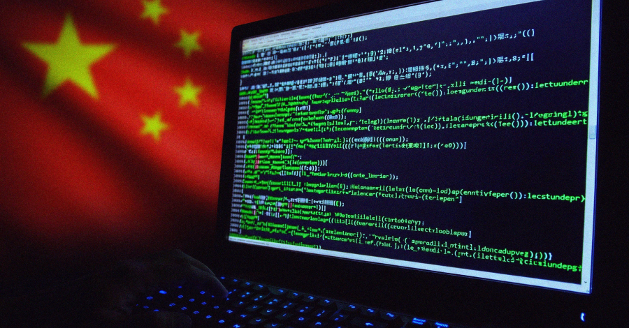
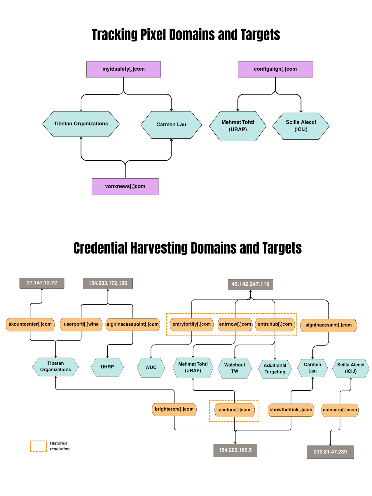

# China-Linked Cyber Espionage Campaign Targeting Asian Governments

**China-Linked APT**{.cve-chip}  **Government Espionage**{.cve-chip}  **Exchange Exploitation**{.cve-chip}  **Long-Term Persistence**{.cve-chip}

## Overview
A China-linked threat actor conducted a broad cyber espionage campaign targeting government entities, journalists, and defense-related organizations across Asia and parts of Europe. The operation focused on obtaining persistent access to sensitive systems and quietly exfiltrating intelligence over extended periods.

The campaign reflects a long-horizon intelligence-collection model built on stealth, credential abuse, and infrastructure compromise.

## Technical Specifications

| **Attribute** | **Details** |
|---------------|-------------|
| **Campaign Type** | State-linked cyber espionage |
| **Primary Initial Access** | Exploitation of unpatched Microsoft Exchange vulnerabilities |
| **Credential Operations** | Username/password harvesting and credential dumping |
| **Stealth Tradecraft** | Use of legitimate stolen credentials (living-off-the-land style access) |
| **Lateral Movement** | Expansion across internal network segments toward high-value assets |
| **Persistence Methods** | Compromised accounts and likely backdoor footholds |
| **Primary Intelligence Target** | Email infrastructure and sensitive communications systems |

## Affected Products
- Publicly exposed Microsoft Exchange servers lacking current security updates
- Government and defense-adjacent organizations in targeted regions
- Journalist and activist communication ecosystems
- Enterprise identity environments vulnerable to credential abuse and weak privilege hygiene

## Attack Scenario
1. **Internet Reconnaissance**:
   Attackers scan for exposed and unpatched Microsoft Exchange servers.

2. **Initial Exploitation**:
   Known Exchange vulnerabilities are exploited to gain foothold.

3. **Credential Harvesting**:
   User credentials are extracted from compromised hosts/systems.

4. **Stealth Expansion**:
   Stolen legitimate accounts are used for lateral movement.

5. **Persistence Establishment**:
   Attackers maintain long-term access via compromised accounts and potential backdoors.

6. **Intelligence Collection**:
   Sensitive communications and data are gathered and exfiltrated over time.

## Impact Assessment

=== "Integrity"
    * Unauthorized control over enterprise/government account pathways
    * Increased risk of covert manipulation of mailbox and access policies
    * Trust degradation in internal communications platforms

=== "Confidentiality"
    * Exposure of sensitive government and defense-related communications
    * Elevated surveillance risk for journalists and activists
    * Long-term intelligence leakage with strategic/geopolitical consequences

=== "Availability"
    * Extended response and recovery burden from persistent footholds
    * Potential disruption due to containment and remediation operations
    * Risk of follow-on attacks leveraging sustained access and lateral reach

## Mitigation Strategies

### Immediate Actions
- Apply Microsoft Exchange security updates and vendor guidance immediately.
- Enforce MFA across all accounts, especially privileged and remote-access users.
- Reset/rotate credentials where compromise is suspected.

### Short-term Measures
- Monitor for anomalous logins, impossible travel, and unusual mailbox access patterns.
- Deploy EDR/XDR to detect credential abuse and lateral movement activity.
- Segment networks to limit east-west propagation paths.

### Monitoring & Detection
- Run targeted threat hunting for Exchange exploitation and persistent account abuse.
- Correlate identity, endpoint, and email telemetry in SIEM/SOC pipelines.
- Alert on unusual data access/exfiltration patterns from messaging infrastructure.

### Long-term Solutions
- Conduct regular security audits and compromise-assessment exercises.
- Harden identity and privilege models for government-critical systems.
- Maintain accelerated patch governance for externally exposed services.

## Resources and References

!!! info "Open-Source Reporting"
    - [China-Linked Hackers Target Asian Governments, NATO State, Journalists, and Activists](https://thehackernews.com/2026/05/china-linked-hackers-target-asian.html)

---

*Last Updated: May 3, 2026*
