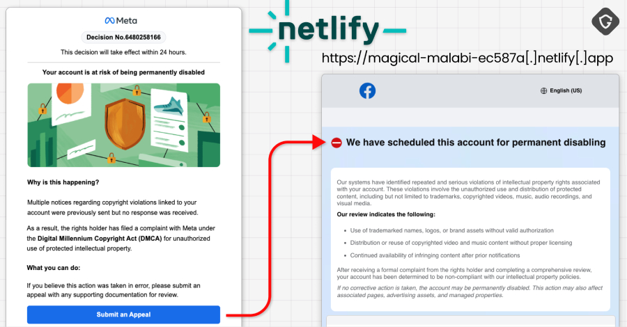
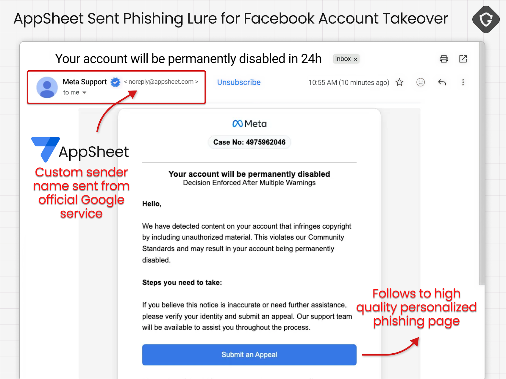

# 30,000 Facebook Accounts Hacked via Google AppSheet Phishing Campaign

**Facebook Phishing**{.cve-chip}  **Google AppSheet Abuse**{.cve-chip}  **Account Takeover**{.cve-chip}  **Credential Theft**{.cve-chip}

## Overview
A large-scale phishing campaign targeted Facebook users by abusing Google AppSheet to deliver convincing messages from trusted-looking infrastructure. The operation reportedly compromised around 30,000 accounts, which were then abused directly or sold on underground markets.

This campaign demonstrates how adversaries can weaponize legitimate SaaS platforms to increase phishing success and evade basic trust-based filtering.

## Technical Specifications

| **Attribute** | **Details** |
|---------------|-------------|
| **Campaign Type** | Credential phishing and account takeover operation |
| **Abused Platform** | Google AppSheet email/workflow infrastructure |
| **Primary Lure** | Account-warning/business-action themed phishing emails |
| **Credential Capture Path** | Redirect to fake Facebook login pages and exfiltration to attacker-controlled servers |
| **Automation Behavior** | Real-time credential validation and immediate takeover workflows |
| **Support Infrastructure** | Hosting services (Netlify-like), messaging bots/channels (Telegram-like) for data handling |
| **Scale (Reported)** | Approximately 30,000 compromised Facebook accounts |

## Affected Products
- Facebook personal and business accounts exposed to phishing lures
- Organizations using Facebook ad/business pages with shared operator access
- Users relying on email-link login flows without strong verification habits
- Environments lacking robust anti-phishing and account anomaly monitoring

## Attack Scenario
1. **Phishing Delivery**:
   Victim receives a legitimate-looking email sent through AppSheet-backed infrastructure.

2. **Urgency Lure**:
   Message pushes immediate action (for example account warning or business issue).

3. **Credential Harvesting**:
   Victim clicks link and lands on a fake Facebook login page.

4. **Real-Time Validation**:
   Entered credentials are captured, validated, and relayed to attacker systems.

5. **Account Takeover**:
   Attackers log in quickly, lock persistence, and monetize access through abuse or resale.

## Impact Assessment

=== "Integrity"
    * Unauthorized control of victim accounts and business assets
    * Abuse for scams, spam, malicious ads, and social engineering
    * Potential unauthorized content or campaign manipulation

=== "Confidentiality"
    * Exposure of messages, profile data, contacts, and account-linked business information
    * Increased credential-reuse risk across other services
    * Theft of account/session context enabling wider fraud operations

=== "Availability"
    * Account lockout and operational disruption for individuals and organizations
    * Financial loss risk for business/ad accounts
    * Reputation damage and customer trust impact after account abuse

## Mitigation Strategies

### Immediate Actions
- Enable multi-factor authentication on Facebook accounts.
- Review active sessions and revoke unknown devices/logins.
- Reset compromised credentials and rotate reused passwords.

### User Protection Measures
- Avoid clicking login links from unsolicited emails.
- Verify destination URLs before credential entry.
- Use password managers to detect mismatched/fake domains.
- Monitor account alerts for unusual sign-ins and security changes.

### Organizational Controls
- Implement email filtering and anti-phishing controls.
- Deliver recurring phishing awareness training.
- Monitor high-risk account actions (ad spend, admin-role changes, login anomalies).

## Resources and References

!!! info "Open-Source Reporting"
    - [30,000 Facebook Accounts Hacked via Google AppSheet Phishing Campaign](https://thehackernews.com/2026/05/30000-facebook-accounts-hacked-via.html)
    - [Vietnamese operation uses Google AppSheet for Facebook phishing, targets 30,000 accounts | brief | SC Media](https://www.scworld.com/brief/vietnamese-operation-uses-google-appsheet-for-facebook-phishing-targets-30000-accounts)
    - [30,000 Facebook accounts just got hacked via Google AppSheet - and hackers are selling them right now](https://cambridgeanalytica.org/data-breaches-scandals/facebook-accounts-hacked-google-appsheet-phishing-50892/)

---

*Last Updated: May 3, 2026*
