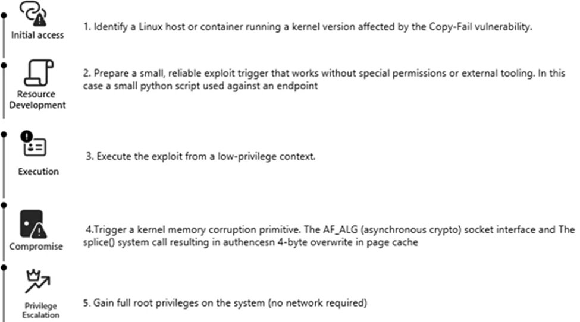

# Actively Exploited Linux Privilege Escalation Vulnerability

**CVE-2026-31431**{.cve-chip}  **Linux Privilege Escalation**{.cve-chip}  **CISA KEV**{.cve-chip}  **Active Exploitation**{.cve-chip}

## Overview
CISA added a Linux privilege-escalation vulnerability to its Known Exploited Vulnerabilities (KEV) catalog, indicating confirmed real-world exploitation activity. The flaw enables attackers with limited access to escalate privileges to root on affected systems.

For organizations with Linux-heavy infrastructure, this significantly increases post-compromise risk and accelerates patch urgency.

## Technical Specifications

| **Attribute** | **Details** |
|---------------|-------------|
| **CVE** | CVE-2026-31431 |
| **Status** | Added to CISA KEV (actively exploited) |
| **Affected Scope** | Linux systems at kernel/system-utility privilege boundary layers |
| **Root Cause Class** | Improper permission handling / flawed access-control logic |
| **Attack Requirement** | Local low-privileged execution context |
| **Outcome** | Privilege escalation to root (UID 0) |
| **Common Exploit Patterns** | SUID abuse, race/logic flaw exploitation, kernel/user boundary manipulation |

## Affected Products
- Linux endpoints and servers running vulnerable unpatched builds
- Multi-user environments where low-privilege shell access is possible
- Internet-exposed systems where attackers can chain initial foothold plus local LPE
- Enterprises lacking rapid patch and hardening workflows for Linux hosts

## Attack Scenario
1. **Initial Foothold**:
   Attacker obtains low-privileged access (phishing payload, exposed service, weak credentials, or existing malware foothold).

2. **Local Execution**:
   Exploit code runs as non-root user.

3. **Privilege Escalation**:
   Vulnerable kernel/system path is triggered to obtain root privileges.

4. **Post-Root Actions**:
   Attacker installs persistence, steals data, and expands laterally across infrastructure.

## Impact Assessment

=== "Integrity"
    * Full root-level control of affected Linux hosts
    * Security-tool tampering and privileged persistence deployment
    * Increased ability to stage follow-on compromise across trusted systems

=== "Confidentiality"
    * Unauthorized access to sensitive host and application data
    * Credential and token theft risk after root compromise
    * Expanded reconnaissance and intelligence collection from compromised nodes

=== "Availability"
    * Service disruption from malware deployment or defensive containment actions
    * Elevated downtime risk if critical Linux infrastructure is affected
    * Broader operational impact through lateral movement and chained attacks

## Mitigation Strategies

### Immediate Actions
- Apply security patches for CVE-2026-31431 immediately across affected Linux systems.
- Prioritize exposed and high-value assets for emergency remediation.

### Hardening and Access Control
- Enforce least-privilege account models and reduce interactive shell exposure.
- Restrict and regularly audit SUID/privileged binaries.
- Maintain secure configuration baselines and rapid drift correction.

### Monitoring & Detection
- Monitor for anomalous privilege-escalation behavior and root process anomalies.
- Deploy EDR/XDR coverage for Linux hosts with escalation-focused detections.
- Conduct threat hunting for suspicious root-level persistence and credential access.

### Long-term Resilience
- Regularly patch and harden Linux systems through automated governance.
- Segment networks to reduce lateral movement opportunities.
- Perform recurring security assessments for privilege-escalation exposure.

## Resources and References

!!! info "Open-Source Reporting"
    - [CISA Adds Actively Exploited Linux Root Access Bug CVE-2026-31431 to KEV](https://thehackernews.com/2026/05/cisa-adds-actively-exploited-linux-root.html)

---

*Last Updated: May 3, 2026*
