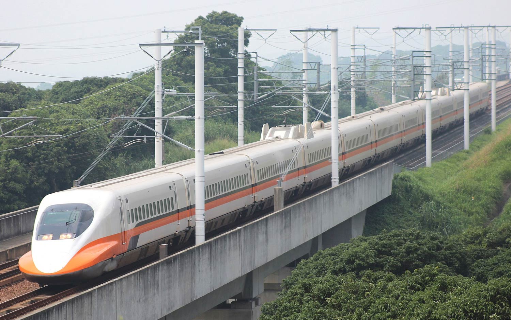
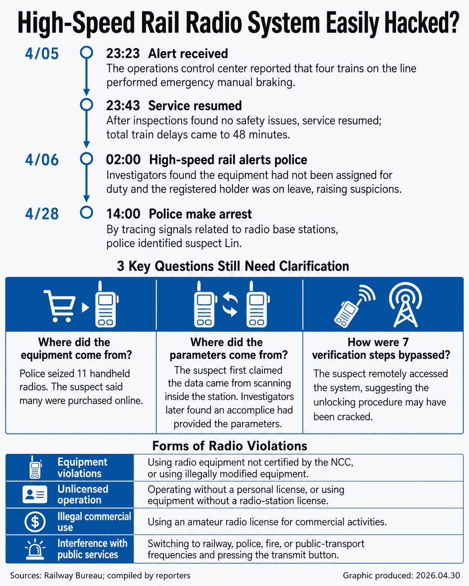

# Student Hacked Taiwan High-Speed Rail to Trigger Emergency Brakes

**OT Security**{.cve-chip} **TETRA Radio Spoofing**{.cve-chip} **Rail Infrastructure**{.cve-chip} **SDR Attack**{.cve-chip}

## Overview

On April 5, 2026, a 23-year-old Taiwanese student used software-defined radio (SDR) equipment and cloned handheld radios to transmit a forged "General Alarm" signal on Taiwan High Speed Rail's (THSR) TETRA radio network, triggering emergency braking on four high-speed trains for approximately 48 minutes. There is no software CVE — the attack exploited a critical OT design failure: the TETRA network's parameters and keys had not been rotated in 19 years, allowing the attacker to clone a legitimate radio beacon using off-the-shelf equipment and a set of decoded static parameters. The student (surname Lin) was arrested on April 28 and faces up to 10 years imprisonment under Taiwan's Criminal Law.

## Technical Specifications

| Attribute | Details |
|---|---|
| **Target System** | THSR TETRA radio network (in service 19 years; 350 km line) |
| **Attack Method** | SDR interception → parameter decoding → beacon cloning → forged signal injection |
| **Tools Used** | SDR equipment + 11 handheld radios purchased online |
| **Signal Injected** | High-priority "General Alarm" — triggers automatic emergency braking |
| **Key Weakness** | Static TETRA parameters / keys unchanged for 19 years; no robust cryptographic beacon authentication |
| **Verification Layers Bypassed** | 7 (by using decoded static parameters) |
| **Disruption** | 4 trains halted; ~48 minutes disruption |
| **CVE** | None — configuration and key management failure, not a software vulnerability |
| **Legal Outcome** | Arrested April 28; charged under Article 184 Taiwan Criminal Law (up to 10 years) |

## Affected Products

- **THSR TETRA radio network** — rail signaling and communications infrastructure
- **Any TETRA deployment** globally that relies on static parameters, unrotated keys, or lacks cryptographic beacon authentication

## Attack Scenario

1. Using SDR, the student passively monitored THSR TETRA frequencies, capturing beacon traffic, control messages, and signaling parameters over time
2. With help from a 21-year-old accomplice who provided critical THSR-specific parameters, the student decoded the static network configuration — including frequencies, talk groups, and authentication parameters that had not changed in 19 years
3. The decoded parameters were programmed into 11 handheld radios, effectively cloning a legitimate TETRA beacon authorized on the THSR network
4. On April 5, the student transmitted a forged high-priority "General Alarm" signal from his cloned device on the TETRA network
5. THSR's systems treated the alarm as legitimate, pushing the emergency brake command to four trains, which automatically halted for ~48 minutes
6. THSR operators noticed the alarm originated from a beacon ID not scheduled for duty; after confirming the real device was still present, they suspected unauthorized cloning and contacted police
7. Investigators correlated TETRA logs with CCTV footage to identify the student's location; SDR equipment, 11 radios, and a laptop were seized

## Impact

=== "Operational Impact"

    - Four high-speed trains halted via emergency braking for approximately 48 minutes
    - Meaningful disruption to a national critical transport system carrying ~81.8 million passengers annually
    - No injuries reported; however, emergency braking at high speed creates passenger and infrastructure stress risk

=== "Safety Risk"

    - Demonstrated that an attacker with ~$500 in off-the-shelf hardware can trigger safety-critical responses on national rail infrastructure
    - Emergency braking at speeds up to 300 km/h poses real risk of passenger injuries and rolling-stock damage in less controlled scenarios

=== "Systemic / OT Implications"

    - Exposes the global risk of legacy radio systems (TETRA, trunked radio) with static keys, no encryption, or weak beacon authentication
    - A single decoded parameter set — valid for 19 years — bypassed 7 verification layers
    - Similar OT design weaknesses exist in rail, utility, and emergency communications infrastructure worldwide

## Mitigations

### For Rail and OT Radio Operators

- **Rotate TETRA keys and parameters regularly** — 19 years without rotation is a critical control failure; establish mandatory rotation schedules and procedures for suspected compromise
- **Implement strong cryptographic authentication and encryption** on all TETRA channels so only devices with valid keys and certificates can issue high-priority signals such as General Alarm
- **Multi-source validation for safety-critical commands** — require corroboration from multiple independent sources or control-center confirmation before propagating global emergency brake commands
- **Whitelist and geofen authorized beacon IDs** — strictly limit which devices can originate General Alarm signals; flag any alarm from a non-duty beacon for immediate investigation
- **Deploy RF intrusion detection** — monitor for rogue transmitters near critical track sections using signal strength anomalies and direction-of-arrival analysis
- **Continuously monitor TETRA logs** for alarms from unexpected beacon IDs or unusual patterns of high-priority command traffic

### Governance and Security Reviews

- Treat TETRA and all OT radio/signaling systems as critical assets subject to regular penetration testing, red-team exercises, and threat modeling
- Align with rail and OT security frameworks (IEC 62443) and national rail security guidelines
- Inventory all legacy wireless control channels across OT environments for encryption and authentication gaps; prioritize re-engineering where systems rely on static IDs or obscurity

## Resources

!!! info "Open-Source Reporting"
    - [Student Hacked Taiwan High-Speed Rail to Trigger Emergency Brakes — BleepingComputer](https://www.bleepingcomputer.com/news/security/student-hacked-taiwan-high-speed-rail-to-trigger-emergency-brakes/)
    - [Student Arrested in Taiwan for Using SDR and Handheld Radios to Halt Four High-Speed Trains — RTL-SDR Blog](https://www.rtl-sdr.com/student-arrested-in-taiwan-for-using-sdr-and-handheld-radios-to-halt-four-high-speed-trains-with-tetra-hack/comment-page-1/)
    - [Student Hacked Taiwan High-Speed Rail to Trigger Emergency Brakes — daily.dev](https://app.daily.dev/posts/student-hacked-taiwan-high-speed-rail-to-trigger-emergency-brakes-bhuc6uouz)

---

*Last Updated: May 6, 2026*