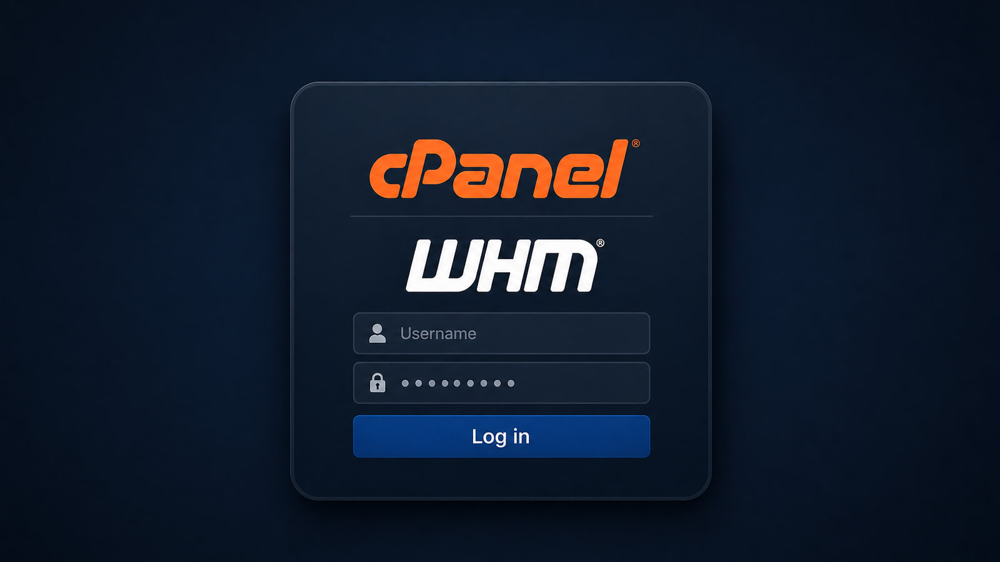

# cPanel & WHM Authentication Bypass Vulnerability

**CVE-2026-41940**{.cve-chip}  **cPanel/WHM**{.cve-chip}  **Authentication Bypass**{.cve-chip}  **Zero-Day Exploitation**{.cve-chip}

## Overview
A critical vulnerability in cPanel & WHM allows unauthenticated attackers to bypass login controls and obtain administrative access. Public reporting indicates the flaw was exploited as a zero-day before emergency patches were released.

Because WHM often manages many hosted websites and accounts per server, successful exploitation can create broad multi-tenant impact.

## Technical Specifications

| **Attribute** | **Details** |
|---------------|-------------|
| **CVE** | CVE-2026-41940 |
| **Affected Platform** | cPanel & WHM |
| **Root Cause (Reported)** | Improper session/authentication handling |
| **Exploit Primitive** | CRLF injection in request handling |
| **Abuse Outcomes** | Header/cookie manipulation, forged authenticated session state |
| **Credential Requirement** | None (unauthenticated bypass path) |
| **Privilege Result** | Administrative/WHM control with server-level impact potential |
| **Known Exploitation State** | Exploited in the wild before patch availability |

## Affected Products
- Internet-exposed cPanel and WHM management interfaces
- Shared hosting servers with multiple customer sites per control-plane instance
- Environments exposing management ports `2083` and `2087` to untrusted networks
- Organizations without emergency patching for cPanel release branches

## Attack Scenario
1. **Target Discovery**:
   Attacker scans for exposed cPanel/WHM services on management ports.

2. **Exploit Delivery**:
   Crafted HTTP requests trigger CRLF injection behavior.

3. **Session Forgery**:
   Authentication/session logic is bypassed to obtain privileged session context.

4. **Administrative Access**:
   Attacker gains WHM-level control and can perform server-management actions.

5. **Post-Exploitation Abuse**:
   Malicious account creation, configuration tampering, malware/web-shell deployment, and data access may follow.

## Impact Assessment

=== "Integrity"
    * Full compromise of hosting control plane and administrative workflows
    * Unauthorized account/configuration changes across hosted environments
    * Potential large-scale supply-chain style abuse across tenant websites

=== "Confidentiality"
    * Exposure of hosted application data, databases, and customer information
    * Credential/session theft opportunities at infrastructure and tenant layers
    * Increased risk of phishing-campaign staging from trusted hosting assets

=== "Availability"
    * Service disruption from malicious configuration or malware deployment
    * Spam/phishing abuse causing blacklisting and operational impact
    * Potential data destruction and prolonged recovery for affected providers

## Mitigation Strategies

### Immediate Actions
- Upgrade immediately to patched cPanel versions:
  - 11.110.0.97
  - 11.118.0.63
  - 11.126.0.54
  - 11.132.0.29
  - 11.134.0.20
  - 11.136.0.5

### Access Hardening
- Restrict management port exposure (`2083`/`2087`) to trusted admin networks.
- Apply firewall controls and IP allowlisting for control-plane access.

### Monitoring & Detection
- Monitor logs for suspicious session creation/authentication anomalies.
- Run vendor-provided detection checks and integrity scripts where available.
- Apply targeted WAF rules to reduce exploit-path exposure.

## Resources and References

!!! info "Open-Source Reporting"
    - [cPanel, WHM emergency update fixes critical auth bypass bug](https://www.bleepingcomputer.com/news/security/cpanel-whm-emergency-update-fixes-critical-auth-bypass-bug/)
    - [CVE-2026-41940: cPanel & WHM Authentication Bypass](https://www.rapid7.com/blog/post/etr-cve-2026-41940-cpanel-whm-authentication-bypass/)
    - [CVE-2026-41940 | Arctic Wolf](https://arcticwolf.com/resources/blog/cve-2026-41940/)
    - [cPanel Authentication Bypass CVE-2026-41940 - watchTowr](https://watchtowr.com/resources/2765-rapid-reaction-cpanel-authentication-bypass/)

---

*Last Updated: May 3, 2026*
