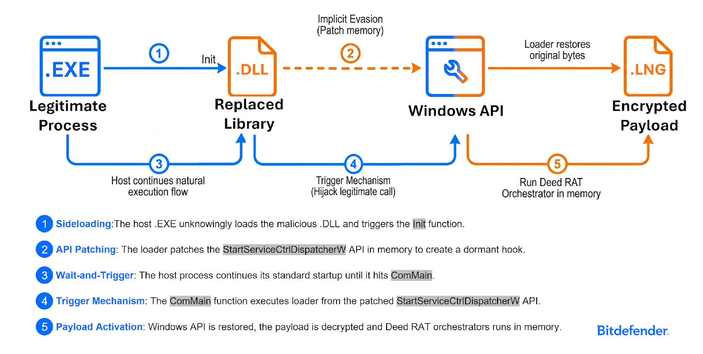

# Azerbaijani Energy Firm Hit by Repeated Cyber Attacks

**Noname057(16)**{.cve-chip} **Hacktivist**{.cve-chip} **Energy Sector**{.cve-chip} **Hybrid Warfare**{.cve-chip} **DDoS**{.cve-chip}

## Overview

Azerbaijan's state-owned energy company SOCAR (State Oil Company of the Azerbaijan Republic) was repeatedly targeted by politically motivated hacktivist groups — primarily Noname057(16) and a broader cluster tracked as "Azerbaijan-hack" — in a sustained series of denial-of-service and network-intrusion attempts tied to regional geopolitical tensions and the war in Ukraine. SOCAR reported that it successfully fended off most attacks, with no confirmed large-scale outages or physical consequences to oil and gas operations. However, the campaign illustrates how energy infrastructure in the South Caucasus is drawn into digital fronts of geopolitical conflict, with overlapping hacktivist, ransomware, and nation-state activity creating a persistent and escalating threat environment.

## Technical Specifications

| Attribute | Details |
|---|---|
| **Primary Target** | SOCAR (State Oil Company of the Azerbaijan Republic) — oil & gas production, pipelines, international energy projects |
| **Threat Actors** | Noname057(16) (pro-Russian hacktivist); "Azerbaijan-hack" cluster; overlapping state-linked actors |
| **Attack Types** | DDoS (volunteer botnet / tool-based), password spraying, phishing, exploit scanning, hack-and-leak posturing |
| **Targeted Systems** | Public web portals, VPN gateways, webmail/email portals, remote-access infrastructure |
| **Geopolitical Context** | Attacks framed as retaliation for perceived pro-Western or anti-Russian positions; Azerbaijan's energy export role makes SOCAR a high-value symbolic target |
| **Information Operations** | Hacktivist Telegram channels publicize "operations" to amplify fear and perceived vulnerability |
| **CVE** | None — DDoS, credential abuse, and opportunistic exploitation of exposed services |
| **Confirmed Physical Impact** | None publicly attributed |

## Affected Products

- **SOCAR's public-facing web properties and online services** — primary DDoS targets
- **External perimeter services** — VPN gateways, email portals, web applications subjected to credential stuffing and exploit scanning
- **Energy sector broadly in Azerbaijan and the South Caucasus** — Resecurity notes the entire regional energy sector faces escalating hacktivist and nation-state targeting

## :material-file-search: Attack Scenario

1. **Target selection** — Hacktivist and state-linked groups identify SOCAR and Azerbaijan's energy infrastructure as high-impact symbolic targets amid the Russia-Ukraine conflict and regional geopolitical disputes; campaigns are publicly advertised on Telegram to recruit volunteer botnet participants
2. **DDoS and defacement campaigns** — Noname057(16) launches coordinated DDoS waves using supporter botnets and their tooling, aiming to temporarily knock public government and energy portals offline and generate media coverage and political messaging
3. **Concurrent perimeter probing** — other adversaries or overlapping actors simultaneously perform phishing, password spraying, and exploit scanning against SOCAR's external attack surface (VPN endpoints, webmail, web applications), seeking footholds for deeper access
4. **Intrusion attempts** — where weak credentials or unpatched services are identified, attackers attempt to establish access for espionage, credential harvesting, or positioning for potential ransomware deployment
5. **Defensive response** — Azerbaijani authorities report blocking hundreds of millions of malicious access attempts against government and energy networks in 2025; SOCAR and national CERTs deploy DDoS mitigation and perimeter defenses, limiting visible operational impact
6. **Information operations** — regardless of technical outcome, hacktivists publicly claim disruption or data compromise on Telegram and social media to undermine public confidence and amplify perceived vulnerability, serving a psychological and political warfare objective even when actual damage is limited

## Impact

=== "Operational Impact"

    - SOCAR largely absorbed or mitigated DDoS waves; only short-term or localized service issues reported, if any
    - No confirmed large-scale outages or physical consequences to oil and gas production, pipelines, or export logistics have been publicly attributed to these specific campaigns
    - Azerbaijani authorities report blocking hundreds of millions of malicious access attempts across government and critical-infrastructure networks in 2025

=== "Strategic and Risk Impact"

    - SOCAR's repeated targeting demonstrates how critical energy export infrastructure becomes a persistent front in geopolitical digital conflicts — creating risk of future, more sophisticated operations once defenses are mapped
    - Resecurity identifies energy and nuclear operators globally as facing escalating attacks from hacktivists, ransomware groups, and nation-states; Azerbaijan is explicitly named among high-risk regions
    - Overlapping activity from Russia, Iran, and other state-linked actors alongside hacktivists creates a complex, multi-vector threat environment for the regional energy sector

=== "Reputational and Psychological Impact"

    - Hacktivist claims of disruption or data compromise — even when technically limited or unverified — undermine public confidence and may affect investor perceptions of cyber resilience
    - The sustained, publicized nature of the campaigns serves information-warfare objectives independent of technical success, consistent with Noname057(16)'s broader hybrid warfare model

## :material-shield-check: Mitigations

### DDoS and Perimeter Defense

- **Maintain robust DDoS mitigation** — deploy upstream traffic scrubbing and CDN/WAF protection for all public-facing portals; size mitigation capacity for volumetric attacks consistent with Noname057(16)'s documented capabilities
- **Harden external services with MFA and strong authentication** — enforce multi-factor authentication on all VPN gateways, webmail, and remote-access portals; implement aggressive account lockout and CAPTCHA to defeat password-spraying and credential-stuffing attacks
- **Reduce the external attack surface** — regularly enumerate publicly accessible services and close or restrict any that do not need to be internet-facing

### Vulnerability and Configuration Management

- **Conduct regular external attack-surface mapping** and patch high-severity vulnerabilities on internet-facing systems promptly; prioritize VPN appliances, email gateways, and web applications
- **Enforce strict IT/OT segmentation** — ensure ICS/SCADA interfaces are fully isolated from internet-facing infrastructure; remove unnecessary OT exposure that could escalate opportunistic intrusions into operational disruption

### Monitoring and Threat Intelligence

- **Integrate threat intelligence feeds** tracking Noname057(16), energy-focused ransomware groups, and regional hacktivist clusters to anticipate and prepare for announced campaigns before they launch
- **Deploy SOC capabilities** that correlate DDoS telemetry, login anomalies, phishing indicators, and intrusion alerts into a unified incident picture to distinguish opportunistic probing from targeted intrusion campaigns

### Resilience Planning

- **Maintain and regularly test business-continuity and incident-response plans** covering cyber incidents affecting energy production, pipeline operations, and export logistics
- **Exercise manual and fallback operational modes** to ensure oil and gas operations can continue if IT or internet-facing systems are disrupted by a successful attack

## :material-book-open-variant: Resources

!!! info "Open-Source Reporting"
    - [Azerbaijani Energy Firm Hit by Repeated Cyber Attacks — The Hacker News](https://thehackernews.com/2026/05/azerbaijani-energy-firm-hit-by-repeated.html)
    - [China-Linked FamousSparrow Targeted an Azerbaijani Oil and Gas Firm — The Hacker News (Facebook)](https://www.facebook.com/thehackernews/posts/%EF%B8%8F-china-linked-famoussparrow-targeted-an-azerbaijani-oil-and-gas-firm-in-a-multi/1367022738795639/)
    - [Azerbaijani Energy Firm Campaign Coverage — Instagram](https://www.instagram.com/p/DYSgpRUv7pb/)

---

*Last Updated: May 14, 2026*