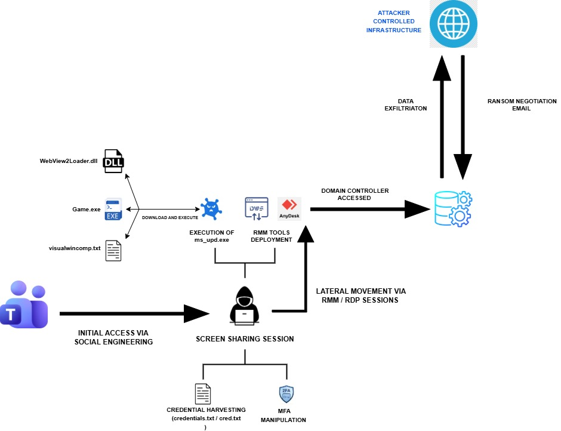

# MuddyWater Cyber Espionage Disguised as a Chaos Ransomware Attack

**MuddyWater**{.cve-chip} **Iran-Linked APT**{.cve-chip} **Ransomware Disguise**{.cve-chip} **Cyber Espionage**{.cve-chip}

## Overview

Researchers discovered an Iran-linked cyber espionage campaign in which attackers disguised data theft operations as a Chaos ransomware incident. The threat actors — showing strong similarities with the MuddyWater APT group — used social engineering through platforms such as Microsoft Teams to impersonate IT support staff and convince victims to install remote administration tools. After gaining access, attackers harvested credentials, altered MFA settings, exfiltrated sensitive data, and then listed victims on the Chaos ransomware leak site to create the appearance of a genuine ransomware attack. Investigators found no evidence of actual file encryption, confirming espionage rather than financial extortion as the true objective.

## Technical Specifications

| Attribute | Details |
|---|---|
| **Threat Actor** | MuddyWater (Iran-linked APT; MOIS-affiliated) |
| **Campaign Objective** | Cyber espionage disguised as ransomware extortion |
| **Initial Access Method** | Social engineering via Microsoft Teams (fake IT support) |
| **Remote Access Tool** | AnyDesk (legitimate software abused for unauthorized access) |
| **Tools and Techniques** | PowerShell scripts, credential dumping, MFA modification, reconnaissance |
| **Ransomware Disguise** | Chaos ransomware leak site listing; no actual file encryption observed |
| **Post-Access Activity** | Privilege escalation, credential harvesting, data exfiltration, persistence |
| **CVE** | None — exploitation of social engineering and legitimate tooling |

## Affected Products

- **Organizations targeted via Microsoft Teams** — any environment where external messaging is permitted without strict controls on inbound contact from unknown parties
- **Endpoints with AnyDesk or similar remote access tools** installed by social engineering
- Sectors with national security relevance — consistent with historical MuddyWater targeting (government, defense, critical infrastructure, telecoms)

## Attack Scenario

1. Attackers impersonate IT support personnel via Microsoft Teams, contacting victims through the platform and establishing false credibility
2. Victims are convinced to install AnyDesk or another legitimate remote access tool, giving attackers interactive access to the corporate endpoint
3. With remote access established, attackers escalate privileges and begin reconnaissance inside the victim network
4. Credentials and authentication data — including MFA configurations — are harvested; MFA settings are altered to establish persistent, attacker-controlled authentication paths
5. Attackers conduct lateral movement, access internal file shares and sensitive systems, and collect targeted data for exfiltration
6. Sensitive files and internal information are exfiltrated from victim environments to attacker-controlled infrastructure
7. To conceal the espionage objective, the operation is branded as a Chaos ransomware attack: victims are listed on the Chaos leak site and threatened with public data release
8. Investigators find no evidence of file encryption, revealing the ransomware framing as a deception layer to obscure the true intelligence-collection mission

## Impact

=== "Data and Credential Exposure"

    - Confidential organizational data, sensitive files, and internal communications exfiltrated to attacker infrastructure
    - Employee and administrator credentials compromised, enabling long-term unauthorized access and potential credential reuse across services
    - MFA configurations altered, creating persistent attacker-controlled authentication backdoors

=== "Operational and Strategic Impact"

    - Long-term attacker persistence inside victim networks increases the window for ongoing intelligence collection
    - Reputational damage from public listing on a ransomware leak site, regardless of whether encryption occurred
    - Potential national security risk for victims in government, defense, or critical infrastructure sectors — consistent with MuddyWater's historical targeting
    - Possible regulatory, legal, and compliance consequences arising from the data breach

=== "Threat Intelligence Implications"

    - The ransomware disguise blurs the line between financially motivated attacks and state-sponsored espionage, complicating incident classification and response
    - Demonstrates that leak site listings should not be treated as definitive evidence of file encryption — responders should verify independently
    - Abuse of legitimate tools (Teams, AnyDesk, PowerShell) reduces reliance on traditional malware indicators, challenging signature-based detection

## Mitigations

### User Awareness and Social Engineering Defenses

- **Train employees to recognize fake IT support requests** — establish a clear, verified process for legitimate IT support contact; employees should never install remote tools at the request of an unsolicited Teams message or call
- **Implement phishing-resistant MFA** (e.g., FIDO2/passkeys) to prevent credential harvesting and MFA manipulation from granting attacker-controlled authentication paths
- **Restrict external Teams communication** — review and limit whether external organizations can initiate Teams chats with internal users; alert on or block unsolicited external contact for high-risk roles

### Endpoint and Access Controls

- **Restrict and monitor remote administration tools** such as AnyDesk, TeamViewer, and similar — whitelist only approved tools; alert on installations or connections involving unlisted remote access software
- **Apply least-privilege access controls and network segmentation** to limit lateral movement following initial compromise
- **Monitor for suspicious MFA modifications** — alert immediately on any changes to MFA device registrations or authentication policy outside approved change windows
- **Detect unusual PowerShell execution and credential dumping behavior** using EDR telemetry and SIEM rules aligned to MuddyWater TTPs (MITRE ATT&CK T1059.001, T1003)

### Detection and Threat Hunting

- **Monitor outbound traffic for abnormal data exfiltration patterns** — large or unusual transfers to external destinations, especially outside business hours, warrant immediate investigation
- **Conduct proactive threat hunting** for Iranian APT TTPs — MuddyWater indicators include AnyDesk abuse, PowerShell-based credential dumping, and Teams-based social engineering; review threat intelligence feeds for current IoCs
- **Treat ransomware leak site listings as unconfirmed** pending independent verification — investigate for actual encryption evidence before assuming a financially motivated incident

## Resources

!!! info "Open-Source Reporting"
    - [Iranian APT Intrusion Masquerades as Chaos Ransomware Attack](https://securityaffairs.com/191765/breaking-news/iranian-cyber-espionage-disguised-as-a-chaos-ransomware-attack.html)
    - [Iranian Government Hackers Using Chaos Ransomware as Cover, Researchers Say — The Record](https://therecord.media/iran-government-hackers-use-chaos-ransomware-as-cover)
    - [Iranian Cyber Espionage Disguised as a Chaos Ransomware Attack](https://www.securityweek.com/iranian-apt-intrusion-masquerades-as-chaos-ransomware-attack/amp/)

---

*Last Updated: May 10, 2026*