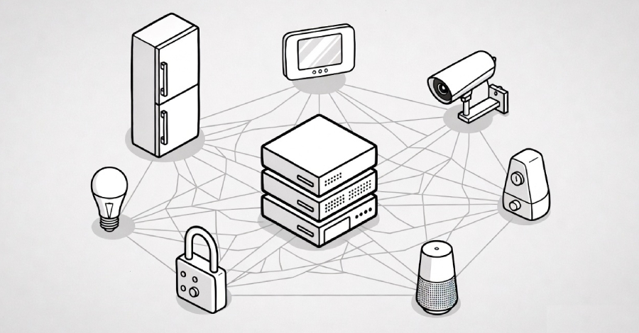
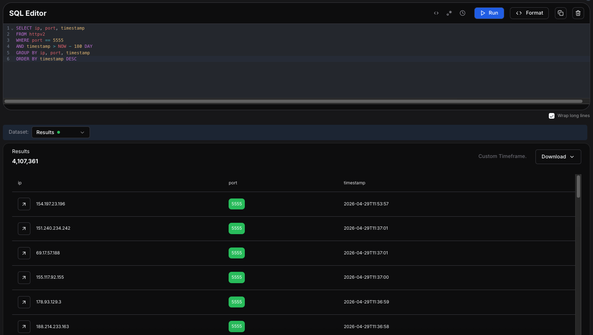

# The xlabs_v1 Mirai-Based Botnet Built for DDoS Attacks

**Mirai Botnet**{.cve-chip} **IoT Security**{.cve-chip} **DDoS**{.cve-chip} **ADB Exploit**{.cve-chip}

## Overview

Security researchers identified a new Mirai-based botnet named **xlabs_v1** targeting Android TVs, streaming devices, routers, and Linux-based IoT systems. The malware abuses exposed Android Debug Bridge (ADB) services on TCP port 5555 to compromise devices and enlist them into a coordinated DDoS attack infrastructure. The botnet is derived from the leaked Mirai source code and supports at least 21 DDoS attack methods, including TCP floods, UDP floods, and raw packet floods. Common targets include gaming servers, hosting providers, and online services.

## Technical Specifications

| Attribute | Details |
|---|---|
| **Malware Family** | Mirai-based (derived from leaked source code) |
| **Botnet Name** | xlabs_v1 |
| **Target Devices** | Android TVs, streaming devices, routers, Linux-based IoT systems |
| **Initial Access Vector** | Exposed ADB service on TCP port 5555 |
| **DDoS Methods Supported** | At least 21 (TCP flood, UDP flood, raw packet flood, and others) |
| **C2 Communication** | Device connects to attacker-controlled C2 server post-compromise |
| **Payload Delivery** | Download and execute via ADB shell after unauthorized access |
| **CVE** | None — exploitation of exposed ADB service (misconfiguration) |

## Affected Products

- **Android TV devices** and streaming hardware with ADB enabled and exposed to the internet
- **Consumer and SOHO routers** running Linux-based firmware
- **Linux-based IoT systems** reachable on TCP port 5555
- Any network-connected device with an unauthenticated or publicly exposed ADB interface

## Attack Scenario

1. Attackers scan public IP ranges targeting devices with TCP port 5555 (ADB) open and unauthenticated
2. Android TV, streaming device, or Linux IoT systems exposing ADB are identified and targeted for unauthorized access
3. The ADB service is abused to gain shell-level access without credentials, bypassing normal authentication
4. A malware payload derived from the Mirai source code is downloaded and executed on the compromised device
5. The infected device registers with the attacker's Command-and-Control (C2) server and joins the xlabs_v1 botnet infrastructure
6. Botnet operators issue remote commands directing compromised devices to participate in coordinated DDoS campaigns
7. High-volume attacks are launched against targets — commonly gaming servers, hosting providers, and online services — using any of 21+ attack methods including TCP floods, UDP floods, and raw packet floods

## Impact

=== "Service Impact"

    - Targeted organizations may experience service outages, downtime, and network congestion from high-volume DDoS traffic
    - Critical online services — gaming platforms, hosting providers, web services — can become temporarily unavailable
    - Network bandwidth exhaustion can degrade performance for legitimate users beyond the direct target

=== "Operational and Financial Impact"

    - Organizations face operational disruption and potential financial loss from downtime and recovery efforts
    - Additional DDoS mitigation, traffic scrubbing, and infrastructure protection costs are incurred during and after attacks
    - Degraded system performance affects business continuity and SLA commitments

=== "Consumer and IoT Impact"

    - Infected consumers unknowingly participate in cyberattacks launched from their own devices (TVs, routers, streaming hardware)
    - Compromised IoT devices may experience performance degradation or unexpected behavior while enlisted in the botnet
    - Device owners typically have no visibility into their device's participation in DDoS activity

## Mitigations

### Immediate Actions

- **Disable ADB on all internet-facing devices** — ADB is a developer/debugging interface; it should never be exposed to the public internet; disable it on consumer devices and IoT hardware when not actively in use
- **Block TCP port 5555 at firewalls and perimeter gateways** — prevent external access to ADB; enforce this at the network edge as a defense-in-depth measure even on devices with ADB disabled locally
- **Change default usernames and passwords** on all IoT devices, routers, and streaming hardware immediately upon deployment

### Hardening and Monitoring

- **Apply firmware and software updates regularly** — patch IoT devices and routers promptly; replace devices no longer receiving security updates from the manufacturer
- **Segment IoT devices from critical enterprise networks** — place smart TVs, streaming devices, and other consumer IoT on isolated VLANs with no direct path to sensitive systems
- **Monitor outbound traffic for suspicious patterns** — unexpected high-volume outbound traffic or connections to unknown external IPs from IoT devices may indicate botnet activity
- **Deploy IDS/IPS solutions** to detect and alert on scanning activity targeting ADB (TCP 5555) and known Mirai C2 communication patterns

### DDoS Resilience

- **Use DDoS protection and traffic filtering services** (on-premise scrubbing or cloud-based) to absorb or redirect volumetric attack traffic before it reaches critical infrastructure
- **Replace unsupported or insecure IoT devices** with alternatives that receive regular firmware updates and follow secure-by-default design principles (no exposed debugging interfaces, enforced authentication)

## Resources

!!! info "Open-Source Reporting"
    - [From Android TVs to Routers: The xlabs_v1 Mirai-Based Botnet Built for DDoS Attacks](https://securityaffairs.com/191796/malware/from-android-tvs-to-routers-the-xlabs_v1-mirai-based-botnet-built-for-ddos-attacks.html)
    - [Mirai-Based xlabs_v1 Botnet Exploits ADB to Hijack IoT Devices for DDoS Attacks — The Hacker News](https://thehackernews.com/2026/05/mirai-based-xlabsv1-botnet-exploits-adb.html)
    - [From Android TVs to Routers: The xlabs_v1 Mirai-Based Botnet Built for DDoS Attacks — SOC Defenders](https://www.socdefenders.ai/item/0e41733c-bc35-4b2c-af87-f03775565720)

---

*Last Updated: May 10, 2026*