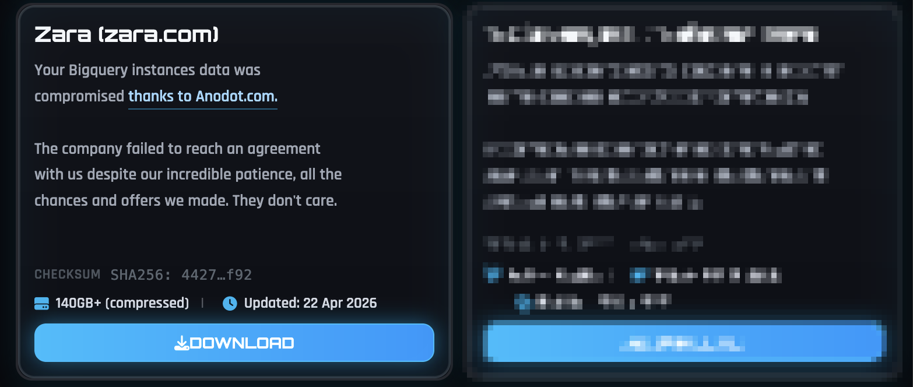

# Zara Data Breach: 197,000 Customers Exposed in Third-Party Security Incident

**Data Breach**{.cve-chip} **Third-Party Risk**{.cve-chip} **ShinyHunters**{.cve-chip} **Supply Chain**{.cve-chip}

## Overview

A third-party security incident exposed personal data belonging to approximately 197,000 Zara customers. The breach reportedly originated from a compromised external vendor connected to Inditex infrastructure. Threat actors — linked in reports to the cybercrime group ShinyHunters — accessed customer-related records held by a third-party analytics or cloud service provider, then allegedly attempted extortion. No payment card data or account passwords were reported to have been exposed.

## Technical Specifications

| Attribute | Details |
|---|---|
| **Target Organization** | Inditex / Zara |
| **Breach Origin** | Compromised third-party analytics or cloud service provider |
| **Records Exposed** | ~197,000 customers |
| **Data Exposed** | Email addresses, customer support records, geographic transaction data, purchase-related data |
| **Data Not Exposed** | Payment card data, account passwords |
| **Threat Actor** | ShinyHunters (reported attribution) |
| **Method** | Third-party vendor compromise → connected cloud database access → data extraction |
| **Post-Breach Activity** | Extortion / leak threats |
| **CVE** | None |

## Affected Products

- **Inditex / Zara** third-party vendor infrastructure (analytics or cloud service)
- Connected customer data systems accessible to the compromised vendor

## Attack Scenario

1. Threat actors compromise a third-party analytics or cloud service provider with access to Inditex/Zara customer data
2. Attackers leverage the vendor's existing access to connected cloud databases within Inditex infrastructure
3. Customer information — including email addresses, support records, transaction geography, and purchase history — is extracted from vendor systems
4. Stolen data is weaponized for extortion or public leak threats against the affected organization
5. Inditex and Zara investigate the incident, notify impacted customers, and report unauthorized access to transaction databases

## Impact

=== "Customer Impact"

    - Personal information of ~197,000 Zara customers exposed, including email addresses, support records, and purchase-related data
    - Increased risk of targeted phishing, fraud, and social-engineering campaigns directed at affected customers
    - Potential privacy violations triggering regulatory obligations under GDPR and equivalent frameworks

=== "Business and Reputational Impact"

    - Reputational damage to Zara and the wider Inditex brand stemming from an incident in the vendor supply chain rather than a direct internal failure
    - Regulatory and compliance scrutiny under GDPR and other applicable data protection laws
    - Customer trust erosion, particularly given the sensitivity of purchase behavior and support correspondence

=== "Supply Chain Risk"

    - Demonstrates how a single third-party provider with broad access to customer data can become the weakest link in an enterprise security posture
    - Extortion follow-on underscores that third-party breaches carry post-incident operational and financial consequences beyond the initial data loss

## Mitigations

### Third-Party Risk Management

- **Conduct regular third-party security audits** — assess the security posture of all vendors with access to customer data before onboarding and on a recurring schedule; require evidence of controls such as SOC 2 Type II or ISO 27001 certification
- **Perform supply-chain risk assessments** — map all vendors with connectivity to internal systems or access to customer datasets; prioritize reviews for analytics, cloud, and marketing providers
- **Limit vendor access to sensitive customer data** — enforce data minimization: vendors should only receive the data strictly necessary for their contracted service, and access should be scoped, time-limited, and reviewed periodically
- **Enforce Zero Trust access controls** — treat vendor accounts as untrusted by default; require strong authentication and enforce least-privilege access to internal systems and databases

### Technical Controls

- **Enable MFA for all vendor accounts** with access to internal environments or cloud databases
- **Encrypt sensitive stored data** at rest and in transit so that extraction without decryption keys yields limited usable data
- **Implement continuous monitoring and logging** across vendor-connected access paths; alert on anomalous query volumes, bulk data exports, or access from unexpected locations

### Incident Response

- **Notify affected users promptly** and provide clear guidance on phishing risk; advise customers to be vigilant about emails referencing their Zara order history or support interactions
- **Monitor for downstream phishing campaigns** targeting affected customers using the exposed email addresses and purchase data
- Engage regulatory authorities as required under GDPR (72-hour notification obligation) and equivalent frameworks

## Resources

!!! info "Open-Source Reporting"
    - [Zara Data Breach: 197,000 Customers Exposed in Third-Party Security Incident](https://securityaffairs.com/191859/cyber-crime/zara-data-breach-197000-customers-exposed-in-third-party-security-incident.html)
    - [Zara Data Breach Exposed Personal Information of 197,000 People](https://www.bleepingcomputer.com/news/security/zara-data-breach-exposed-personal-information-of-197-000-people/)
    - [Zara Owner Inditex Reports Unauthorised Access to Transaction Databases](https://finance.yahoo.com/sectors/technology/articles/zara-owner-inditex-reports-unauthorised-063746679.html)
    - [Zara owner Inditex reports unauthorised access to transaction databases | Reuters](https://www.reuters.com/technology/zara-owner-inditex-reports-unauthorised-access-transaction-databases-2026-04-16/)

---

*Last Updated: May 10, 2026*