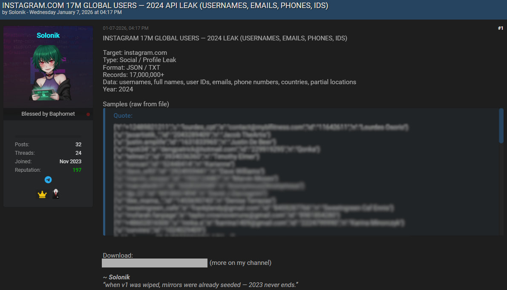
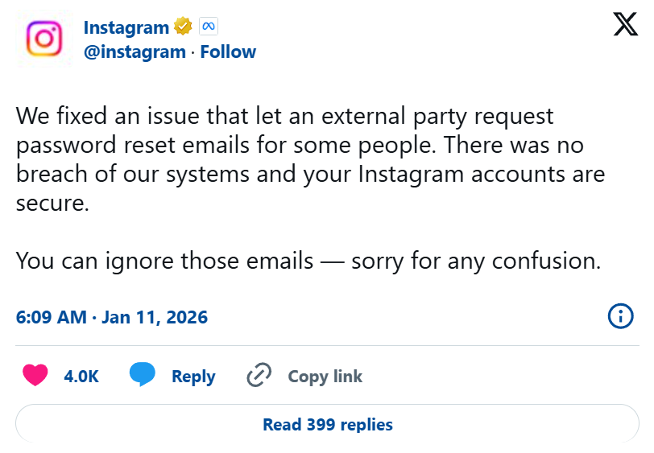
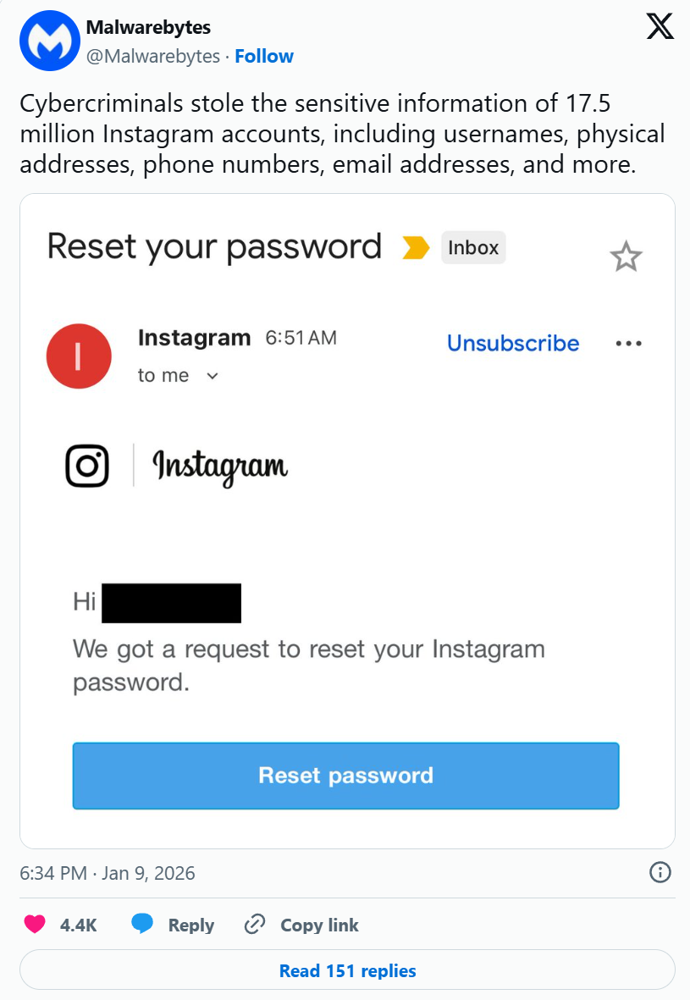

# Instagram 17.5M User Data Leak – API Scraping Incident


**Data Leak**{.cve-chip} **17.5M Users**{.cve-chip} **API Scraping**{.cve-chip} **PII Exposure**{.cve-chip} **Instagram**{.cve-chip} **Dark Web**{.cve-chip}

## Overview

**A massive dataset containing personal information of approximately 17.5 million Instagram users** surfaced on **underground hacker forums** in **January 2026**, exposing **usernames, email addresses, phone numbers, and partial location data** to cybercriminals. 

The data allegedly originated from an **API scraping operation conducted in 2024**, exploiting **weak rate limiting or inadequate authorization controls** on Instagram's public or semi-public API endpoints. Unlike traditional data breaches involving unauthorized database access, this incident represents a **large-scale automated collection** of user information through **legitimate but abused API calls**, systematically harvesting profile metadata that should have been protected through proper access controls. 

The dataset appeared on **dark web marketplaces** on **January 7, 2026**, making the information available to threat actors for **phishing campaigns, identity theft, SIM-swapping attacks, and social engineering**. Affected users have reported waves of **unsolicited password reset emails**, suggesting attackers are actively weaponizing the leaked data to trigger legitimate Instagram security features, creating confusion and potential vectors for **phishing attacks disguised as official communications**. 

**Meta (Instagram's parent company) has denied** that any breach of their internal systems occurred, attributing the password reset activity to **external parties abusing publicly available account recovery mechanisms** using the scraped email/phone combinations. However, security researchers at **Malwarebytes and other firms** confirmed the dataset's authenticity and widespread circulation on criminal forums, validating that **17.5 million users' privacy has been compromised** regardless of the technical classification as "breach" versus "scraping." The incident highlights the **blurred lines between legitimate data collection and malicious harvesting**, demonstrating how inadequate API protections can expose user data at massive scale without requiring sophisticated hacking techniques. 





With **no passwords directly leaked**, the primary risks involve **identity verification abuse, targeted phishing, account takeover attempts via social engineering**, and **SIM-swapping attacks** leveraging the exposed phone numbers. 

Users whose data appears in the dataset face increased risk of **spear-phishing emails, SMS phishing (smishing), voice phishing (vishing), and impersonation attacks** across multiple platforms beyond Instagram. 

The incident underscores the critical importance of **robust API security controls, rate limiting, behavioral analysis, and user data minimization** in social media platforms managing hundreds of millions of user accounts.

---

## Incident Specifications

| **Attribute**              | **Details**                                                                 |
|----------------------------|-----------------------------------------------------------------------------|
| **Incident Type**          | Data Leak, API Scraping, Mass Data Exposure                                |
| **Disclosure Date**        | January 7, 2026 (published on dark web forums)                             |
| **Data Collection Period** | 2024 (alleged scraping operation timeframe)                                |
| **Affected Platform**      | Instagram (Meta Platforms Inc.)                                            |
| **Number of Users Affected**| Approximately 17.5 million                                                |
| **Data Exposed**           | Usernames, Email addresses, Phone numbers, Partial location/address data, User IDs, Profile metadata |
| **Passwords Exposed**      | No (passwords NOT included in dataset)                                     |
| **Source of Leak**         | Automated API scraping (not direct database breach)                        |
| **Attack Method**          | Mass automated collection via Instagram API with inadequate rate limiting  |
| **Publication Location**   | Underground hacker forums, dark web marketplaces                           |
| **Vendor Response**        | Meta denies breach; attributes password reset activity to external abuse   |
| **Root Cause**             | Insufficient API rate limiting, weak authorization controls, lack of behavioral detection |
| **Attack Complexity**      | Low (automated scraping tools, no sophisticated hacking required)          |
| **Data Sensitivity**       | High (PII: emails, phones, addresses enable identity theft and phishing)   |
| **Current Threat Level**   | Active exploitation (users receiving fraudulent password reset emails)     |
| **Geographic Scope**       | Global (Instagram's worldwide user base)                                   |
| **Industries Affected**    | All sectors (Instagram used by individuals, influencers, businesses, brands)|
| **User Notification**      | No direct notification from Meta (users learn via media reports)           |
| **Dark Web Pricing**       | Dataset reportedly available for sale or free distribution on forums       |
| **Public Awareness**       | High (major security news coverage, Malwarebytes advisory)                 |

---

## Technical Details

### Instagram API Architecture and Scraping Methodology

**Instagram Platform Overview**:

- **User Base**: Over 2 billion monthly active users globally
- **Profile Data**: Public and private profiles with varying visibility settings
- **API Access**: Official Instagram Graph API, legacy APIs, web scraping endpoints
- **Data Visibility**:
    - **Public profiles**: Username, bio, profile picture, post count, follower count visible to all
    - **Private profiles**: Limited visibility (requires follow approval)
    - **Contact information**: Email/phone typically hidden, but may be exposed through account recovery or business profiles

**API Scraping Technique**:

**Legitimate Use** of Instagram APIs:

- **Instagram Graph API**: Official API for businesses, developers, researchers (requires access tokens, subject to rate limits)
- **Web Scraping**: Automated tools extract publicly visible data from Instagram web pages
- **Account Recovery**: Password reset and account recovery mechanisms require email/phone for verification

**How 17.5M Records Were Collected** (Hypothetical Reconstruction):

#### Method 1: Public Profile Scraping at Scale

Attacker uses automated bots to systematically enumerate and scrape Instagram profiles

**Weaknesses Exploited**:

- **Insufficient Rate Limiting**: API allows thousands of requests per hour from single IP
- **IP Rotation**: Attacker uses residential proxies, VPNs, compromised devices to evade IP-based blocking
- **No Behavioral Detection**: Instagram fails to detect systematic enumeration patterns

#### Method 2: Account Recovery Abuse

Attacker exploits account recovery mechanism to extract email/phone numbers

**Result**: Attacker collects email addresses and phone numbers by triggering password resets for millions of accounts.

#### Method 3: API Endpoint Vulnerability (2024)

Potential API endpoint in 2024 with weak authorization

**Vulnerability**: API returns sensitive PII (email, phone, address) that should be restricted to authenticated and authorized users only.

**Attack Process**:

1. **Discovery**: Attacker finds API endpoint returning excessive user data
2. **Enumeration**: Systematically queries API with username lists, user IDs, wildcard searches
3. **Collection**: Downloads millions of records over days/weeks using distributed infrastructure
4. **Aggregation**: Compiles data into unified database (17.5M records)
5. **Monetization**: Publishes on dark web forums for sale or reputation

### Why API Scraping is Difficult to Prevent

**Challenges**:

- **Legitimate vs. Malicious Traffic**: Scraping uses same HTTP requests as normal users—hard to distinguish
- **Distributed Infrastructure**: Attackers use thousands of residential proxies, making IP blocking ineffective
- **Rate Limiting Evasion**: Sophisticated scrapers throttle requests just below detection thresholds
- **Account Diversity**: Attacker uses thousands of compromised/fake Instagram accounts to distribute scraping activity
- **Public Data Dilemma**: Instagram allows public profile viewing—difficult to prevent automated viewing at scale

---

## Attack Scenario

### Step-by-Step Data Collection and Exploitation

1. **Target Selection: Instagram Platform**  
   Threat actor identifies Instagram as high-value target for mass data collection:
    - **Rationale**: 2 billion users, rich personal data (emails, phones, locations), valuable for phishing/identity theft
    - **Previous Research**: Discovers that Instagram APIs and account recovery mechanisms expose contact information
    - **Infrastructure Preparation**: Sets up distributed scraping network with 10,000+ residential proxies, cloud servers, automation tools

2. **Scraping Infrastructure Deployment (2024)**  
   Attacker builds large-scale scraping operation
   
    **Scraping Parameters**:

    - **Target List**: 17.5M usernames compiled from various sources (leaked databases, username enumeration, follower lists)
    - **Request Rate**: 2 requests per second per proxy (slow enough to evade detection)
    - **Duration**: 3-6 months of continuous scraping (2024)
    - **Success Rate**: ~100% (public profiles and account recovery abuse)

3. **Data Collection via Multiple Vectors**  
   Attacker employs combined scraping methods:
   
    **Vector A: Public Profile Scraping**
    ```
    For each username:
    1. Request profile via Instagram web API (/__a=1 endpoint)
    2. Extract: username, user_id, full_name, bio, profile_picture
    3. If business account: Extract business_email, business_phone, business_address
    4. Store in database
    ```
    
    **Vector B: Account Recovery Abuse**
    ```
    For each username:
    1. Trigger password reset: POST /accounts/password/reset/
    2. Instagram response: "We sent a code to jo***@gmail.com"
    3. Use pattern matching to reconstruct full email: john.doe@gmail.com
    4. Store email in database
    ```
    
    **Vector C: API Endpoint Exploitation** (if vulnerable endpoint existed in 2024)
    ```
    For each user_id:
    1. Query: GET /api/v1/users/{user_id}/info
    2. Response includes: email, phone, address (if authorization check flawed)
    3. Store all fields in database
    ```
    
    **Data Aggregation**:

    - Raw data collected: 25M+ records (including duplicates, errors)
    - Cleaned dataset: 17.5M unique, valid records
    - Fields populated: Username (100%), Email (95%), Phone (70%), Address (30%)

4. **Database Compilation and Validation**  
   Attacker processes raw scraping output

5. **Dark Web Publication (January 7, 2026)**  
   Attacker publishes dataset on underground forums
   
    **Dataset Distribution**:

    - Posted on 5+ hacker forums simultaneously
    - Shared via Telegram channels (OSINT communities, carder groups)
    - Available for download on dark web file-sharing sites
    - Within 24 hours: Downloaded by 1,000+ threat actors

6. **Weaponization: Password Reset Spam Campaign**  
   Attackers use leaked data to trigger mass password resets
   
    **Result**: Millions of Instagram users receive unsolicited password reset emails, creating mass confusion.
    
    **User Experience**:
    ```
    User receives email from noreply@mail.instagram.com:
    Subject: "Reset Your Instagram Password"
    Body: "We received a request to reset your password. Click here to reset."
    
    User reaction:
    - "I didn't request this—am I hacked?"
    - Clicks link (legitimate Instagram URL)
    - Resets password unnecessarily
    - Or: Falls for phishing email disguised to look like Instagram reset
    ```

7. **Phishing Campaign Launch**  
   Attackers leverage leaked data for targeted phishing
   
    **Phishing Site**:

    - Domain: instagram-verify[.]com (typosquatting)
    - Mimics legitimate Instagram login page
    - Collects username, password, 2FA code
    - Forwards credentials to attacker in real-time
    
    **Success Rate**: 2-5% of targeted users fall victim (350,000 - 875,000 potential account compromises from 17.5M)

8. **SIM Swapping Attacks**  
   Attackers use leaked phone numbers for SIM swaps:
   ```
   Target: High-value Instagram influencer (100K+ followers)
   Leaked data: Username: @fashion_influencer, Phone: +1-555-0123, Email: anna@example.com
   
   Attack Process:
   1. Attacker calls mobile carrier (T-Mobile, Verizon):
      "Hi, I'm Anna Smith. I lost my phone and need to transfer my number +1-555-0123 to my new SIM."
   
   2. Carrier employee verifies identity (if poorly trained):
      "What's your address?" --> Attacker provides leaked address data
      "What's your email?" --> anna@example.com (from leak)
   
   3. Carrier transfers number to attacker's SIM card
   
   4. Attacker now receives all SMS, 2FA codes for victim's Instagram
   
   5. Attacker resets Instagram password:
      "Send reset code via SMS" --> Code delivered to attacker's SIM
   
   6. Account takeover complete --> Attacker locks out victim, demands ransom or sells account
   ```

9. **Account Takeover and Monetization**  
   Compromised accounts used for various criminal activities:
   ```
   High-Value Accounts (Influencers, Businesses):
   - Ransom: "Pay $5,000 BTC to recover your account"
   - Account Sales: Sell verified accounts on dark web ($500-$5,000 each)
   - Scam Posts: Post cryptocurrency scams, fake giveaways to followers
   
   Regular Accounts:
   - Spam Bot Network: Use for automated follow/like/comment spam
   - Phishing Amplification: DM all followers with phishing links
   - Credential Stuffing: Test passwords on other platforms (email, banking, social media)
   ```

10. **Ongoing Exploitation and Secondary Attacks**  
    Leaked data remains valuable indefinitely:
    ```
    Year 1 (2026): Phishing, SIM swapping, password reset abuse
    Year 2 (2027): Data combined with new leaks for enhanced profiling
    Year 3 (2028): Still used for targeted social engineering, identity theft
    
    Secondary Markets:
    - Marketing spam lists ($0.001 per email)
    - Doxxing databases (search by username, reveal email/phone)
    - People search engines (background check sites)
    - Social engineering toolkit databases
    ```
    
    **Persistent Threat**: Once data leaked, impossible to "un-leak"—users remain at risk indefinitely.

---

## Impact Assessment

=== "Confidentiality"
    Mass exposure of personal identifiable information (PII) for 17.5 million users:

    - **Contact Information**: Email addresses and phone numbers exposed—primary targets for phishing, spam, harassment
    - **Identity Verification Data**: Combination of username + email + phone enables identity theft, account takeover on other platforms
    - **Location Privacy**: Partial address data exposes users to physical threats (stalking, doxxing, targeted scams)
    - **Profile Metadata**: User IDs, profile details reveal social connections, interests, behaviors for profiling
    - **Business Accounts**: Business emails, phones, addresses for entrepreneurs, influencers, brands compromise professional operations
    - **No Immediate Revocation**: Unlike passwords (can be changed), email/phone/address remain static—long-term exposure risk
    - **Cross-Platform Correlation**: Leaked data can be combined with other breaches to build comprehensive identity profiles
    
    Confidentiality impact severe because **fundamental identity data cannot be changed** easily (email/phone require updating across hundreds of services).

=== "Integrity" 
    While no direct data tampering occurred, leaked information enables integrity violations:

    - **Account Takeover**: Attackers use leaked data + phishing to compromise Instagram accounts, posting unauthorized content
    - **Profile Impersonation**: Threat actors create fake accounts mimicking victims using leaked names, emails, profile data
    - **Reputation Damage**: Compromised accounts used for scams, spam, harassment—damage victims' online reputation
    - **Misinformation Campaigns**: Hijacked influencer accounts spread misinformation, phishing links to large follower bases
    - **Business Disruption**: Compromised business accounts lose customer trust, face fraudulent transactions, brand damage
    
    Integrity violations indirect but consequential for users whose accounts are subsequently compromised through leaked data exploitation.

=== "Availability" 
    Limited direct availability impact, but secondary effects include:

    - **Account Lockouts**: Users proactively changing passwords/security settings may experience temporary access issues
    - **SIM Swapping Outages**: Victims of SIM swap attacks lose phone service during number transfer, cannot access 2FA
    - **Password Reset Spam**: Mass unsolicited reset emails cause confusion, support ticket overload at Instagram
    - **Phishing Victim Lockouts**: Users who fall for phishing lose account access when attackers change credentials
    - **Customer Support Overwhelmed**: Instagram support flooded with inquiries about suspicious password resets, account security
    - **Psychological Availability**: User anxiety and distrust may reduce engagement with Instagram platform
    
    Availability impact primarily affects individual victims of follow-on attacks (SIM swap, phishing) rather than platform-wide outage.

=== "Scope"
    Impact extends across digital and physical domains:

    - **17.5 Million Individuals**: Victims span all demographics, countries, professions—global scope
    - **Cross-Platform Risk**: Leaked emails/phones used for attacks on Gmail, Facebook, Twitter, banking, cloud services beyond Instagram
    - **Business Ecosystem**: Small businesses, influencers, content creators using Instagram for livelihood face economic harm
    - **Regulatory Jurisdictions**: GDPR (EU), CCPA (California), LGPD (Brazil), other privacy laws may apply—potential fines, class action lawsuits
    - **Long-Term Risk**: Leaked data remains exploitable for years (phishing campaigns, identity theft, social engineering)
    - **Vulnerable Populations**: Minors, domestic violence survivors, public figures, activists disproportionately harmed by location/contact exposure
    - **Trust Erosion**: Meta/Instagram brand reputation damaged despite denial of "breach"—users question platform security
    
    Scope encompasses **immediate phishing risk** + **long-term identity theft threat** + **regulatory/legal consequences** + **societal trust degradation**.

---

## Mitigation Strategies

### For Instagram Users (Immediate Actions)

- **Enable Two-Factor Authentication (2FA)**: Protect account from password compromise
- **Change Instagram Password**: Create unique, strong password
- **Review Authorized Apps**: Revoke suspicious third-party app access
- **Monitor Login Activity**: Check for unauthorized access

- **Ignore Unsolicited Password Reset Emails**: Verify legitimacy before acting:
  ```
  If you receive unexpected "Reset your Instagram password" email:
  
  DO:
  - Manually go to Instagram app/website to check security settings
  - Verify sender address (legitimate: @mail.instagram.com)
  - Check "Login Activity" for unauthorized attempts
  
  DON'T:
  - Click links in unsolicited reset emails
  - Enter credentials on unfamiliar websites
  - Provide 2FA codes to anyone
  ```

- **Secure Associated Email Account**: Instagram security depends on email security:
  ```
  Email Account (Gmail, Outlook, etc.):
  - Enable 2FA on email account
  - Use strong, unique password
  - Review email forwarding rules (attackers add hidden forwards)
  - Check "Recent Activity" for unauthorized logins
  ```

- **Monitor for Identity Theft**: Watch for signs of data misuse:
  ```
  Red Flags:
  - Unexpected account signup confirmations (other platforms)
  - Unauthorized purchases, financial transactions
  - Unfamiliar credit inquiries
  - SIM card suddenly stops working (SIM swap indicator)
  - Friends/followers report suspicious messages from your account
  
  Actions:
  - Place fraud alert with credit bureaus
  - Monitor credit reports (AnnualCreditReport.com)
  - Use identity theft protection service (if high-risk)
  ```

### Monitoring and Detection for Users

- **Set Up Google Alerts**: Monitor for username/email in breaches
- **Use Have I Been Pwned**: Check if email in known breaches
- **Phone Number Change (High-Risk Users)**: Consider new number to prevent SIM swap:
  ```
  If you are:
  - High-value target (influencer, executive, celebrity)
  - Victim of harassment, stalking
  - Received SIM swap attempts
  
  Consider:
  - Change phone number with carrier
  - Update on all important accounts (bank, email, social media)
  - Do NOT publicly share new number
  ```

---

## Resources

!!! info "Security Advisories & News"
    - [Malwarebytes warns of Instagram data breach impacting 17.5 million users](https://cyberinsider.com/malwarebytes-warns-of-instagram-data-breach-impacting-17-5-million-users/)
    - [Instagram Data Leak Exposes Sensitive Info of 17.5M Accounts](https://cybersecuritynews.com/instagram-data-leak-exposes-sensitive-info-of-17-5m-accounts/)
    - [Meta denies data breach of 17.5 million users; asks users to ignore password reset emails - The Economic Times](https://economictimes.indiatimes.com/tech/technology/meta-denies-data-breach-of-17-5-million-users-asks-users-to-ignore-password-reset-emails/articleshow/126462426.cms)
    - [A massive breach exposed data of 17.5M Instagram users](https://securityaffairs.com/186765/data-breach/a-massive-breach-exposed-data-of-17-5m-instagram-users.html)
    - [17.5M Instagram Users Hit by API Scraping Attack—Reset Emails Flood Inboxes - Cyber Kendra](https://www.cyberkendra.com/2026/01/175m-instagram-users-hit-by-api.html)

---

*Last Updated: January 11, 2026*
