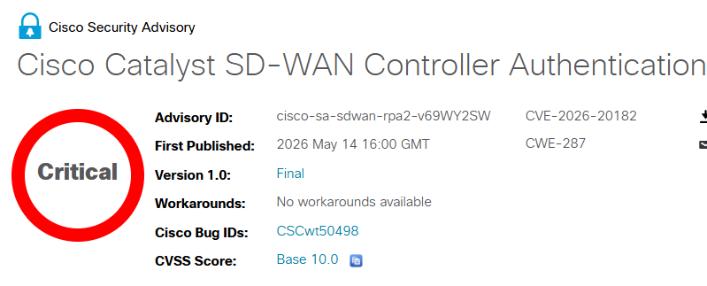

# Cisco Catalyst SD-WAN Zero-Day Vulnerability - CVE-2026-20182

**CVE-2026-20182**{.cve-chip} **Cisco SD-WAN**{.cve-chip} **Zero-Day**{.cve-chip} **Authentication Bypass**{.cve-chip}

## Overview
Cisco disclosed and patched CVE-2026-20182, a critical zero-day vulnerability affecting Catalyst SD-WAN products. The flaw was actively exploited in the wild and allowed attackers to bypass authentication controls and gain privileged administrative access to SD-WAN infrastructure.

This is the sixth Cisco SD-WAN zero-day reported as exploited during 2026.

## Technical Specifications

| **Attribute** | **Details** |
|---------------|-------------|
| **CVE** | CVE-2026-20182 |
| **Affected Components** | Cisco Catalyst SD-WAN Controller (vSmart), Cisco Catalyst SD-WAN Manager (vManage) |
| **Vulnerable Service** | `vdaemon` |
| **Protocol / Port** | DTLS over UDP `12346` |
| **Vulnerability Type** | Authentication bypass via trusted-peer impersonation |
| **Attack Vector** | Specially crafted DTLS packets in SD-WAN peering authentication workflow |
| **Privileges Required** | None on target device prior to exploitation |
| **Observed Status** | Actively exploited in the wild (zero-day) |

## Affected Products
- Cisco Catalyst SD-WAN Controller (vSmart)
- Cisco Catalyst SD-WAN Manager (vManage)
- Internet-exposed SD-WAN management interfaces and peering paths

## Attack Scenario
1. **Discovery**:
   The attacker scans for exposed Cisco SD-WAN management or peering endpoints.

2. **Impersonation via DTLS**:
   The attacker sends crafted DTLS packets to the `vdaemon` service on UDP port `12346` and impersonates a trusted SD-WAN peer.

3. **Authentication Bypass**:
   Peer authentication is bypassed, granting unauthorized privileged administrative access.

4. **Post-Exploitation Actions**:
   The attacker adds malicious SSH keys, modifies NETCONF configurations, escalates privileges (up to root), and establishes persistence.

5. **Operational Abuse**:
   With control over SD-WAN infrastructure, the attacker can manipulate traffic routing and policy enforcement across connected branches.

## Impact Assessment

=== "Network and Operations"
    * Full administrative control of SD-WAN control-plane components
    * Traffic interception, rerouting, policy tampering, and WAN disruption
    * Potential malware deployment across branch-connected environments

=== "Security and Data"
    * Exposure of sensitive enterprise traffic and configuration data
    * Persistence for long-term espionage and follow-on attack operations
    * Increased risk of lateral movement into downstream enterprise assets

=== "Business Risk"
    * Outages and degraded connectivity for distributed branches
    * Incident response and recovery complexity at infrastructure scale
    * Elevated regulatory and contractual impact when sensitive data is affected

## Mitigation Strategies

### Immediate Remediation
- Immediately apply Cisco security patches and fixed releases.

### Exposure Reduction
- Restrict SD-WAN management interfaces from internet exposure.
- Allow access only from trusted IP addresses.

### Detection and Hardening
- Audit SSH keys and SD-WAN peer relationships for unauthorized entries.
- Review logs such as `/var/log/auth.log` for suspicious authentication activity.
- Monitor for unauthorized NETCONF changes and unexpected peer connections.
- Implement network segmentation and continuous monitoring of SD-WAN control-plane systems.

## Resources and References

!!! info "Open-Source Reporting"
    - [Cisco Catalyst SD-WAN Controller Authentication Bypass Vulnerability](https://sec.cloudapps.cisco.com/security/center/content/CiscoSecurityAdvisory/cisco-sa-sdwan-rpa2-v69WY2SW)
    - [CVE-2026-20182 - Vulnerability Details - OpenCVE](https://app.opencve.io/cve/CVE-2026-20182)
    - [Cisco patches another actively exploited SD-WAN zero-day (CVE-2026-20182) - Help Net Security](https://www.helpnetsecurity.com/2026/05/15/cisco-sd-wan-zero-day-cve-2026-20182/)
    - [Cisco warns of new critical SD-WAN flaw exploited in zero-day attacks](https://www.bleepingcomputer.com/news/security/cisco-warns-of-new-critical-sd-wan-flaw-exploited-in-zero-day-attacks/)
    - [Maximum Severity Cisco SD-WAN Bug Exploited in the Wild](https://www.darkreading.com/vulnerabilities-threats/maximum-severity-cisco-sd-wan-bug-exploited)
    - [Cisco Patches Another SD-WAN Zero-Day, the Sixth Exploited in 2026 - SecurityWeek](https://www.securityweek.com/cisco-patches-another-sd-wan-zero-day-the-sixth-exploited-in-2026/)

---

*Last Updated: May 17, 2026*
