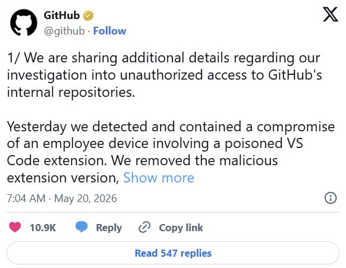
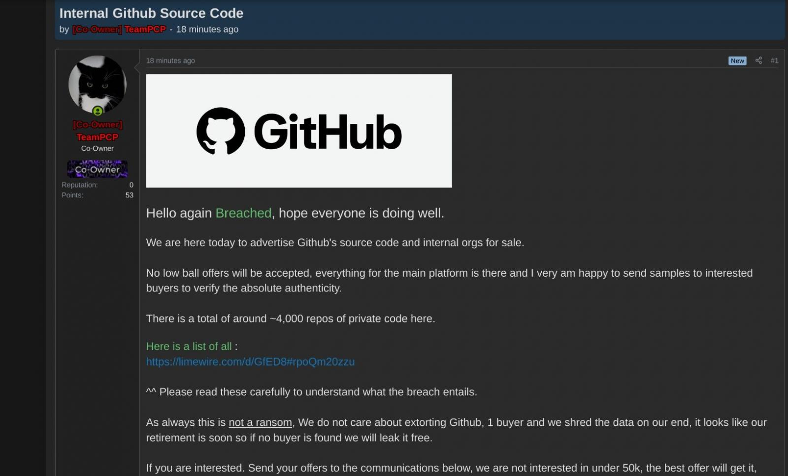

# GitHub Internal Repository Breach

**GitHub**{.cve-chip} **Supply Chain Risk**{.cve-chip} **Malicious VS Code Extension**{.cve-chip} **Insider Access Abuse**{.cve-chip}

## Overview

GitHub confirmed a security breach in which an employee device was compromised via a malicious Visual Studio Code extension. Using the infected workstation as a pivot point, the threat actor "TeamPCP" gained unauthorized access to GitHub's internal environment and exfiltrated approximately 3,800–4,000 internal repositories containing source code, tooling, CI/CD workflows, infrastructure configurations, and internal documentation. The stolen data was subsequently advertised for sale on underground forums. GitHub stated there is currently no evidence that customer repositories or GitHub Enterprise customer environments were directly impacted.

## Technical Specifications

| Attribute | Details |
|---|---|
| **Victim** | GitHub (Microsoft subsidiary) |
| **Threat Actor** | TeamPCP (claimed responsibility) |
| **Initial Access Vector** | Malicious Visual Studio Code extension installed on an employee workstation |
| **Compromise Method** | Endpoint malware enabling credential/token theft, session hijacking, or remote access |
| **Data Exfiltrated** | ~3,800–4,000 internal repositories (source code, tooling, CI/CD workflows, infra configs, internal docs) |
| **Customer Impact** | No confirmed impact on customer repositories or GitHub Enterprise environments (per GitHub) |
| **Post-Breach Activity** | Stolen data advertised/sold on underground forums |
| **CVE** | None — social engineering via malicious IDE extension |

## Affected Products

- **GitHub internal environment** — internal source code repositories, developer tooling, CI/CD pipeline configurations, and infrastructure documentation
- **Developer endpoints running VS Code** — any environment where unvetted marketplace extensions can be installed by users with privileged repository access

## Attack Scenario

1. A GitHub employee installs a malicious Visual Studio Code extension — sourced from the VS Code Marketplace or a third-party source — that contains hidden malware
2. The malware compromises the employee's endpoint, stealing authentication tokens, session cookies, or credentials with access to GitHub's internal systems
3. Using the stolen tokens or credentials, the attacker pivots from the employee device into GitHub's internal repository environment without triggering immediate detection
4. Internal repositories are enumerated; ~3,800–4,000 repositories are identified and exfiltrated, including source code, CI/CD workflow definitions, infrastructure configurations, and internal documentation
5. The threat actor "TeamPCP" claims responsibility and advertises or attempts to sell the stolen repository data on underground forums

## Impact

=== "Immediate Impact"

    - Exposure of GitHub's internal source code, developer tooling, and CI/CD pipeline logic — disclosing implementation details that could reveal new attack surfaces or exploitable weaknesses
    - Potential disclosure of sensitive infrastructure configuration details, internal secrets, or hard-coded credentials if present in exfiltrated repositories
    - Reputational damage to GitHub and elevated security concerns across the global developer ecosystem given GitHub's role as foundational development infrastructure

=== "Supply Chain Risk"

    - CI/CD workflow definitions and build infrastructure details in exfiltrated repositories could enable targeted supply-chain attacks against GitHub's own platform or its downstream users
    - Exposure of internal tooling and automation scripts may reveal privileged access patterns or integration points exploitable for follow-on attacks
    - Even with no confirmed customer repository impact, developer confidence in the platform's security posture is affected

=== "Credential and Secrets Risk"

    - Internal repositories may contain hard-coded secrets, API keys, service tokens, or deployment credentials that were not intended for external exposure
    - Stolen credentials and tokens used for the intrusion represent ongoing risk if not fully rotated; re-entry paths may persist if token revocation is incomplete
    - Developer ecosystem broadly faces elevated risk as attackers possessing GitHub internals may craft more convincing targeted phishing or supply-chain attacks

## Mitigations

### IDE and Extension Security

- **Restrict installation of untrusted IDE extensions** — enforce an approved-extension policy for developer endpoints; use VS Code extension allowlisting or managed extension profiles via MDM/endpoint policy
- **Enforce application allowlisting on developer endpoints** to prevent unauthorized executables introduced via extensions, scripts, or build tools from running
- **Deploy endpoint detection and response (EDR)** solutions on all developer workstations, including those of privileged users with broad repository access

### Access and Credential Controls

- **Implement least-privilege access for repositories** — developers should only have access to the repositories required for their current work; privileged internal repositories should require additional justification and review
- **Use hardware-based MFA** (FIDO2/passkeys) for all accounts with access to internal systems and privileged repositories to prevent token/session theft from translating directly into account takeover
- **Rotate all credentials, tokens, and OAuth app authorizations** following any confirmed device compromise; audit all active sessions and revoke any not attributable to known, legitimate access
- **Monitor GitHub OAuth apps and active sessions** continuously; alert on new OAuth app authorizations, unusual access patterns, or bulk repository clone/download operations

### Secrets and Repository Hygiene

- **Scan repositories continuously for exposed secrets** using tools like GitHub Secret Scanning, truffleHog, or Gitleaks; remediate any hard-coded credentials immediately and treat them as compromised
- **Audit CI/CD pipeline configurations** for sensitive environment variables, deployment keys, or service account tokens that may be exposed in workflow definitions

### Awareness and Response

- **Conduct developer security awareness training** focusing on risks of third-party IDE extensions, phishing targeting developer tooling, and secure handling of access tokens
- If compromise is suspected, **assume broad token and credential exposure** and initiate full rotation across all systems accessible from the affected employee's identity

## Resources

!!! info "Open-Source Reporting"
    - [GitHub Confirms Breach, 4K Internal Repos Stolen — Hackread](https://www.darkreading.com/application-security/github-confirms-breach-4k-internal-repos-stolen)
    - [GitHub Investigates Internal Repositories Breach Claimed by TeamPCP — BleepingComputer](https://www.bleepingcomputer.com/news/security/github-investigates-internal-repositories-breach-claimed-by-teampcp/)
    - [GitHub Breached — Employee Device Hack Led to Exfiltration of 3,800+ Internal Repos — The Hacker News](https://thehackernews.com/2026/05/github-investigating-teampcp-claimed.html)
    - [A Malicious VS Code Extension Just Breached GitHub's Internal Repositories](https://securityaffairs.com/192440/cyber-crime/a-malicious-vs-code-extension-just-breached-github-s-internal-repositories.html)
    - [GitHub Says Hackers Stole Data from Thousands of Internal Repositories — TechCrunch](https://techcrunch.com/2026/05/20/github-says-hackers-stole-data-from-thousands-of-internal-repositories/)

---
*Last Updated: May 21, 2026*