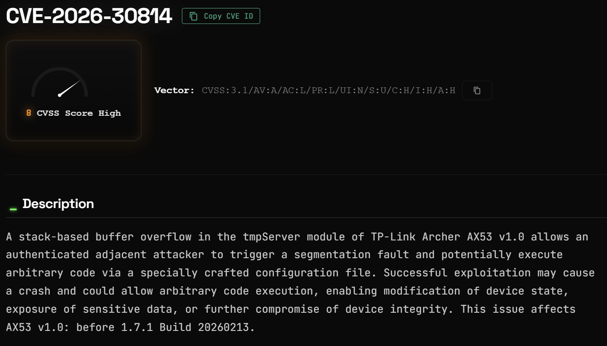

# TP-Link Archer AX53 Stack-Based Buffer Overflow

**CVE-2026-30814**{.cve-chip} **TP-Link**{.cve-chip} **Stack-Based Buffer Overflow**{.cve-chip} **Router Security**{.cve-chip}

## Overview

A high-severity stack-based buffer overflow vulnerability (CVE-2026-30814) was discovered in TP-Link Archer AX53 router firmware. The flaw exists in the `tmpServer` component, where improper bounds checking when processing configuration-related input allows an authenticated attacker on the adjacent network to overflow stack memory and potentially execute arbitrary code or crash the device. Successful exploitation could enable DNS hijacking, traffic interception, and persistent access at the network gateway level.

## Technical Specifications

| Attribute | Details |
|---|---|
| **CVE** | CVE-2026-30814 |
| **Severity** | High |
| **CWE** | CWE-121 (Stack-Based Buffer Overflow), CWE-787 (Out-of-bounds Write) |
| **Affected Product** | TP-Link Archer AX53 v1.0 |
| **Affected Firmware** | Prior to 1.7.1 Build 20260213 |
| **Vulnerable Component** | `tmpServer` module |
| **Attack Vector** | Adjacent network |
| **Authentication Required** | Yes (valid or stolen router credentials) |
| **Impact** | Remote code execution / Denial of Service |
| **Fixed Version** | Firmware 1.7.1 Build 20260213 or later |

## Affected Products

- **TP-Link Archer AX53 v1.0** running firmware versions prior to 1.7.1 Build 20260213

## Attack Scenario

1. Attacker gains access to the local or adjacent network (e.g., via Wi-Fi access, compromised network device, or position on the same subnet)
2. Attacker authenticates to the router using valid credentials or previously stolen admin credentials
3. A maliciously crafted configuration payload is delivered to the vulnerable `tmpServer` service
4. The oversized input triggers a stack-based buffer overflow, overwriting stack memory and corrupting execution flow inside `tmpServer`
5. Attacker achieves remote code execution on the router, crashes the device (denial of service), or manipulates router settings and network traffic

## Impact

=== "Device Impact"

    - Remote code execution on the router, allowing full attacker control of the network gateway
    - Denial of service via device crash or forced reboot, disrupting network connectivity for all connected devices

=== "Network Impact"

    - DNS hijacking — attacker can redirect DNS queries to malicious resolvers, enabling phishing and credential interception for all devices on the network
    - Traffic interception and monitoring of all network communications passing through the compromised router
    - Persistence within the network gateway, surviving reboots if firmware is modified

=== "Lateral Movement Risk"

    - Compromised router provides a persistent foothold for lateral movement into internal systems
    - All devices on the network become exposed to man-in-the-middle attacks, credential harvesting, and further exploitation from the attacker-controlled gateway

## Mitigations

- **Upgrade firmware to version 1.7.1 Build 20260213 or later** — apply the patch immediately on all affected TP-Link Archer AX53 v1.0 devices
- **Change default and admin passwords** — use strong, unique credentials for router administration to reduce the risk of credential-based exploitation
- **Disable remote administration** if not actively required to eliminate external attack surface
- **Restrict router management access to trusted hosts only** — use access control lists or IP restrictions to limit which devices can reach the admin interface
- **Use network segmentation and VLANs** to isolate IoT and untrusted devices, limiting the blast radius if the router is compromised
- **Monitor router logs and DNS configuration** for unauthorized changes that may indicate post-exploitation activity

## Resources

!!! info "Open-Source Reporting"
    - [CVE-2026-30814 — NVD](https://nvd.nist.gov/vuln/detail/CVE-2026-30814)
    - [CVE-2026-30814 — SentinelOne Vulnerability Database](https://www.sentinelone.com/vulnerability-database/cve-2026-30814/)
    - [CVE-2026-30814: Stack-Based Buffer Overflow in TP-Link Archer AX53 — TheHackerWire](https://www.thehackerwire.com/vulnerability/CVE-2026-30814/)

---
*Last Updated: May 21, 2026*