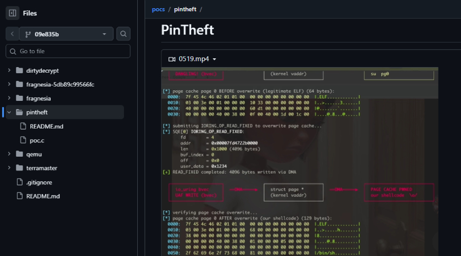

# CVE-2026-46333 - "ssh-keysign-pwn" Linux Kernel Privilege Escalation

**CVE-2026-46333**{.cve-chip} **Linux Kernel**{.cve-chip} **Privilege Escalation**{.cve-chip} **Local Root**{.cve-chip}

## Overview
A Linux kernel vulnerability tracked as CVE-2026-46333 allows local attackers to escalate privileges to root. The flaw reportedly existed for approximately nine years and affects multiple major Linux distributions.

Researchers demonstrated successful exploitation against modern Ubuntu and Debian systems.

## Technical Specifications

| **Attribute** | **Details** |
|---------------|-------------|
| **CVE** | CVE-2026-46333 |
| **Nickname** | ssh-keysign-pwn |
| **Vulnerability Class** | Local privilege escalation (LPE) |
| **Affected Logic** | Linux kernel `__ptrace_may_access()` privilege-checking path |
| **Exploit Condition** | Credential-transition and shutdown edge-case handling abuse |
| **Abused Target Process (Reported)** | Privileged process interaction such as `ssh-keysign` |
| **Result** | Unauthorized sensitive memory access and escalation to root |
| **Affected Timeline** | Kernel lineage reportedly vulnerable since 2016 |
| **PoC Status** | Qualys proof-of-concept exploits reported for Debian 13 and Ubuntu 24.04/26.04 |

## Affected Products
- Linux distributions using vulnerable kernel builds dating back to 2016-era code paths
- Ubuntu systems (reported PoC targets include 24.04 and 26.04)
- Debian systems (reported PoC target includes Debian 13)
- Multi-tenant and cloud workloads where local footholds are possible

## Attack Scenario
1. **Initial Foothold**:
   The attacker gains low-privileged local access through stolen credentials, web-shell access, container compromise, or another vulnerability.

2. **Local Exploit Execution**:
   Exploit code is executed to target vulnerable kernel privilege-checking behavior.

3. **ptrace Logic Abuse**:
   The exploit abuses `ptrace` permission handling involving privileged processes such as `ssh-keysign`.

4. **Privilege Escalation**:
   The attacker elevates privileges to root.

5. **Post-Compromise Control**:
   Full system compromise enables persistence, credential theft, and lateral movement.

## Impact Assessment

=== "Host Security"
    * Full root compromise of Linux systems
    * Security control tampering or disablement
    * Persistence installation by local threat actors

=== "Identity and Access"
    * Theft of SSH keys and credential material
    * Broader account abuse and trust-boundary compromise

=== "Infrastructure Risk"
    * Elevated risk for cloud workloads and shared hosting
    * Potential container-to-host escalation scenarios

## Mitigation Strategies

### Patch and Hardening
- Apply vendor kernel patches immediately.
- Update affected Linux distributions to patched kernel versions.
- Restrict ptrace functionality with `kernel.yama.ptrace_scope = 2` where operationally feasible.

### Detection and Response
- Monitor for abnormal `ptrace` usage or suspicious `ssh-keysign` activity.
- Audit systems for indicators of unauthorized privilege escalation.
- Rotate credentials and SSH keys if compromise is suspected.
- Enforce least-privilege access controls across interactive and service accounts.

## Resources and References

!!! info "Open-Source Reporting"
    - [9-Year-Old Linux Kernel Flaw Enables Root Command Execution on Major Distros](https://thehackernews.com/2026/05/9-year-old-linux-kernel-flaw-enables.html)
    - [Another major Linux security flaw revealed - nine-year old issue could spell disaster for users | TechRadar](https://www.techradar.com/pro/security/another-major-linux-security-flaw-revealed-nine-year-old-issue-could-spell-disaster-for-users)
    - [Linux Kernel Local root Privilege Escalation (CVE-2026-46333) | UIT](https://www.yorku.ca/uit/2026/05/linux-kernel-local-root-privilege-escalation-cve-2026-46333/)

---

*Last Updated: May 24, 2026*
