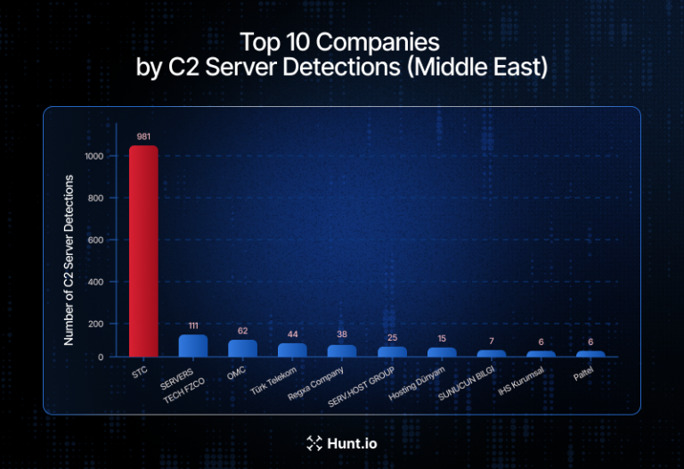

# One Telecom Provider Hosted Most of the Middle East's Active C2 Infrastructure

**C2 Infrastructure**{.cve-chip} **Threat Intelligence**{.cve-chip} **Telecom Hosting Abuse**{.cve-chip} **Middle East**{.cve-chip}

## Overview
Hunt.io researchers reported that a large percentage of active malicious command-and-control (C2) infrastructure in the Middle East was hosted through a small number of telecom and hosting providers. Saudi Telecom Company (STC) alone reportedly hosted approximately 72.4% of observed active C2 servers in the region during the study period.

The infrastructure was associated with malware campaigns, espionage operations, phishing activity, botnets, and post-exploitation frameworks.

## Technical Specifications

| **Attribute** | **Details** |
|---------------|-------------|
| **Study Scope** | More than 1,350 active C2 servers |
| **Provider Coverage** | 98 providers across 14 Middle Eastern countries |
| **Observation Period** | Three months |
| **Highest Reported Concentration** | STC hosted ~72.4% of observed active C2 servers |
| **Threat Frameworks / Malware Observed** | Cobalt Strike, AsyncRAT, Sliver, Mirai, Mozi, Hajime, Tactical RMM, Gophish |
| **Abuse Methods** | Malicious VPS use, compromised servers, telecom-hosted infrastructure abuse |
| **Attributed / Linked Activity (Reported)** | Eagle Werewolf espionage ops, DYNOWIPER-related infrastructure, RondoDox botnet activity |
| **Additional Provider Note** | Turk Telekom reportedly hosted infrastructure tied to at least six malware families |

## Affected Products
- Telecom-hosted VPS and cloud infrastructure in the Middle East
- Public-facing enterprise systems targeted by C2-managed malware and phishing operations
- Organizations relying only on static blocklists for C2 prevention

## Attack Scenario
1. **Infrastructure Acquisition**:
   Threat actors rent or compromise servers hosted by telecom and cloud providers in the region.

2. **C2 Deployment**:
   Systems are configured as command-and-control nodes to manage malware operations.

3. **Operational Use**:
   Attackers use the infrastructure to control infections, deliver phishing payloads, exfiltrate data, and coordinate botnet actions.

4. **Blended Traffic Evasion**:
   Malicious communications blend with legitimate telecom-hosted traffic, reducing defender visibility and complicating blocking.

## Impact Assessment

=== "Security Impact"
    * Espionage risk against government, telecom, and industrial sectors
    * Malware deployment, credential theft, and persistent unauthorized access
    * Botnet growth and sustained phishing campaign enablement

=== "Defensive and Operational Impact"
    * Harder attribution when infrastructure is co-located with trusted providers
    * Reduced effectiveness of simple IP/domain deny-list strategies
    * Increased need for behavioral and telemetry-based detection at scale

## Mitigation Strategies

### Detection and Visibility
1. Monitor outbound traffic for suspicious beaconing and C2 patterns.
2. Deploy network detection and response (NDR) with high-quality threat intelligence feeds.
3. Use behavioral analytics rather than relying only on IP/domain blocklists.

### Hardening and Containment
4. Implement segmentation and least-privilege controls.
5. Continuously scan hosted infrastructure for compromise indicators.
6. Enforce MFA and strong credential hygiene.
7. Monitor VPS and cloud assets for unauthorized services or malware frameworks.

## Resources and References

!!! info "Open-Source Reporting"
    - [One Telecom Provider Hosted Most of the Middle East's Active C2 Infrastructure](https://securityaffairs.com/192518/hacking/one-telecom-provider-hosted-most-of-the-middle-east-s-active-c2-infrastructure.html)
    - [One Telecom Provider Hosted Most of the Middle East's Active C2 Infrastructure | SOC Defenders](https://www.socdefenders.ai/item/4924b220-08d6-405c-bf25-13bfaca2073c)
    - [Saudi Telecom Company Dominates Middle East's C2 Infrastructure with 72% of Active Servers - Cyber Warriors Middle East](https://cyberwarriorsmiddleeast.com/one-telecom-provider-hosted-most-of-the-middle-east-s-active-c2-infrastructure-html/)

---

*Last Updated: May 24, 2026*
