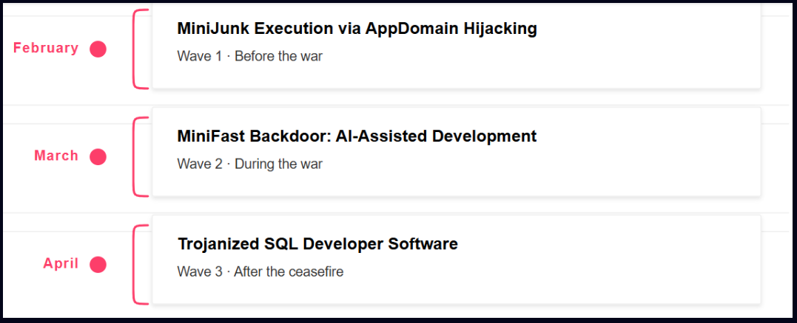

# Nimbus Manticore Expanded Attacks with AI-Assisted Malware and Fake Zoom Installers

**Nimbus Manticore**{.cve-chip} **Iran-Linked APT**{.cve-chip} **MiniFast Malware**{.cve-chip} **AppDomain Hijacking**{.cve-chip}

## Overview

Researchers identified a significant expansion of operations by Nimbus Manticore, an IRGC-linked Iranian APT group. The threat actor deployed a new backdoor malware family called **MiniFast**, leveraged trojanized Zoom installers, abused .NET AppDomain Hijacking to load malicious DLLs through trusted processes, and used SEO poisoning to distribute malware to victims. Evidence suggests portions of MiniFast were developed using AI-assisted coding tools. The campaign primarily targets organizations in aviation, defense, telecom, and software sectors for long-term intelligence gathering and persistent access.

## Technical Specifications

| Attribute | Details |
|---|---|
| **Threat Actor** | Nimbus Manticore (IRGC-linked Iranian APT) |
| **New Malware** | MiniFast — backdoor supporting command execution, file transfer, process management, persistence, and payload deployment |
| **AI-Assisted Development** | Evidence indicates portions of MiniFast were developed with AI coding tool assistance |
| **Initial Access Vectors** | Trojanized Zoom installers; SEO poisoning redirecting victims to malicious download sites |
| **Evasion Technique** | .NET AppDomain Hijacking — malicious DLLs loaded within legitimate .NET application processes |
| **Persistence Mechanism** | Manipulation of Zoom scheduled update tasks |
| **C2 Communication** | MiniFast connects to attacker-controlled C2 infrastructure for command receipt and data exfiltration |
| **Targeted Sectors** | Aviation, defense, telecommunications, software |
| **Campaign Objective** | Long-term espionage and intelligence collection |
| **CVE** | None — abuse of legitimate software and .NET framework features |

## Affected Products

- **Windows endpoints** in aviation, defense, telecom, and software organizations — targeted via trojanized installers and SEO-poisoned software downloads
- **Any .NET application environment** susceptible to AppDomain configuration file hijacking
- **Zoom-installed systems** — persistence abuses the Zoom scheduled update task

## Attack Scenario

1. **Delivery** — victim receives a spear-phishing lure, fake job offer, or is redirected to a malicious software download site via SEO poisoning; the lure leads to a trojanized Zoom installer or fake software package
2. **Trojanized installation** — the fake Zoom installer executes the legitimate Zoom installation process normally (reducing victim suspicion) while simultaneously deploying malicious DLLs in the background
3. **AppDomain Hijacking** — attacker-placed `.NET` configuration files cause legitimate .NET applications to load attacker-controlled DLLs within trusted process contexts, bypassing application-whitelisting and reducing the visibility of malicious activity to security tooling
4. **Persistence** — MiniFast manipulates Zoom's scheduled update tasks to ensure the malware survives reboots and continues executing without requiring re-infection
5. **C2 establishment** — MiniFast connects to attacker-controlled C2 infrastructure and awaits commands, supporting interactive command execution, file transfer, process management, and additional payload deployment
6. **Espionage operations** — attackers conduct reconnaissance, collect sensitive documents and credentials, and maintain long-term persistent access for ongoing intelligence collection against aviation, defense, telecom, and software targets

## Impact

=== "Data and Intelligence Theft"

    - Theft of sensitive business, defense, aviation, and telecommunications data for Iranian intelligence objectives
    - Potential compromise of intellectual property, strategic plans, and operational information from targeted sectors
    - Long-term persistent access enables sustained intelligence collection across extended campaign periods

=== "Operational and Detection Challenges"

    - Abuse of legitimate software (Zoom) and trusted .NET application processes makes malicious activity difficult to distinguish from normal behavior
    - AI-assisted malware development accelerates the creation of novel variants and may reduce IOC reuse, complicating signature-based detection
    - Persistence via scheduled tasks means malware survives standard endpoint remediation steps that do not include task audit and cleanup

=== "Broader Risk"

    - Compromised defense and aviation environments carry national security implications beyond the individual victim organization
    - Lateral movement from an initial foothold can expose partner organizations, supply chains, and government-connected networks
    - Increased risk of follow-on attacks using stolen credentials, internal documentation, and knowledge of victim network architecture

## Mitigations

### Software Download and Installation Controls

- **Download software only from official vendor websites** — never install applications from search results, sponsored ads, or links received in unsolicited messages; verify installer hashes against official checksums where available
- **Implement application allowlisting** to prevent execution of unauthorized binaries dropped alongside or in place of legitimate installers
- **Restrict execution from user-writable directories** (Downloads, Temp, AppData) — most trojanized installer payloads stage malicious components in these locations before execution

### .NET AppDomain Hijacking Detection

- **Monitor for unauthorized `.config` and `.ini` files** placed alongside legitimate .NET executables — unexpected configuration files in application directories are a key indicator of AppDomain Hijacking attempts
- **Detect DLL loading from unexpected paths** — alert on DLLs loaded by trusted .NET processes from non-standard locations using EDR telemetry or Sysmon `ImageLoad` events
- **Audit application directories** for unexpected files, particularly those matching the naming patterns used for AppDomain configuration hijacking

### Persistence and Scheduled Task Monitoring

- **Monitor creation and modification of scheduled tasks** — alert on new or modified tasks associated with Zoom and other legitimate applications that were not created by official software update mechanisms
- **Audit scheduled tasks regularly** as part of endpoint hygiene; remove any tasks without a clear, legitimate origin

### Network and Endpoint Detection

- **Deploy EDR solutions** with behavioral detection rules for AppDomain Hijacking, DLL search order abuse, and suspicious .NET process activity
- **Monitor outbound connections to suspicious or newly registered domains** — MiniFast C2 communication is a detection opportunity; integrate threat intelligence feeds for Nimbus Manticore IoCs
- **Apply least-privilege access controls and network segmentation** to limit the blast radius of a successful compromise and impede lateral movement

### Awareness

- **Strengthen phishing and social-engineering awareness training** with specific coverage of fake job offer lures and trojanized software installer campaigns, which are consistent Nimbus Manticore delivery patterns

## Resources

!!! info "Open-Source Reporting"
    - [Iranian APT Targets Aviation, Software Companies With Updated Tools — SecurityWeek](https://securityaffairs.com/192689/apt/nimbus-manticore-expanded-attacks-with-ai-assisted-malware-and-fake-zoom-installers.html)
    - [IRGC-Linked Nimbus Manticore Group Attacks Defense, Aerospace, Telecom Sectors Using MiniFast Malware Toolkit — Industrial Cyber](https://industrialcyber.co/ransomware/irgc-linked-nimbus-manticore-group-attacks-defense-aerospace-telecom-sectors-using-minifast-malware-toolkit/)
    - [Nimbus Manticore Expanded Attacks With AI-Assisted Malware and Fake Zoom Installers](https://www.securityweek.com/iranian-apt-targets-aviation-software-companies-with-updated-tools/)
    - [CSA Research Note: Nimbus Manticore AI-Assisted Malware — IRGC Nation-State (PDF)](https://labs.cloudsecurityalliance.org/wp-content/uploads/2026/05/CSA_research_note_nimbus-manticore-ai-assisted-malware-irgc-nation-state_20260526-csa-styled.pdf)

---

*Last Updated: June 1, 2026*