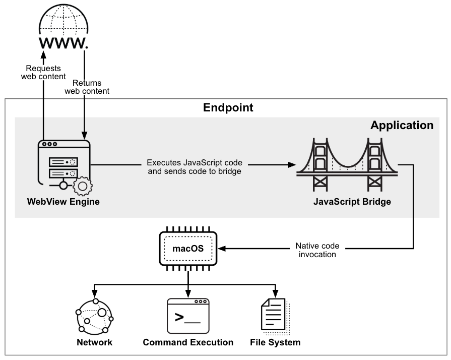

# FlutterShell macOS Backdoor Campaign

**macOS Malware**{.cve-chip} **Backdoor**{.cve-chip} **Malvertising**{.cve-chip} **Operation FlutterBridge**{.cve-chip}

## Overview

Researchers discovered a sophisticated macOS malware campaign named "Operation FlutterBridge" distributing a backdoor called "FlutterShell" through malicious Google and YouTube advertisements. The malware disguises itself as legitimate software applications and provides attackers with remote access to infected systems.

## Technical Specifications

| Attribute | Details |
|---|---|
| **Campaign Name** | Operation FlutterBridge |
| **Malware Family** | FlutterShell backdoor |
| **Primary Delivery Vector** | Malicious Google and YouTube sponsored advertisements (malvertising) |
| **Target Platform** | macOS |
| **Development Stack** | Google Flutter with WebView and JavaScript bridges |
| **Execution Method** | Dynamic loading of malicious code from attacker-controlled infrastructure |
| **Core Capabilities** | Remote command execution, file manipulation, persistence, payload download, and data theft |
| **Evasion Traits** | Designed to evade static analysis and traditional detection methods |
| **Observed Advanced Abuse** | Some variants reportedly abuse AI-powered document summarization workflows for data exfiltration |
| **CVE IDs** | Not specified for this campaign |

## Affected Products

- macOS endpoints where users install software from untrusted ads or unofficial sources
- Users searching for software and downloading trojanized applications from malicious ad links
- Enterprise environments with unmanaged or weakly monitored macOS application execution controls

## Attack Scenario

1. A victim searches online for software.
2. Attacker-sponsored ads appear on Google or YouTube.
3. The victim downloads a trojanized macOS application.
4. FlutterShell installs silently and establishes persistence.
5. The backdoor connects to attacker C2 infrastructure.
6. Attackers execute commands, steal data, or deploy additional payloads remotely.

## Impact

=== "Integrity"

    - Unauthorized remote command execution on infected macOS systems
    - Persistent compromise through startup/persistence mechanisms
    - Potential modification of local files and endpoint configurations

=== "Confidentiality"

    - Theft of sensitive documents, credentials, and local data
    - Possible abuse of AI-assisted workflows to extract high-value content
    - Increased espionage risk in enterprises using macOS devices for sensitive operations

=== "Availability"

    - Endpoint instability from follow-on payloads or adversary actions
    - Potential deployment of additional malware/adware impacting system performance
    - Operational disruption if infected devices are leveraged for lateral movement or broader compromise

## Mitigations

### Immediate Actions

- Download applications only from trusted official sources or the Mac App Store
- Avoid clicking sponsored software advertisements
- Enable macOS Gatekeeper and XProtect

### Short-term Measures

- Keep macOS and installed applications fully updated
- Restrict execution of unapproved applications
- Isolate and investigate endpoints suspected of malvertising-based compromise

## Resources

!!! info "Open-Source Reporting"
    - [FlutterShell Backdoor Spreads to macOS via Malicious Google and YouTube Ads](https://thehackernews.com/2026/06/fluttershell-backdoor-spreads-to-macos.html)
    - [Operation FlutterBridge: macOS Malvertising Campaign Spreads New FlutterShell Backdoor](https://unit42.paloaltonetworks.com/flutterbridge-new-fluttershell-backdoor/)
    - [FlutterShell Backdoor Weaponizes Flutter's Architecture to E — Threat Campaign Analysis](https://techjacksolutions.com/scc-intel/fluttershell-backdoor-weaponizes-flutters-architecture-to-evade-apple-notarization-and-hit-macos-at-scale/)
    - [Malicious podcast, PDF apps spread FlutterShell macOS backdoor malware | news | SC Media](https://www.scworld.com/news/malicious-podcast-pdf-apps-spread-fluttershell-macos-backdoor-malware)
    - [Operation FlutterBridge MacOS Backdoor Via Google Ads](https://cipherssecurity.com/operation-flutterbridge-fluttershell-macos/)

---

*Last Updated: June 7, 2026*
