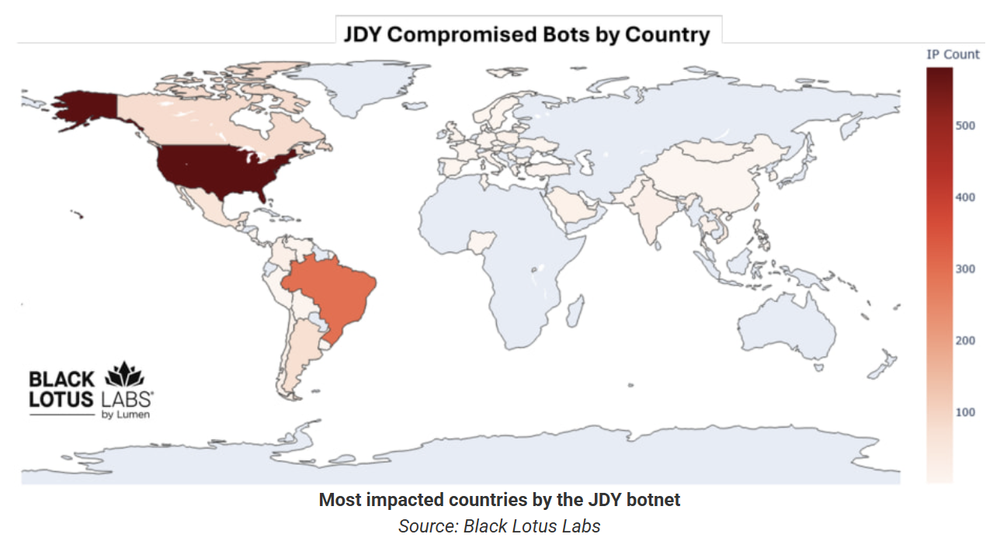
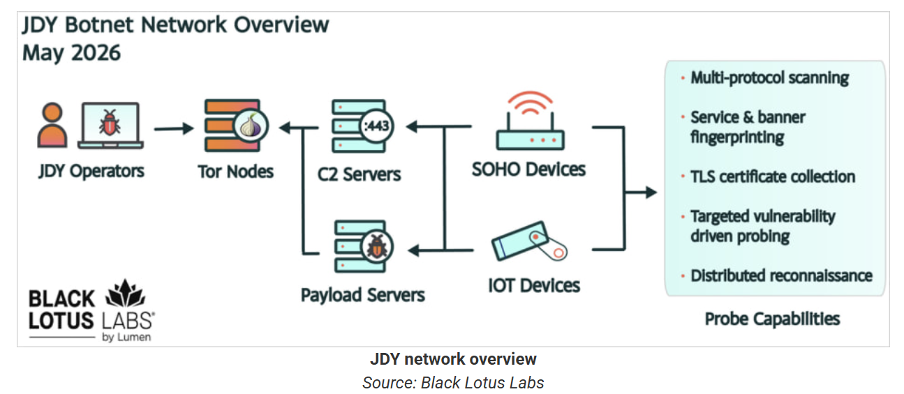
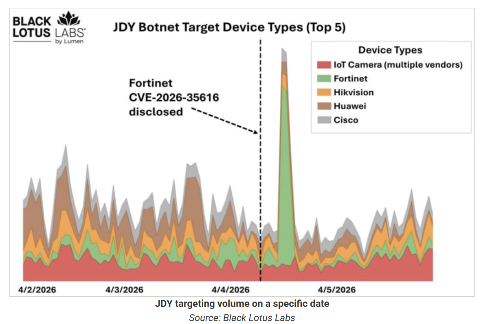

# China-Linked JDY Botnet Expands to 1,500+ Devices for Cyber Reconnaissance

**China-Nexus APT**{.cve-chip} **IoT Botnet**{.cve-chip} **Reconnaissance**{.cve-chip} **Volt Typhoon**{.cve-chip} **Critical Infrastructure**{.cve-chip}

## Overview

The JDY botnet is a China-linked network of over 1,500 compromised SOHO routers, firewalls, and IoT devices operating as a high-performance, centrally controlled scanning infrastructure. It maps and fingerprints exposed services worldwide, feeding targeting data to Chinese state-sponsored threat actors including Volt Typhoon. Following the U.S. takedown of the KV-botnet in 2024, JDY operators rebuilt and expanded — doubling the botnet from approximately 650 nodes in early 2024 to 1,500+ devices by mid-2026 — with the majority of bots concentrated in the United States and Brazil.

## Technical Specifications

| Attribute | Details |
|---|---|
| **Botnet Name** | JDY |
| **Threat Actor Association** | China-nexus, Volt Typhoon |
| **Primary Function** | Dedicated reconnaissance and internet-wide scanning botnet |
| **Device Types Targeted** | SOHO routers, firewalls, IoT devices |
| **Scale** | 1,500+ active compromised nodes (as of mid-2026) |
| **Geographic Concentration** | United States, Brazil, Europe, Asia |
| **Infection Vectors** | Unpatched edge device CVEs, default/weak credentials, exposed management interfaces |
| **C2 Architecture** | Centrally coordinated; C2 nodes tied to China-nexus operators |
| **Scanning Capabilities** | Port scanning, service fingerprinting, banner/TLS/HTTP header collection, rapid CVE exposure detection |
| **Predecessor** | KV-botnet (disrupted by U.S. in 2024) |
| **Research Attribution** | Lumen Black Lotus Labs |

## Affected Products

- SOHO routers, firewalls, and IoT devices with unpatched vulnerabilities or default credentials
- Edge devices with internet-exposed management interfaces
- Devices no longer receiving firmware security updates (end-of-life hardware)
- Organizations with poorly segmented network perimeters, particularly in the U.S., Brazil, Europe, and Asia

## Attack Scenario

1. Chinese operators scan the internet for unpatched SOHO routers, firewalls, and IoT devices with exposed management interfaces or known CVEs.
2. Exploiting vulnerabilities or default credentials, a lightweight scanner implant is installed, enrolling the device into the JDY botnet.
3. JDY's C2 issues scanning tasking to bots, targeting specific IP ranges (e.g., U.S. defense contractors, telecoms, infrastructure operators) and searching for hosts exposed to recently disclosed vulnerabilities.
4. Bots conduct extensive port scanning and service fingerprinting, collecting open ports, protocols, banner information, TLS certificates, and indicators of remote management interfaces, VPNs, ICS gateways, and cloud services.
5. Scan results are reported back to C2, providing operators a near-real-time targeting map of exposed and potentially vulnerable systems worldwide.
6. Chinese APT teams (e.g., Volt Typhoon) select high-value targets and launch follow-on intrusions using tailored tools and TTPs.
7. As takedown or sinkholing efforts occur, operators shift C2 nodes and rebuild infrastructure, maintaining JDY as a persistent reconnaissance asset.

## Impact

=== "Integrity"

    - JDY provides China-linked actors with a near-real-time global map of exposed services, enabling rapid exploitation after vulnerability disclosure
    - Shortened window for defenders between CVE publication and state-actor exploitation attempts
    - Enables pre-positioning and operational planning against critical infrastructure, telecoms, and military-adjacent networks

=== "Confidentiality"

    - Reconnaissance data collected supports targeted intrusions into sensitive U.S. and allied networks
    - Botnet infrastructure enables stealthy scanning from geographically distributed, legitimate-looking IP ranges
    - Link to Volt Typhoon aligns with broader Chinese efforts to pre-position inside critical infrastructure

=== "Availability"

    - Compromised SOHO/IoT devices generate unusual outbound scan traffic and remain under attacker control long-term if unremediated
    - Device owners may experience bandwidth spikes or ISP abuse notices
    - National security risk: JDY maintains a strong focus on U.S. military and associated networks per Black Lotus Labs research

## Mitigations

### Immediate Actions

- Keep router, firewall, and IoT device firmware up to date; replace devices that no longer receive security updates
- Disable internet-facing remote management by default; restrict access via VPN or IP allowlists
- Change all default credentials and remove unused or default management accounts

### Short-term Measures

- Minimize and monitor public-facing services, especially remote management interfaces, VPNs, ICS gateways, and OT/IT bridge points
- Rapidly patch high-impact vulnerabilities — JDY is specifically designed to find hosts exposed to freshly disclosed CVEs
- Factory-reset and re-flash suspected compromised devices with the latest firmware before re-securing

### Monitoring & Detection

- Monitor for unusual outbound scanning traffic or ISP abuse notices on edge devices
- Use IDS/IPS and flow monitoring to detect JDY-like scanning patterns from edge networks
- Integrate JDY C2 IP indicators (from Lumen Black Lotus Labs and threat intel feeds) into blocklists and detection content

### Long-term Solutions

- Implement network segmentation and zero-trust architecture to prevent scanning success from translating into lateral movement
- Ensure edge devices and remote offices are properly isolated from core networks
- Enforce automated patch management and asset inventory for all internet-exposed edge devices

## Resources

!!! info "Open-Source Reporting"
    - [China-Linked JDY Botnet Expands to 1,500+ Devices](https://thehackernews.com/2026/06/china-linked-jdy-botnet-expands-to-1500.html)
    - [China-Linked JDY Botnet Expands Targeting of US Military Networks](https://www.bleepingcomputer.com/news/security/china-linked-jdy-botnet-expands-targeting-of-us-military-networks/)
    - [JDY Botnet: China Uses 1,500 Devices for Reconnaissance](https://thenextweb.com/news/jdy-botnet-china-1500-devices-reconnaissance)

---

*Last Updated: June 11, 2026*
