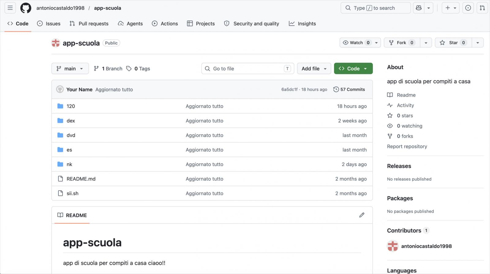
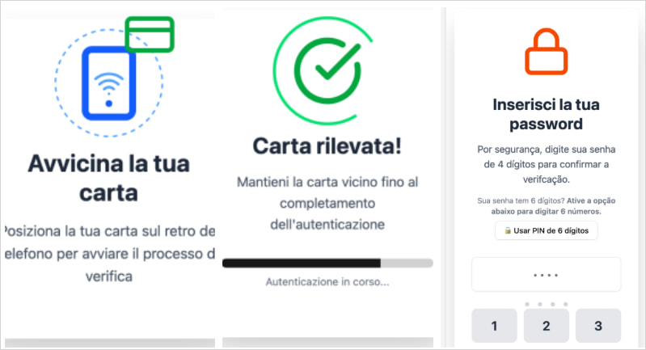

# NFCShare Android Malware Campaign

**Android Malware**{.cve-chip} **NFC Theft**{.cve-chip} **Mobile Banking Fraud**{.cve-chip} **Social Engineering**{.cve-chip}

## Overview

Researchers uncovered a sophisticated Android malware campaign named "NFCShare" that spreads through fake banking app updates hosted on GitHub repositories. The malware tricks victims into installing malicious APK files masquerading as banking security updates, then abuses Android NFC functionality to steal payment card data and PINs for financial fraud. Since its creation on April 10, the GitHub repository used for distribution has hosted 56 unique APKs impersonating mobile banking apps primarily from Italy and Spain.

## Technical Specifications

| Attribute | Details |
|---|---|
| **Threat Family** | NFCShare Android malware |
| **Target Profile** | Banking customers in Italy and Spain |
| **Delivery Method** | Phishing websites and SMS/email lures directing victims to GitHub-hosted malicious APKs |
| **Lure Themes** | Fake banking security updates |
| **Distribution Infrastructure** | GitHub-hosted repositories |
| **NFC Abuse Method** | Android IsoDep APIs and EMV communication commands |
| **Data Exfiltration** | WebSocket communication to attacker-controlled infrastructure |
| **Evasion Techniques** | Malformed APK packaging to evade static analysis and automated malware detection |
| **Unique APK Count** | 56 unique APKs identified |
| **CVE IDs** | Not assigned |

## Affected Products

- Android devices where users sideload APK files from unofficial sources
- Customers of Italian and Spanish banking institutions targeted by impersonated apps:
    - Intesa Carte, Sella Carte, Banca Sella Carte, Nexi Carte, Fideuram Carte, Mooney Carte (Italy)
    - CaixaBank, CaixaBankNfc, CaixaReactivaTarjeta (Spain)
- Devices with NFC functionality enabled

## Attack Scenario

1. Victim receives a phishing SMS/email or visits a fake banking website.
2. Fake portal claims the banking app requires a security update.
3. Victim is directed to download a malicious APK from a GitHub-hosted repository.
4. Malware requests NFC and other permissions, then launches a fake verification workflow.
5. Victim is instructed to tap their payment card to the device using NFC.
6. Malware captures EMV/NFC card data using Android IsoDep APIs and EMV commands.
7. Victim is prompted to enter their PIN, which is exfiltrated via WebSocket to attacker infrastructure.
8. Attackers use stolen card data and PIN for fraudulent contactless payments, relay attacks, or card emulation fraud.

## Impact

=== "Integrity"

    - Unauthorized use of stolen NFC card data and PINs for fraudulent transactions
    - Card emulation and relay attacks enabling contactless payment fraud
    - Potential long-term banking account compromise through harvested credentials

=== "Confidentiality"

    - Theft of payment card NFC data via EMV command interception
    - Exfiltration of card PINs to attacker-controlled infrastructure
    - Exposure of sensitive financial information tied to targeted banking customers

=== "Availability"

    - Disruption of legitimate banking access through account compromise
    - Potential blocking or freezing of compromised cards and accounts
    - Financial losses requiring investigation and card replacement procedures

## Mitigations

### Immediate Actions

- Install banking apps only from trusted stores such as Google Play
- Avoid sideloading APKs from GitHub or unknown links
- Keep Google Play Protect enabled
- Do not trust unsolicited banking update requests via SMS or email

### Short-term Measures

- Monitor banking transactions regularly for unauthorized activity
- Restrict unnecessary NFC and Accessibility permissions on mobile devices
- Report suspicious banking update requests directly to your bank

### Monitoring & Detection

- Monitor for anomalous NFC transaction patterns and unusual contactless payment activity
- Track indicators of compromise linked to NFCShare APK distribution infrastructure
- Detect unusual permission requests combining NFC access with network exfiltration behavior

### Long-term Solutions

- Banks should implement fraud monitoring and anomalous NFC transaction detection
- Enforce device attestation mechanisms to validate app authenticity
- Deploy anti-phishing awareness campaigns targeting banking customers
- Implement stronger authentication controls to limit the impact of stolen card data

## Resources

!!! info "Open-Source Reporting"
    - [NFCShare Android malware spreads via fake banking app updates on GitHub](https://www.bleepingcomputer.com/news/security/nfcshare-android-malware-spreads-via-fake-banking-app-updates-on-github/)
    - [NFCShare Android Malware Spreads via Fake Banking App Updates on GitHub | QPulse](https://qpulse.quasarcybertech.com/news/3912/nfcshare-android-malware-spreads-via-fake-banking-app-updates-on-github)

---

*Last Updated: June 10, 2026*
