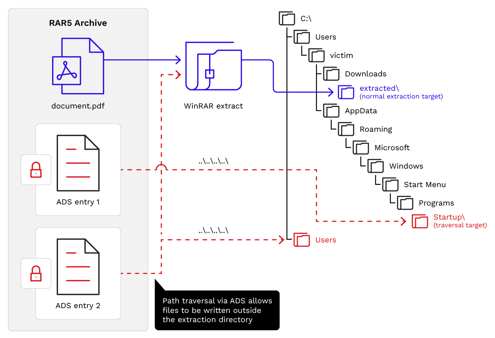
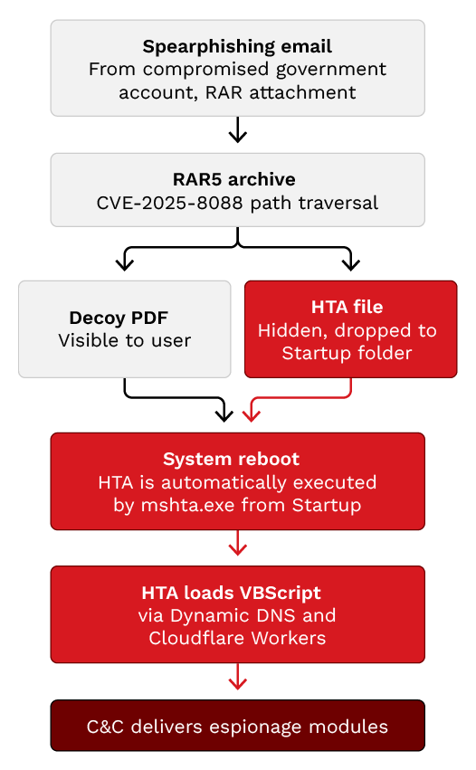

# WinRAR CVE-2025-8088 Exploitation Campaign

**CVE-2025-8088**{.cve-chip} **Path Traversal**{.cve-chip} **Russia-Aligned APT**{.cve-chip} **Ukraine Targeting**{.cve-chip}

## Overview

Russia-aligned threat actors exploited a known WinRAR path traversal vulnerability (CVE-2025-8088) to distribute malware through malicious RAR archives targeting Ukrainian organizations. Attackers used phishing emails with weaponized archive files to deliver hidden payloads, abusing NTFS Alternate Data Streams to write files outside intended extraction directories and establish persistence. The vulnerability was patched in WinRAR 7.13.

## Technical Specifications

| Attribute | Details |
|---|---|
| **CVE ID** | CVE-2025-8088 |
| **Vulnerability Type** | Path Traversal via NTFS Alternate Data Streams (ADS) abuse |
| **Affected Versions** | WinRAR versions prior to 7.13 |
| **Fixed Version** | WinRAR 7.13 |
| **Threat Actor Alignment** | Russia-aligned |
| **Primary Targets** | Ukrainian organizations |
| **Delivery Method** | Phishing emails with malicious RAR archive attachments |
| **Persistence Mechanism** | Startup folder write via ADS path traversal |
| **Observed Payloads** | HTA payloads, DLL sideloading, in-memory execution, GIFTEDCROOK infostealer |
| **C2 Communication** | Encrypted channels |

## Affected Products

- WinRAR versions prior to 7.13 on Windows systems
- Endpoints with NTFS filesystems where ADS abuse is possible
- Organizations in Ukraine and potentially other geopolitical targets

## Attack Scenario

1. Victim receives a phishing email with a malicious RAR archive attachment.
2. Victim extracts the archive using a vulnerable version of WinRAR.
3. CVE-2025-8088 exploit writes malicious files outside the intended extraction directory by abusing NTFS Alternate Data Streams.
4. Malware establishes persistence by dropping payloads into Startup folders or other sensitive locations.
5. Threat actor steals credentials, documents, browser data, and sensitive information from compromised systems.

## Impact

=== "Integrity"

    - Unauthorized file writes outside intended extraction paths via path traversal
    - Persistence established through Startup folders or scheduled execution mechanisms
    - Deployment of DLL sideloading and in-memory execution to evade defenses

=== "Confidentiality"

    - Credential theft and browser data exfiltration via GIFTEDCROOK infostealer
    - Espionage operations targeting sensitive documents and organizational data
    - Exfiltration of intelligence from Ukrainian organizations via encrypted C2

=== "Availability"

    - Potential for lateral movement and broader organizational compromise
    - Persistent access enabling long-term espionage and data harvesting
    - Risk of follow-on destructive payloads following initial foothold

## Mitigations

### Immediate Actions

- Upgrade to WinRAR 7.13 or later immediately
- Audit endpoints for outdated archive software installations
- Block or restrict execution from archive extraction folders

### Short-term Measures

- Monitor Startup directories for suspicious or unexpected files
- Disable unnecessary HTA execution across endpoints
- Implement phishing-aware email filtering and attachment sandboxing

### Monitoring & Detection

- Deploy EDR/XDR monitoring solutions to detect post-exploitation activity
- Alert on unexpected file writes to Startup folders or sensitive system paths
- Monitor for GIFTEDCROOK and similar infostealer indicators of compromise

### Long-term Solutions

- Enforce software inventory and patch management for third-party tools including archive utilities
- Conduct phishing awareness training targeting social engineering lures
- Implement application allowlisting to restrict unauthorized payload execution

## Resources

!!! info "Open-Source Reporting"
    - [WinRAR Flaw Exploited by Russia-Aligned Groups to Deploy Stealers in Ukraine](https://thehackernews.com/2026/06/winrar-flaw-exploited-by-russia-aligned.html)
    - [Old WinRAR Flaw Fuels Attacks on Ukraine: How Unmanaged Software Keeps the Door Open | Trend Micro](https://www.trendmicro.com/en_us/research/26/f/old-winrar-flaw-fuels-attacks-on-ukraine.html)

---

*Last Updated: June 10, 2026*
