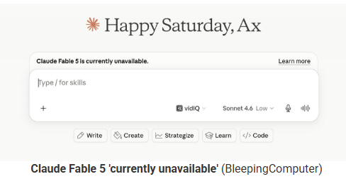

# U.S. Government Restricts Foreign Access to Anthropic Fable 5 and Mythos 5 AI Models

**AI Governance**{.cve-chip} **National Security**{.cve-chip} **Model Access Controls**{.cve-chip} **Anthropic**{.cve-chip}

## Overview

The U.S. government reportedly directed Anthropic to restrict access to its advanced AI models, Fable 5 and Mythos 5, for foreign nationals due to concerns that the models could assist in cyber offensive operations, vulnerability discovery, or bypassing security protections. The action reflects increasing government oversight of frontier AI technologies and their potential national security implications.

## Technical Specifications

| Attribute | Details |
|---|---|
| **Incident Type** | Government-directed access restriction on advanced AI models |
| **Affected Models** | Anthropic Fable 5 and Mythos 5 |
| **Primary Concern** | Potential misuse for offensive cybersecurity support and security-control bypass |
| **Capability Focus** | Advanced reasoning and cybersecurity-related assistance capabilities |
| **Reported Abuse Vector** | Prompt-engineering/jailbreaking techniques to bypass safety restrictions |
| **Control Mechanism** | Restriction modeled similarly to export-control approaches for sensitive technologies |
| **Operational Change** | Access reportedly disabled or limited for non-U.S. persons pending compliance evaluation |
| **Threat Context** | Potential acceleration of reconnaissance, exploit ideation, phishing, and malware-related workflows |
| **CVE IDs** | Not applicable |

## Affected Products

- Anthropic advanced model access pathways for Fable 5 and Mythos 5
- International users, researchers, and organizations relying on these model tiers
- Cross-border AI-enabled cybersecurity research and enterprise workflows dependent on model availability

## Attack Scenario

1. A threat actor or hostile operator attempts to access a highly capable frontier AI model.
2. Prompt-engineering techniques are used to probe model safeguards and bypass restrictions.
3. The model is leveraged to assist reconnaissance, vulnerability analysis, or exploit concept generation.
4. Outputs are adapted to improve phishing, malware development, or operational planning.
5. Authorities respond by enforcing access restrictions to reduce offensive misuse potential.

## Impact

=== "Integrity"

    - Increased pressure on AI providers to enforce robust policy and technical safety controls
    - Potential trust and governance shifts in how high-capability models are deployed globally
    - Risk of uneven control enforcement across jurisdictions and service tiers

=== "Confidentiality"

    - Elevated concern that advanced model outputs could support data-targeting and intelligence collection operations
    - Greater scrutiny over model-assisted discovery of sensitive system weaknesses
    - Heightened focus on misuse pathways that could expose protected infrastructure information

=== "Availability"

    - Restricted global access to top-tier Anthropic model capabilities for foreign users
    - Operational disruption for international organizations dependent on restricted model access
    - Potential fragmentation of AI service availability across geopolitical boundaries

## Mitigations

### Immediate Actions

- Implement strong AI safety guardrails and jailbreak resistance mechanisms
- Enforce strict access control and identity verification for advanced AI systems
- Monitor AI usage for suspicious cyber-related activity patterns

### Short-term Measures

- Conduct continuous red-team testing for prompt-injection and misuse scenarios
- Harden policy enforcement around high-risk model capabilities and tool integrations
- Introduce adaptive risk scoring for user behavior and request intent in sensitive workflows

### Monitoring & Detection

- Log and review anomalous prompt patterns indicative of safeguard probing
- Detect repeated jailbreak attempts and high-risk instruction chains
- Audit model output channels for policy-violating cybersecurity content attempts

### Long-term Solutions

- Develop international governance frameworks for high-risk AI capabilities
- Build contingency plans for organizations dependent on foreign AI providers
- Establish transparent compliance programs aligning AI access controls with legal and national-security requirements

## Resources

!!! info "Open-Source Reporting"
    - [US Gov asks Anthropic to ban 'foreign national' access to Fable, Mythos](https://www.bleepingcomputer.com/news/security/us-gov-asks-anthropic-to-ban-foreign-national-access-to-fable-mythos/)
    - [Anthropic disables new models after government calls them a national security concern | CyberScoop](https://cyberscoop.com/us-government-anthropic-fable-5-mythos-5-export-controls/)
    - [Anthropic cuts off Fable 5 and Mythos 5 access following government order | The Verge](https://www.theverge.com/ai-artificial-intelligence/949553/anthropic-fable-5-mythos-5-government-national-security)
    - [Anthropic disables top-tier AI models after US order limiting foreign access | Reuters](https://www.reuters.com/technology/us-blocks-foreign-access-anthropics-most-advanced-ai-models-axios-reports-2026-06-13/)
    - [Trump admin blocks foreign access to Anthropic's most powerful AI](https://www.axios.com/2026/06/12/anthropic-trump-mythos-fable-national-security)
    - [US ban on Anthropic's Fable 5 and Mythos 5 has 'Amazon link': Researchers from Amazon used a series of prompts to ... - The Times of India](https://timesofindia.indiatimes.com/technology/tech-news/us-ban-on-anthropics-fable-5-and-mythos-5-has-amazon-link-researchers-from-amazon-used-a-series-of-prompts-to-/articleshow/131701361.cms)

---

*Last Updated: June 14, 2026*
