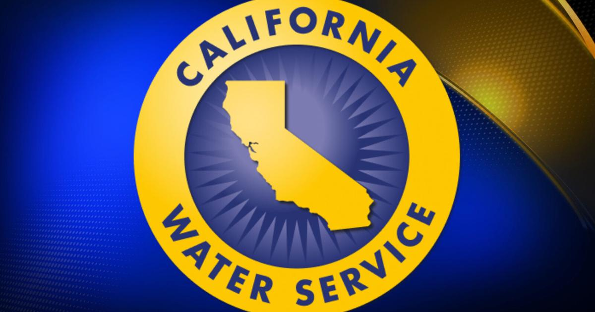
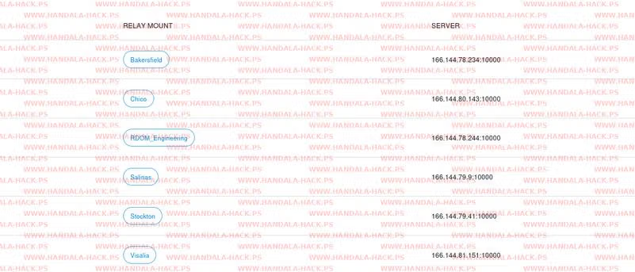

# Handala Cyberattack on California Water Service (Cal Water)

**Handala**{.cve-chip} **Critical Infrastructure**{.cve-chip} **Water Utility**{.cve-chip} **Data Breach**{.cve-chip}

## Overview

The Iran-linked threat group "Handala" claimed responsibility for breaching California Water Service (Cal Water), one of the largest private water utilities in the U.S. The attackers leaked approximately 5GB of allegedly stolen data and stated they intentionally avoided causing operational disruption, implying they had the capability to do more severe damage.

## Technical Specifications

| Attribute | Details |
|---|---|
| **Threat Actor** | Handala (Iran-linked, publicly claimed) |
| **Target Organization** | California Water Service (Cal Water) |
| **Alleged Data Leak Size** | Approximately 5GB |
| **Suspected Initial Access** | Internet-exposed RTKBase system (open-source GNSS/GPS correction platform) |
| **Likely Weaknesses** | Exposed services/credentials and weak segmentation between external and internal networks |
| **Suspected Post-Compromise Activity** | Lateral movement into internal business systems |
| **Reported Data Types** | Customer PII, billing information, administrative credentials, infrastructure details |
| **Operational Impact Claim** | Attackers stated they avoided direct operational disruption despite implied capability |
| **CVE IDs** | Not specified in referenced reporting |

## Affected Products

- California Water Service business systems and associated data repositories
- Externally reachable RTKBase environment used as a potential intrusion foothold
- Internal enterprise systems accessible from weakly segmented external-facing infrastructure

## Attack Scenario

1. Attackers identify an internet-exposed RTKBase instance.
2. Weak or exposed credentials are abused to gain access.
3. The compromised environment is used as a pivot point into internal enterprise systems.
4. Sensitive customer and administrative data is collected.
5. Handala leaks stolen data publicly and issues statements implying capability to disrupt water operations.

## Impact

=== "Integrity"

    - Potential compromise of administrative credentials and trusted system controls
    - Increased risk of unauthorized changes if attacker access persists
    - Elevated concern over integrity of critical infrastructure support systems

=== "Confidentiality"

    - Exposure of customer PII and billing-related information
    - Disclosure risk for internal infrastructure and administrative data
    - Long-term intelligence value of leaked data for follow-on targeting

=== "Availability"

    - Immediate operational disruption reportedly avoided, but demonstrated access raises future disruption risk
    - Increased risk of destructive or service-impacting attacks against water infrastructure
    - Potential outage pressure from incident response, containment, and recovery actions

## Mitigations

### Immediate Actions

- Remove or secure internet-exposed RTKBase systems
- Enforce Multi-Factor Authentication (MFA)
- Rotate all potentially compromised credentials

### Short-term Measures

- Improve segmentation between IT and OT networks
- Restrict remote administrative access to trusted paths
- Harden externally exposed services and management interfaces

### Monitoring & Detection

- Conduct forensic investigation and continuous monitoring
- Audit externally exposed assets on a recurring basis
- Alert on anomalous authentication, privilege changes, and lateral movement behavior

### Long-term Solutions

- Implement continuous attack surface management for critical infrastructure assets
- Adopt zero-trust access controls for administrative and remote operations
- Regularly exercise incident response plans for utility-sector cyber scenarios

## Resources

!!! info "Open-Source Reporting"
    - [Iran-Linked Handala Breached a California Water Utility. It Could Have Done Worse, and It Knows That. - Security Affairs](https://securityaffairs.com/193565/uncategorized/iran-linked-handala-breached-a-california-water-utility-it-could-have-done-worse-and-it-knows-that.html)
    - [Iran-backed hackers claim breach of California water systems - state media | Iran International](https://www.iranintl.com/en/202606123530)
    - [Iranian Cyber Group Handala Claims Cal Water Hack - SecurityWeek](https://www.securityweek.com/iranian-cyber-group-handala-claims-cal-water-hack/)
    - [Iran-Linked Handala Breached a California Water Utility. It Could Have Done Worse, and It Knows That. | SOC Defenders](https://www.socdefenders.ai/item/8908592f-3c5f-4778-80e4-658318741619)

---

*Last Updated: June 14, 2026*
