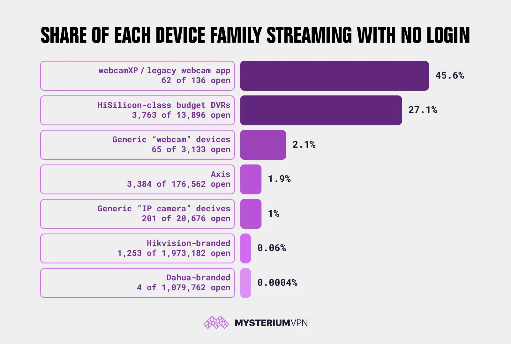

# Exposure of 21,786 Internet-Connected Home Cameras Without Password Protection

**IoT Exposure**{.cve-chip} **Unsecured Cameras**{.cve-chip} **Privacy Risk**{.cve-chip} **Attack Surface**{.cve-chip}

## Overview

Security researchers discovered more than 21,786 internet-connected home and surveillance cameras publicly accessible without password protection or proper authentication. Many devices exposed live video streams directly over the internet, allowing unauthorized individuals to view feeds remotely without exploiting sophisticated vulnerabilities.

## Technical Specifications

| Attribute | Details |
|---|---|
| **Incident Type** | Mass exposure of internet-connected cameras without authentication |
| **Exposed Devices** | 21,786+ home and surveillance cameras |
| **Discovery Methods** | Internet-wide scanning via platforms such as Shodan and Censys |
| **Exposed Services** | RTSP, HTTP, and camera web management interfaces |
| **Primary Security Gaps** | No password protection, default credentials, insecure firmware configuration |
| **Additional Exposure Factors** | Exposed APIs and UPnP-enabled routers forwarding ports automatically |
| **Advanced Device Risk** | Some systems allowed remote PTZ (Pan-Tilt-Zoom) control |
| **Exploitation Complexity** | Low; direct access possible without advanced exploitation techniques |
| **CVE IDs** | Not specified for this exposure event |

## Affected Products

- Internet-exposed home and business IP camera deployments lacking authentication
- Surveillance devices with RTSP/HTTP interfaces reachable from the public internet
- Camera environments using default credentials or insecure remote access settings
- Networks where UPnP-enabled routers auto-forward camera management ports externally

## Attack Scenario

1. An attacker scans the internet with search engines like Shodan to locate exposed camera services.
2. The attacker identifies open RTSP streams or camera web interfaces.
3. Live video feeds are accessed directly without credentials.
4. In severe cases, attackers attempt lateral movement through the camera into local networks.
5. Attackers may exploit outdated firmware or recruit devices into IoT botnets for further abuse.

## Impact

=== "Integrity"

    - Unauthorized modification risk for exposed camera settings and monitoring behavior
    - Potential tampering with PTZ controls to alter surveillance coverage
    - Increased chance of configuration abuse leading to persistent insecure states

=== "Confidentiality"

    - Severe privacy violations from unauthorized live-feed viewing
    - Exposure of occupants' routines, locations, and sensitive environments
    - Intelligence gathering potential for targeted crimes and social engineering

=== "Availability"

    - Camera service disruption risk if devices are hijacked or overloaded
    - Potential botnet enrollment enabling DDoS participation and degraded device performance
    - Operational impact for homes and businesses relying on continuous video monitoring

## Mitigations

### Immediate Actions

- Change all default passwords immediately
- Disable unnecessary remote access services such as RTSP if unused
- Disable UPnP on routers
- Avoid exposing camera management ports directly to the internet

### Short-term Measures

- Enable MFA/2FA where supported
- Regularly update device firmware
- Place IoT devices on isolated VLANs or guest networks

### Monitoring & Detection

- Continuously monitor internet exposure using attack surface management tools
- Alert on unexpected remote access attempts and abnormal device traffic
- Review router forwarding rules for unauthorized external mappings

### Long-term Solutions

- Replace unsupported or end-of-life camera devices
- Standardize secure-by-default deployment baselines for IoT cameras
- Implement recurring external exposure audits across home and enterprise environments

## Resources

!!! info "Open-Source Reporting"
    - [21,786 Home Cameras, No Password, No Warning](https://securityaffairs.com/193536/hacking/21786-home-cameras-no-password-no-warning.html)
    - [21,786 Home Cameras, No Password, No Warning | SOC Defenders](https://www.socdefenders.ai/item/4cc07ff1-410f-4d46-a252-b0b64be83b3a)

---

*Last Updated: June 14, 2026*
